# 5개 종목의 1분봉 차트는 어떻게 수집·저장·확장할까

> 기존 POC 로컬 측정일은 2026년 8월 11일이고, B1 부하 재검증은 8월 14일, KIS·토스 공식 명세와 이용 범위의 마지막 재확인은 8월 15일에 진행했습니다. 화면과 API 검증에는 같은 값을 다시 만들 수 있는 `blog-local-seed`를 사용했습니다. 실제 증권사 시세가 아니며, 공급자 분석은 공식 문서, 성능 수치는 로컬 재실행 결과를 기준으로 합니다.
>
> 본문의 손그림은 개념을 설명하기 위한 삽화입니다. 실제 구현 여부와 성능 수치는 Flutter 화면, 로컬 검사와 측정 결과에서만 판단합니다.

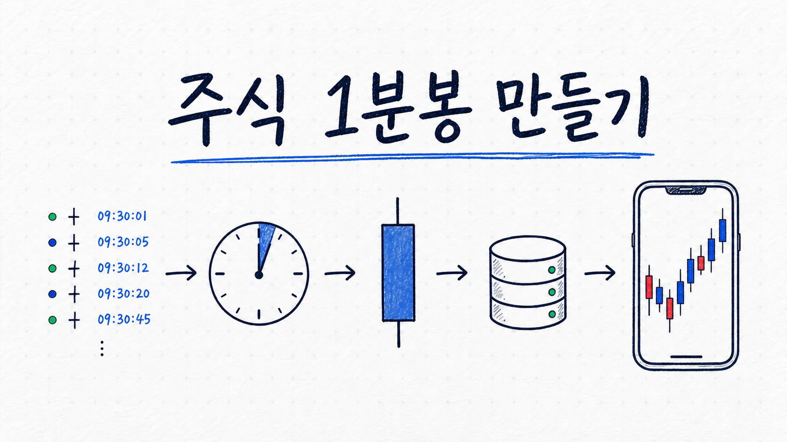

*대표 이미지 — 체결 한 건이 1분봉으로 묶여 저장되고 차트에 도착하기까지의 흐름을 단순화했습니다.*

처음에는 1분봉 차트를 만드는 일이 단순해 보였습니다. 증권사 API에서 가격을 받고, 데이터베이스에 저장한 다음, 차트에 그리면 끝이라고 생각했습니다.

그런데 막상 설계를 시작하니 가격보다 먼저 확인할 내용이 많았습니다. 같은 거래가 두 번 들어오거나 순서가 바뀌면 분봉은 달라질 수 있습니다. 개인용 API로 받은 시세를 여러 사용자에게 보여줄 수 있는지도 확인해야 합니다.

그래서 이번 작업에서는 코드보다 기초 이론을 먼저 공부했습니다. 체결과 분봉의 차이부터 시작해 REST와 WebSocket의 역할, 늦게 도착한 데이터, 중복 저장, HTTP 압축과 부하 지표를 차례로 정리했습니다.

이 글에서는 삼성전자, SK하이닉스, 카카오, NAVER, 현대차 다섯 종목을 대상으로 만든 1분봉 파이프라인을 살펴봅니다. 매수·매도는 다루지 않고, 체결 데이터가 서버를 거쳐 차트 화면에 도착하는 과정에만 집중합니다.

## 이번 연구에서 답하려는 질문

처음부터 목표를 세 영역으로 나눴습니다. 화면 하나가 보이는 데서 끝내지 않고, 데이터가 어디서 와서 어떻게 남고, 사용자가 늘면 어느 부분이 먼저 한계에 닿는지까지 확인하려고 했습니다.

### 계획

- 국내주식 5종목의 1분봉을 어떤 방법으로 수집할 것인가
- 수집과 조회가 안정적이고 충분히 빠른가
- PostgreSQL 구조는 안전하며 데이터는 얼마나 커지는가
- 사용자와 요청이 늘면 어디부터 확장해야 하는가
- 매수·매도는 제외하고 차트 데이터에만 집중한다

### 주요 범위

1. **실시간 데이터 수집:** 어디서 어떤 값을 받고, 끊김과 중복을 어떻게 복구할지 조사합니다.
2. **서버 저장:** 1분봉 스키마와 멱등 저장을 검증하고, 종목 수와 보관기간에 따른 용량을 계산합니다.
3. **클라이언트 표현:** 첫 화면의 봉 개수와 조회 범위를 정하고, 사용자 증가 시 공급자 연결과 조회 부하를 분리합니다.

### 범위 밖

- 매수·매도와 주문 체결
- 계좌·포트폴리오·수익률
- 투자 판단과 종목 추천
- 개인용 무료 시세를 공개 서비스에 재배포하는 운영 결정

### 현재 상태부터 구분했습니다

| 항목 | 상태 | 이 글에서 말할 수 있는 것 |
| --- | --- | --- |
| 경로 A: `sim` → 수집·집계 → PostgreSQL | 계층별 구현·로컬 검증 | 체결 정규화, 집계와 저장 경계 |
| 경로 B: 결정적 seed → PostgreSQL → REST → Flutter | 로컬 연결 검증 | 저장한 OHLCV의 조회와 화면 표현 |
| 증권사·공공 API 비교 | 공식 문서 조사 | 기능, 한도, 권리와 구현 적합성 |
| KIS WebSocket + REST | 5종목 기술 1순위·실수집 미구현 | 저장·벤치마크 서면 허가 전에는 실제 호출하지 않음 |
| 토스 REST 1분봉 | 기술적으로 적합·`RIGHTS_BLOCKED` | 서면 예외 승인 전 실측·저장·화면 사용에서 제외 |
| 공급자 관측 저장소 P1 | [별도 PR #4](https://github.com/stdiodh/GrowAnt-SERVER/pull/4)에서 구현·검증, 병합 전 | 공급자별 증거 격리 기반. 실제 공급자 데이터는 아직 없음 |
| 로컬 REST B1 부하 재검증 | 4조건을 각 3회 실행 | 5일·100 VU만 p95 기준 3회 모두 실패 |
| 공개 다중 사용자 운영 공급자 | 개인용 무료 API 중 채택 없음 | 정식 시세 이용 계약이 먼저 필요함 |

두 경로는 아직 하나의 실제 종단 경로가 아닙니다. 같은 증권사 체결이 수집부터 Flutter까지 통과한 것이 아니며, 현재 자동 검증도 `sim → Flutter` 전체를 하나의 데이터로 관통하지 않습니다. 경로 A는 수집·집계·저장 계층을, 경로 B는 재현 가능한 시드의 저장·조회·표현을 확인했습니다. 실제 공급자 어댑터와 재연결 백필을 구현한 뒤 두 경로를 하나로 잇는 검증이 남아 있습니다.

여기서 다섯 종목은 시장 전체를 대표한다고 새로 선정한 표본이 아닙니다. GrowAnt의 기존 기본 카탈로그에 있던 삼성전자 `005930`, SK하이닉스 `000660`, 카카오 `035720`, NAVER `035420`, 현대차 `005380`을 그대로 사용했습니다. 같은 입력을 반복 검증하는 MVP 범위를 고정한 것이며, 유동성이나 업종 대표성을 입증한 결과로 해석하지 않습니다.

검증 기준도 결과를 본 뒤 정하지 않았습니다. 정확성 검사는 전부 일치해야 하고, 짧은 로컬 REST 기준선은 HTTP 오류율 1% 미만·p95 200ms 미만·상태·`success`·최소 봉 수 검사 성공률 99% 초과로 잡았습니다. 실제 공급자 지연, 재연결과 장시간 안정성은 아직 수치가 없으므로 별도 후속 기준으로 남겼습니다.

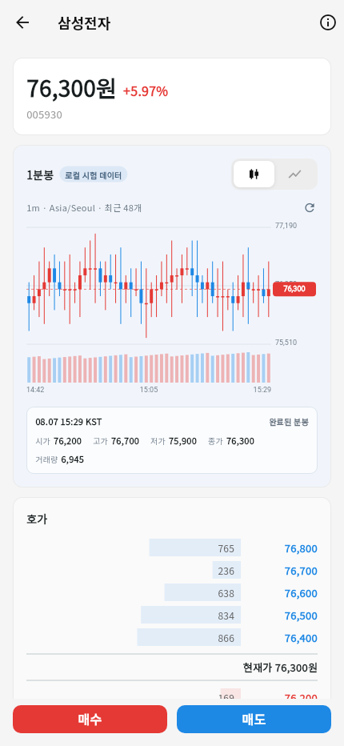

*그림 1. 고친 로컬 Flutter 화면은 서버가 반환한 OHLCV 중 최신 48개를 그립니다. `로컬 시험 데이터` 표시는 실제 시세와 혼동하지 않기 위한 경계입니다.*

화면에서 검증할 대상은 1분봉 카드입니다. 삼성전자 화면 상단의 현재가와 분봉 카드의 마지막 종가는 모두 76,300원입니다. 나머지 네 종목도 `MarketService`의 결정적 상세 가격과 `blog-local-seed`의 마지막 종가를 의도적으로 같은 값에 맞췄습니다. 서로 다른 두 로컬 데이터셋의 표시 계약을 확인한 것이며, 실시간 동기화를 증명한 것은 아닙니다.

---

## 분석 1. 믿을 수 있는 1분봉은 무엇일까

주식 화면에는 가격이 계속 바뀌어 보입니다. 이때 실제 거래가 끝난 한 건을 **체결**이라고 합니다. 누군가 사고 싶다고 제시한 가격인 호가와 달리, 체결은 가격과 수량이 실제로 확정된 기록입니다.

1분봉은 이 체결들을 1분 단위로 묶은 요약입니다. 예를 들어 09시 00분에 다음 세 건이 체결됐다고 가정해보겠습니다.

| 체결 시각 | 가격 | 수량 |
| --- | ---: | ---: |
| 09:00:05 | 70,000원 | 10주 |
| 09:00:20 | 70,500원 | 5주 |
| 09:00:50 | 69,800원 | 8주 |

이 세 건으로 만든 1분봉은 다음 값을 가집니다.

| 이름 | 의미 | 결과 |
| --- | --- | ---: |
| 시가(open) | 그 분에 가장 먼저 체결된 가격 | 70,000원 |
| 고가(high) | 그 분의 가장 높은 가격 | 70,500원 |
| 저가(low) | 그 분의 가장 낮은 가격 | 69,800원 |
| 종가(close) | 그 분에 가장 나중에 체결된 가격 | 69,800원 |
| 거래량(volume) | 체결 수량의 합 | 23주 |

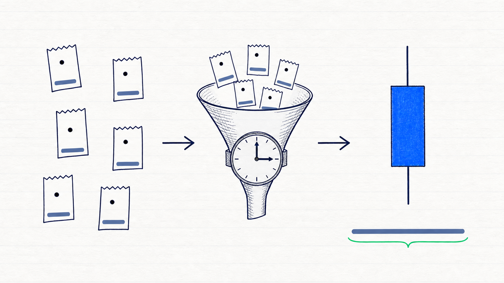

*설명용 삽화 — 여러 체결을 한 분 동안 모아 캔들 한 개와 거래량으로 요약하는 개념입니다. 실제 계산은 바로 위 표처럼 첫·최고·최저·마지막 가격과 수량 합으로 구하며, 이 그림은 실제 시세나 측정 결과가 아닙니다.*

이 다섯 값을 영문 첫 글자로 묶어 `OHLCV`라고 부릅니다. 처음에는 약어보다 “여러 체결을 한 줄로 요약한다”는 뜻을 이해하는 편이 도움이 됐습니다.

### 캔들끼리 선을 그어야 이어져 보일까

캔들 차트는 봉과 봉 사이에 선을 억지로 그리지 않습니다. 각 봉의 몸통과 꼬리를 실제 가격 위치와 시간 위치에 놓습니다. 장중에는 다음 분의 첫 체결가가 이전 분의 마지막 체결가와 같거나 가까운 경우가 많아서 여러 봉이 자연스럽게 이어져 보입니다.

처음 만든 로컬 시드는 이 관계를 고려하지 않고 각 분의 시가를 따로 계산했습니다. 삼성전자 하루의 인접한 389쌍을 확인하니 다음 시가와 이전 종가가 같은 경우가 0쌍이었고, 차이의 평균은 187.61원, 최댓값은 740원이었습니다. 아래처럼 규칙적인 톱니 모양이 생긴 이유는 차트가 선을 빼먹어서가 아니라 시험 가격이 매분 불연속적으로 뛰었기 때문입니다.

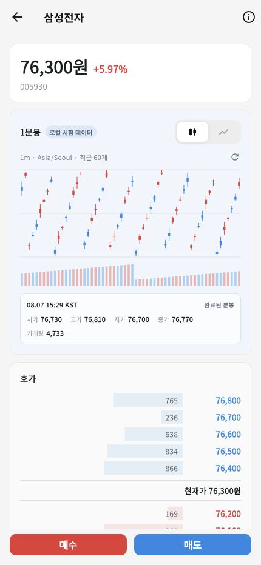

*그림 2. 잘못된 기존 시드는 캔들마다 가격 위치가 크게 뛰었습니다. 이 화면은 수정 이유를 남기기 위한 before 자료입니다.*

새 교육용 시드는 장중에 `다음 시가 = 이전 종가`가 되도록 만들었습니다. 다섯 종목 모두 장중 연결과 1분 간격이 각각 1,945/1,945쌍이었고, 잘못된 OHLCV와 가격 단위 위반은 0건이었습니다. 한 분의 가격 변화는 최대 2틱이며 종목별 각 거래일의 상승·하락 합계는 0이 되도록 만들었습니다.

여기서 **틱**은 그 종목 가격이 한 번 움직이는 최소 단위입니다.

| 종목 | 로컬 시험 가격 단위 |
| --- | ---: |
| 삼성전자(005930) | 100원 |
| SK하이닉스(000660) | 100원 |
| 카카오(035720) | 50원 |
| NAVER(035420) | 100원 |
| 현대차(005380) | 500원 |

거래일이 바뀔 때만 -2틱에서 +2틱의 갭을 허용했습니다. 따라서 전체 종목에서 가능한 원화 범위는 -1,000원에서 +1,000원이지만, 같은 2틱도 카카오는 100원이고 현대차는 1,000원처럼 종목에 따라 금액이 다릅니다.

이 규칙을 실제 시장의 정답으로 오해하면 안 됩니다. 실제 시세에서는 시초가, 거래 중단, 체결이 없던 구간 등으로 다음 시가가 이전 종가와 달라질 수 있습니다. 서버는 실제 공급자 값을 보기 좋게 만들려고 임의로 고치지 않습니다. 라인 모드에서만 연속된 구간의 종가를 선으로 잇고, 중간 1분이 빠지면 캔들 모드는 빈 공간을, 라인 모드는 끊어진 선을 보여줍니다.

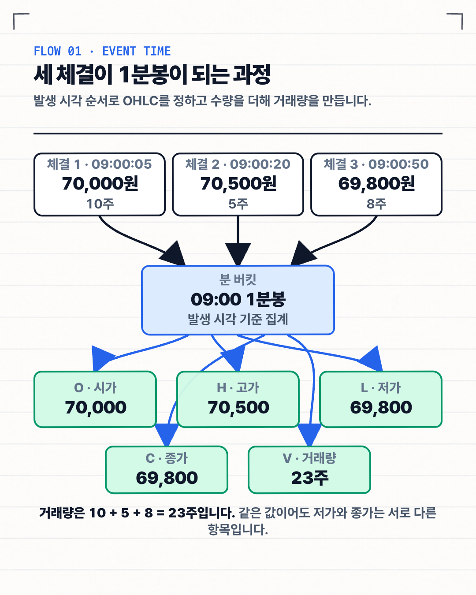

*흐름도 — 09시 00분에 발생한 세 체결을 발생 시각 순서로 모으면 O 70,000원, H 70,500원, L·C 69,800원, V 23주인 한 개의 1분봉이 됩니다.*

여기서 한 가지 선택이 생깁니다. 원래 체결을 모두 저장하면 나중에 분봉을 다시 계산할 수 있지만, 저장량과 쓰기 횟수가 커집니다. 이번 MVP는 원시 체결을 메모리에서 분봉으로 계산하고 확정된 분봉만 PostgreSQL에 저장했습니다.

KRX 정규장은 09시부터 15시 30분까지 390분입니다. 다섯 종목을 기준으로 하면 하루 최대 1,950개 구간이고, 5거래일이면 9,750개입니다. 이 정도 규모에서 저장소를 먼저 복잡하게 만들 필요가 있는지는 실제 크기를 측정한 뒤 판단하기로 했습니다.

---

## 분석 2. 어느 API에서 받을까

처음에는 가장 빠른 API를 찾으려고 했습니다. 그러나 기술적으로 시세를 받을 수 있다는 사실과 여러 사용자에게 그 시세를 보여줄 수 있다는 사실은 같지 않았습니다.

영화를 개인적으로 구매한 것과 여러 사람에게 상영할 권리를 얻은 것이 다른 것과 비슷합니다. 시세를 자체 분봉으로 가공하더라도 표시·재배포 권리가 자동으로 생긴다고 볼 수는 없습니다.

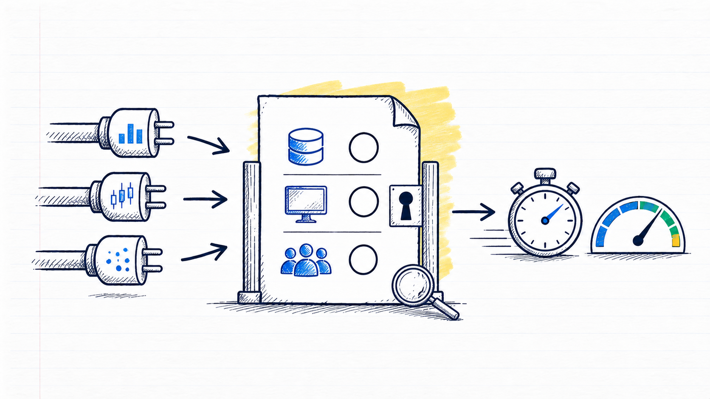

*설명용 삽화 — API 속도를 재기 전에 받은 시세를 저장하고 여러 사용자에게 보여줄 수 있는지부터 확인했습니다. 빈 확인란은 조사할 항목이며, 실제 사용 허가나 계약 승인을 받았다는 의미는 아닙니다.*

이번에는 KIS, 키움, 토스증권, LS처럼 1분봉을 만들 수 있는 증권사 API와 금융위원회·KRX·OpenDART 같은 공공 API를 분리해서 비교했습니다. 공식 문서로 확인한 조사 범위는 이 7개이며, 국내외에 존재하는 모든 API의 완전한 목록을 뜻하지 않습니다. 호출 비용이 없거나 계좌 고객에게 열려 있다는 사실과 여러 사용자에게 시세를 재배포할 수 있다는 사실도 구분했습니다.

비교 기준은 다음 여덟 가지로 고정했습니다.

1. 원시 체결 또는 1분봉을 제공하는가
2. 실시간 전달은 WebSocket인가 REST polling인가
3. 시작·재연결 때 REST 백필이 가능한가
4. 호출·구독 한도는 무엇을 기준으로 계산하는가
5. 과거 분봉을 어느 범위까지 보관하는가
6. 계좌·OAuth·허용 IP 같은 인증 조건은 무엇인가
7. 저장·화면 표시·제3자 재배포가 허용되는가
8. 현재 GrowAnt의 `MarketDataProvider`와 분봉 모델에 자연스럽게 연결되는가

한도는 응답 속도가 아니라 허용 요청량입니다. 후보 비교는 2026년 8월 14일에 진행했고 KIS·토스는 8월 15일에 공식 명세와 이용 범위를 한 번 더 확인했습니다. 공개 문서에 없는 보관기간이나 재배포 권리는 추정하지 않았습니다.

### 실제 1분봉 후보

| 후보 | 1분봉을 가져오는 방법 | 공개 문서에서 확인한 한도 | 공개 화면 사용 | 역할·현재 상태 |
| --- | --- | --- | --- | --- |
| 한국투자 KIS | `H0STCNT0` KRX 체결 WebSocket을 직접 집계하고 당일·일별 분봉 REST로 복구 | 신규 실전은 첫 3일 3회/초, 이후 18회/초. 모의 1회/초, WebSocket은 앱 키당 1세션·전 상품 합산 41개 등록. 일별 분봉은 실전 전용이며 120개/호출·보관된 범위에서 최대 1년 | 개인 시세의 제3자 제공 금지. GrowAnt 화면은 제휴와 KRX·코스콤 계약 필요 | **5종목 기술 1순위. 저장·벤치마크 서면 허가 전 실측 차단** |
| 키움 REST API | `0B` 체결 WebSocket + `ka10080` 주식분봉 REST | 국내 조회 5회/초, 토큰당 한 세션, 실시간 200종목. 과거 보관기간·페이지 크기는 공개 문서에 수치가 없음 | 약관상 개인 업무에 한해 사용하며 제3자 제공 금지 | 41종목을 넘길 때 비교할 후보 |
| 토스증권 Open API | `GET /api/v1/candles?symbol=005930&interval=1m&count=200&adjusted=false`로 공급자가 집계한 OHLCV를 REST 조회 | 기본 100개·최대 200개/호출, `before`로 과거 페이지 이동. 일반 시세 15회/초, 차트 그룹 20회/초 | 본인 매매 목적만 허용하며 외부 배포·상업적 이용 금지. 내부 공급자 시험도 서면 예외 승인 전에는 허용으로 해석하지 않음 | **기술 후보지만 현재 `RIGHTS_BLOCKED`** |
| LS OPEN API | 체결 WebSocket + `t8412`·`t8452` N분 차트 REST | 공개 상세에서 확인한 `t8412` 1회/초 | 데이터를 다른 서비스에 재사용하려면 별도 권리 확인 필요 | 저속 백필 비교 후보 |

KIS와 LS의 해당 시세 API는 공식 상세에서 무과금으로 표시됩니다. 다른 후보도 계좌 고객이 신청할 수 있지만, 주문 수수료는 이번 글의 범위가 아니어서 비교하지 않았습니다. 조회 비용이 없거나 낮더라도 시세 저장·표시·재배포 권리를 함께 얻는 것은 아닙니다.

토스증권 랜딩 페이지에는 REST와 WebSocket을 함께 언급하는 홍보 문구가 있지만, 2026년 8월 15일 현재 공식 운영 개요는 **REST API만 제공**한다고 명시하고 공개 OpenAPI 명세에도 WebSocket endpoint가 없습니다. 따라서 현재 지원이 확인된 기능만 기준으로 REST 후보로 분류했습니다. 토스의 `/trades`도 당일 최근 체결 최대 50건을 조회하는 REST API라서, 이를 반복 호출해 모든 체결 스트림을 대신하면 거래가 많은 종목에서 누락될 수 있습니다.

### 공공 API가 1분봉 대안이 될 수 있을까

| 후보 | 실제 갱신·데이터 | 공개 호출 한도 | 1분봉에서 맡을 수 있는 역할 |
| --- | --- | --- | --- |
| 금융위원회 주식시세정보 | 일별 OHLCV를 하루 한 번 갱신하며 기준일 다음 영업일 13시 이후 제공 | 개발계정 10,000회/일 | 1분봉 불가. 전일 일봉·일일 합계 참고 |
| KRX 무료 OPEN API | 주식 API는 일별매매정보이며 당일·실시간·장중 데이터 미제공 | 키당 10,000회/일 | 1분봉 불가. 일봉 참고 |
| OpenDART | 공시, 기업 개황, 재무정보를 제공하며 가격·체결·OHLCV는 미제공 | 일반적으로 20,000건 이상 요청에서 제한 오류가 날 수 있으나 공개 가이드에 시간 단위는 명시되지 않음 | 차트 위 공시 이벤트 표시에는 유용하지만 분봉 원천은 아님 |

즉 이번에 확인한 공공 API는 “몇 분 늦은 1분봉”이 아니라 **애초에 1분봉을 제공하지 않거나 D+1 일별 데이터**입니다. 호출 한도가 1만 회여도 입력 데이터의 시간 단위가 일봉이면 1분봉 390개로 복원할 수 없습니다. KRX 실시간 체결은 무료 OPEN API가 아니라 별도 시장 데이터 상품이며, 공개 서비스에서 수신·표시하려면 KRX·코스콤 계약이 필요합니다.

숫자로 요약하면, 이 조사 범위에서 **계좌 없이 누구나 쓰는 무료 공개 API 중 국내주식 실시간 체결 또는 1분봉을 제공한 것은 0개**였습니다. 계좌·앱 신청 후 1분봉을 기술적으로 만들거나 조회할 후보는 KIS·키움·토스·LS 4개였지만, API 조회 비용과 공개 재배포 권리는 별개입니다. 따라서 “무료 후보가 네 개”를 “GrowAnt 공개 서비스에 네 개 모두 사용 가능”으로 바꾸어 말하지 않습니다.

표의 `18회/초` 같은 값은 응답이 1초 안에 온다는 뜻이 아니라 서버가 허용하는 요청 횟수의 상한입니다. 토스의 20회/초도 `클라이언트 × API 그룹` 기준 현재값이며 운영 중 바뀔 수 있어 실제 응답의 `X-RateLimit-Limit` 헤더를 기준으로 제어해야 합니다. 실제 속도는 공급자 시각부터 우리 서버 수신까지 걸린 시간, 끊김, 누락, 재연결과 백필 완료 시간을 따로 측정해야 합니다.

### 그래서 지금 어떤 API를 채택할 수 있을까

먼저 결론부터 말하면, **GrowAnt 공개 운영에 채택할 수 있는 개인용 무료 API는 현재 0개**입니다. KIS·키움은 개인 시세의 제3자 제공을 금지하고, 토스는 본인 매매 목적만 허용하며 외부 배포·상업적 이용을 금지합니다. 사용자마다 자기 앱 키를 넣는 방식도 GrowAnt가 제3자 서비스를 제공한다는 사실을 자동으로 바꾸지 않으므로 계약을 대신하지 못합니다.

기술 후보와 운영 채택은 분리했습니다.

| 판단 역할 | 현재 결론 | 다음 조건 |
| --- | --- | --- |
| 공개 다중 사용자 운영 공급자 | **채택 없음** | KRX·코스콤/NXT 또는 증권사·데이터 사업자의 저장·표시·재배포 계약 |
| 5종목 실제 수집 기술 후보 | **KIS 조건부 1순위** | 저장·파생·내부 벤치마크 범위의 서면 허가와 실전 read-only 계정 |
| 완성 1분봉 REST 기술 후보 | **토스 기능 적합, 권리 차단** | 본인 매매 목적 밖의 저장·벤치마크에 대한 명시적 서면 예외 승인 |
| 현재 실제 공급자 | **`sim`만 존재** | 실제 어댑터와 실거래일 관측은 아직 없음 |

KIS를 조건부 기술 1순위로 둔 이유는 현재 공급자 경계에 실시간 체결과 REST 복구를 함께 연결해 중복·역순·늦은 데이터 처리를 검증할 수 있기 때문입니다. 다섯 종목은 41개 등록 한도 안에 있습니다. 하지만 KIS 체결 시각은 초 단위이고 재연결 전후를 관통하는 공급자 event ID도 확인되지 않았으므로 서브초 지연이나 완전한 tick 복구를 과장할 수 없습니다. 무엇보다 저장·벤치마크 사용은 공개 약관만으로 허용됐다고 볼 수 없어 서면 답변 전에는 실제 수집을 시작하지 않습니다.

토스 REST는 공급자가 집계한 1분 OHLCV를 가장 적은 코드로 읽는 기술 경로입니다. 다만 공식 캔들 응답에는 `timestamp`, OHLCV와 통화만 있고 GrowAnt가 노출하는 `tradeCount`와 명시적인 `isFinal`은 없습니다. 모르는 값을 `0`이나 `true`로 꾸며 PostgreSQL 원본에 넣어서는 안 됩니다. 현재는 기능보다 이용 범위가 먼저 탈락 조건이므로 실제 polling·저장·화면 실험도 서면 승인 뒤로 미룹니다.

토스의 `adjusted` 기본값은 `true`입니다. KIS 체결을 직접 집계한 원시 가격과 대조할 때는 `adjusted=false`로 의미를 맞추고, 장기 사용자 차트에 수정주가를 쓸지는 별도 제품 정책으로 결정해야 합니다. `before`는 경계 시각을 포함하므로 다음 페이지에서는 응답의 `nextBefore`를 그대로 사용하고 중복 경계를 검사합니다.

공개 출시의 Gate 0은 KRX·코스콤/NXT 또는 증권사·데이터 사업자와의 시세 이용 계약입니다. 기술 점수가 높아도 이 권리 gate를 통과하지 못하면 최종 점수표에 올리지 않습니다.

KOSPI 전체 확장은 5종목의 단순 배수가 아닙니다. KIS 개인 키 한 개는 WebSocket 합산 41개 등록이라 전 종목을 담을 수 없습니다. 토스는 한 요청에 한 종목을 읽으므로 차트 그룹 20회/초를 전부 사용해도 이론상 분당 1,200종목, 20% 여유를 두면 약 960종목입니다. 종목별 polling 완료 시각도 한 분 안에서 벌어지고 현재 이용 권리도 차단돼 있습니다. 키움의 공개 200종목/세션 역시 전체 시장 계약을 대신하지 못합니다. 따라서 매일 계약 종목 master를 갱신하고, 계획용 1,000종목을 거쳐 실제 universe의 1.2배로 서버를 재생 시험하되 운영 원천은 전체시장 권리와 SLA를 가진 정식 피드로 다시 선정합니다.

현재 서버에는 KIS나 토스의 실제 어댑터가 없습니다. 로컬 `sim`이 만든 체결로 집계·저장 흐름만 검증한 상태이며, 실제 공급자는 사용 권리와 계정을 확보한 뒤 같은 다섯 종목, 같은 거래 시간, 같은 장비에서 비교해야 합니다.

### REST와 WebSocket은 경쟁 관계가 아니었습니다

REST는 필요한 시점에 요청하고 한 번 응답받는 방식입니다. WebSocket은 연결을 유지한 채 새 체결을 계속 받는 방식입니다.

진행 중인 봉을 빠르게 바꾸려면 WebSocket이 어울립니다. 하지만 연결이 끊긴 동안의 체결은 알 수 없으므로, 과거 분봉 REST로 빈 구간을 다시 채워야 합니다. 이 작업을 **백필(backfill)**이라고 합니다.

이번에 세운 목표는 다음과 같습니다.

> WebSocket으로 현재 체결을 받고, REST로 과거와 누락 구간을 복구합니다.

현재 구현 범위는 로컬 체결 집계와 확정 분봉 REST 조회까지입니다. 실제 공급자 WebSocket 연결과 REST 백필은 후속 검증 범위입니다.

---

## 실행 1. 실제 공급자보다 먼저 로컬 파이프라인을 만든 이유

수집, 계산, 저장, 조회를 하나의 기능으로 묶으면 장애 원인을 찾기 어렵습니다. 그래서 각 단계의 책임을 나눴습니다.

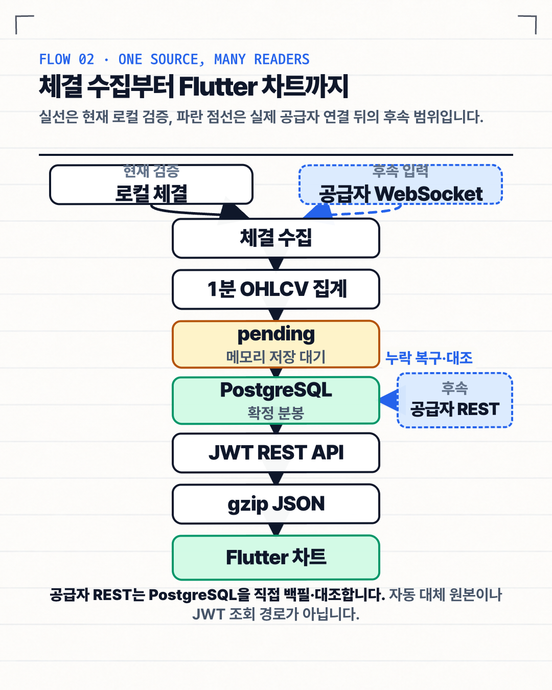

*구조도 — 실선은 현재 로컬 체결로 검증한 수집·집계·저장·조회 경로이고, 실제 공급자 WebSocket 연결과 점선의 공급자 REST 누락 복구·대조는 후속 범위입니다.*

공급자 연결은 사용자마다 만들지 않습니다. 서버가 종목별 체결을 한 번 받고, 여러 사용자는 우리 서버의 조회 API를 사용합니다. 사용자 수가 늘어도 증권사 연결 수가 함께 늘지 않게 하기 위한 구조입니다.

### 서버에 도착한 순서로 계산하면 안 되는 이유

체결이 실제로 발생한 순서와 서버에 도착한 순서는 다를 수 있습니다. 09:00:05 체결이 네트워크 지연으로 09:00:20 체결보다 늦게 도착할 수도 있습니다.

이때 도착 순서로 시가와 종가를 정하면 같은 체결을 받아도 결과가 달라집니다. 그래서 집계기는 체결 발생 시각 `occurredAt`과 같은 시각 안의 순번 `sequence`를 함께 비교합니다.

```kotlin
fun add(tick: TradeTick): Boolean {
    if (!identities.add(tick.identity())) return false

    val order = TickOrder(tick.occurredAt, tick.sequence)
    if (order < firstOrder) {
        firstOrder = order
        open = tick.price
    }
    if (order > lastOrder) {
        lastOrder = order
        close = tick.price
    }
    high = maxOf(high, tick.price)
    low = minOf(low, tick.price)
    volume += tick.quantity
    tradeCount++
    return true
}
```

첫 줄은 같은 체결이 다시 들어오면 거래량에 더하지 않습니다. 더 이른 체결은 시가를, 더 늦은 체결은 종가를 바꿉니다. 고가·저가·거래량은 모든 체결을 보며 갱신합니다.

실제 공급자를 연결할 때는 `sequence`가 재연결 전후에도 체결을 안정적으로 구분하는지 확인해야 합니다. 현재 `sim`의 순번만으로 실제 공급자의 중복 처리까지 검증했다고 말할 수는 없습니다.

### 1분이 끝나도 최소 5초를 더 기다렸습니다

09시 01분이 되는 순간 09시 00분 봉을 닫으면 조금 늦게 도착한 체결을 놓칠 수 있습니다. 현재 서버는 `현재 시각 - 5초`를 워터마크로 계산하고, 1초 간격 스케줄러가 닫을 수 있는 봉을 확인합니다. 따라서 분 종료 최소 5초 뒤, 스케줄러 실행 시점에 따라 보통 약 5~6초 뒤에 확정됩니다.

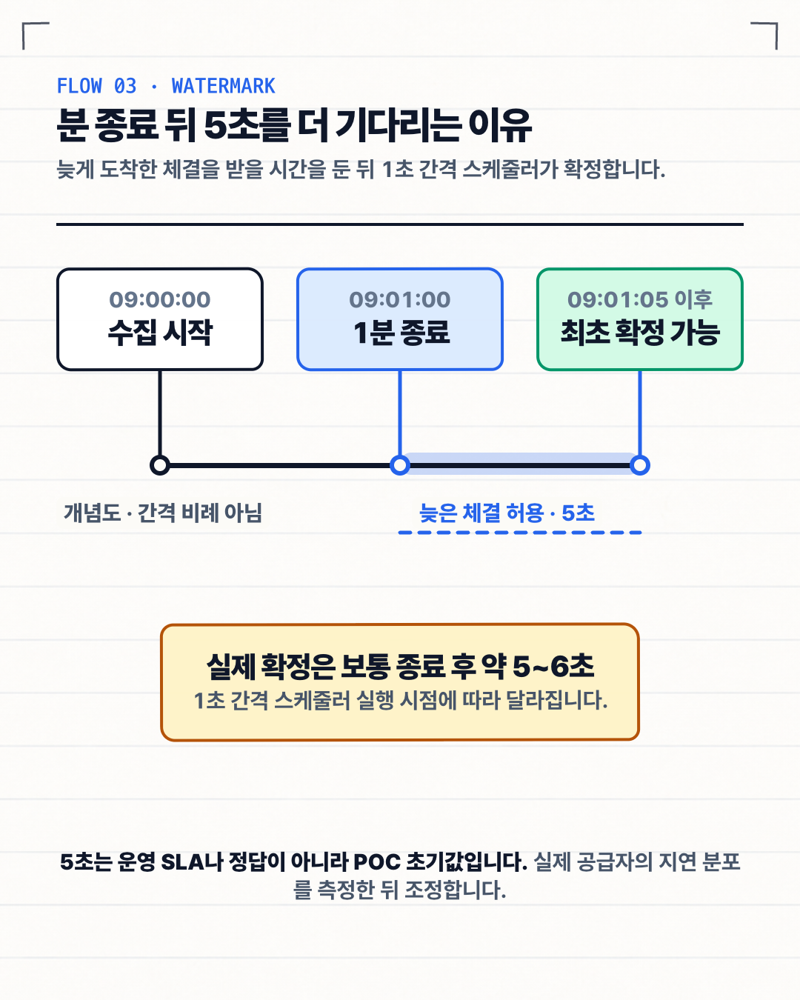

*타임라인 — 09시 00분 봉은 09시 01분에 끝나지만 5초의 늦은 체결 허용 구간을 둔 뒤, 1초 스케줄러 실행 시점에 따라 보통 약 5~6초 뒤 확정됩니다. 5초는 POC의 초기값이며 그림의 간격은 실제 시간 비율이 아닙니다.*

이 마감 기준을 워터마크라고 부릅니다. 5초는 정답이 아니라 POC의 초기값입니다. 실제 공급자의 지연 분포를 측정한 뒤 정확성과 화면 갱신 속도 사이에서 다시 조정해야 합니다.

---

## 실행 2. 계산한 분봉을 잃지 않고 저장하려면

분봉 계산이 끝났더라도 DB 저장은 실패할 수 있습니다. 계산 직후 메모리에서 지우면 DB가 잠시 느려진 순간의 분봉을 잃습니다.

현재 서버는 확정된 분봉을 `pending`, 즉 저장 대기 목록으로 옮깁니다. DB 저장이 성공한 뒤에만 목록에서 제거하고, 실패하면 다음 주기에 다시 시도합니다.

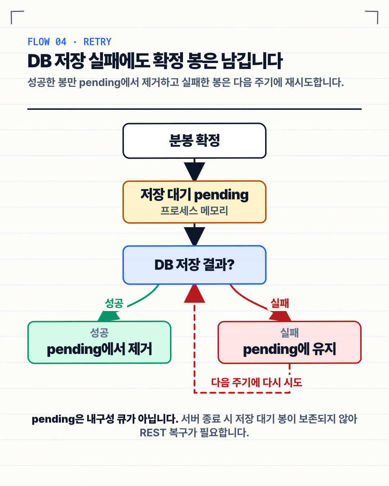

*흐름도 — 확정 분봉은 메모리 pending에 보관되고 DB 저장 성공 때만 제거됩니다. 실패하면 다음 주기에 다시 시도하지만, 서버가 종료되면 pending은 보존되지 않습니다.*

다만 `pending`은 메모리에 있습니다. DB가 잠시 실패하는 상황에는 다시 시도할 수 있지만, 서버 프로세스가 종료되면 저장 대기 데이터와 진행 중인 봉을 잃습니다. 운영 전에는 재시작한 구간을 REST로 다시 받거나, 내구성 있는 저장 경로를 추가해야 합니다.

### 같은 분봉이 여러 번 오면 최신 보정만 반영합니다

분봉은 `종목 코드 + 분 시작 시각`으로 식별합니다. 같은 분봉을 다시 저장할 때는 `revision`이라는 개정 번호를 비교합니다.

```sql
ON CONFLICT (ticker, bucket_start) DO UPDATE SET
    open = EXCLUDED.open,
    high = EXCLUDED.high,
    low = EXCLUDED.low,
    close = EXCLUDED.close,
    volume = EXCLUDED.volume,
    trade_count = EXCLUDED.trade_count,
    revision = EXCLUDED.revision
WHERE minute_candles.revision < EXCLUDED.revision;
```

처음 만든 스트림 분봉은 revision 0입니다. 같은 revision이 다시 오면 기존 행을 바꾸지 않고, 더 높은 revision만 반영합니다. 이렇게 하면 늦게 도착한 오래된 결과가 이미 보정한 값을 덮어쓰는 일을 막을 수 있습니다.

이 방식을 **멱등 저장**이라고 설명할 수 있습니다. 같은 작업을 여러 번 시도해도 최종 결과가 한 번 처리한 것과 같게 유지되는 성질입니다.

더 높은 revision을 자동으로 만드는 REST 대조 작업은 구현 범위에 포함되지 않았습니다. 이번 단계에서는 보정 데이터를 안전하게 받을 스키마와 저장 조건까지 검증했습니다.

같은 revision인데 값이 다른 `REVISION_CONFLICT`는 일시적인 DB 오류와 성격이 다릅니다. 현재는 이 봉도 메모리 `pending`에 남아 반복 시도될 수 있습니다. 운영 적용 때는 동일 데이터는 성공으로, 낮은 revision은 무시와 지표 기록으로 처리하고, 같은 revision·다른 값은 자동 재시도를 멈춰 quarantine과 알림으로 보내야 합니다.

현재 `source_updated_at`도 저장 SQL에서 `now()`로 채우므로 이름과 달리 공급자 갱신 시각이 아니라 GrowAnt의 저장 시각에 가깝습니다. 다음 migration에서는 `ingested_at`으로 의미를 바로잡거나 공급자 원천 갱신 시각과 수집 시각을 두 필드로 분리합니다. 이미 적용된 migration은 수정하지 않습니다.

---

## 결과 1. 분봉 하나는 얼마나 크고, 어디를 압축해야 할까

컬럼 타입의 바이트만 더하면 실제 DB 크기를 알기 어렵습니다. PostgreSQL에는 행 정보와 페이지 여유 공간, 기본키 인덱스도 함께 저장되기 때문입니다.

2026년 8월 11일, PostgreSQL 16.14에 5종목 × 390분 × 5거래일인 9,750행을 다시 넣어 측정했습니다.

| 항목 | 로컬 실측값 |
| --- | ---: |
| 테이블 heap | 1,171,456B |
| 기본키 인덱스 | 360,448B |
| 전체 관계 크기 | 1,531,904B |
| 분봉 한 개당 관계 크기 | 157.118B |
| 삽입 WAL | 2,153,408B |
| 분봉 한 개당 WAL | 220.862B |
| 9,750행 batch 시간 | 181.685ms |
| batch 처리량 | 53,664행/초 |

한 행당 157.118B는 테이블과 기본키 인덱스를 합친 평균입니다. WAL은 장애 복구를 위한 변경 기록이므로 행 옆에 영구적으로 붙는 크기는 아닙니다. batch 처리량도 9,750행을 한 번에 넣은 결과라서 실제 수집 TPS로 바꾸어 읽으면 안 됩니다.

연 252거래일 동안 매분 체결이 있다고 가정하면 5종목은 491,400봉입니다. 현재 행당 평균을 그대로 곱한 단순 선형 추산은 약 77.2MB, 약 73.6MiB입니다. 실제 1년치 DB를 적재한 측정값이 아니며, 데이터가 커질 때 달라질 인덱스 깊이와 페이지 효율도 반영하지 않았습니다.

같은 방식으로 종목 수와 보관기간을 늘리면 다음 정도가 됩니다.

| 범위 | 1년 | 3년 | 5년 |
| --- | ---: | ---: | ---: |
| 5종목 | 49.1만 봉 · 77.2MB | 147.4만 봉 · 231.6MB | 245.7만 봉 · 386.0MB |
| 50종목 | 491.4만 봉 · 772.1MB | 1,474.2만 봉 · 2.32GB | 2,457만 봉 · 3.86GB |
| 200종목 | 1,965.6만 봉 · 3.09GB | 5,896.8만 봉 · 9.26GB | 9,828만 봉 · 15.44GB |

이 표도 heap과 현재 기본키 인덱스의 평균만 선형으로 늘린 값입니다. WAL 보관, 백업, 복제본, vacuum 여유 공간과 원시 체결 저장은 포함하지 않습니다. 사용자 수는 분봉 원본 행 수를 늘리지 않고, 종목 수와 보관기간이 저장량을 늘립니다. 이 규모에서는 데이터베이스를 바꾸기보다 누락 복구, 서버 재시작과 보존 정책을 먼저 해결하는 편이 우선이라고 판단했습니다.

### 집계 계산 자체도 분리해서 측정했습니다

단일 JVM thread에서 1,950,000개 체결을 재생해 1,950개 분봉을 만들었습니다. 중앙 처리 시간은 95.880ms, p95는 97.674ms였고 중앙 처리량은 초당 20,337,922체결이었습니다. 가장 느린 회차도 초당 19,964,397체결을 처리했습니다.

이 숫자는 네트워크 수신, JSON 해석, DB 저장을 뺀 메모리 집계 결과입니다. 전체 서버가 초당 약 2,034만 체결을 처리한다는 뜻이 아니라, 다섯 종목의 OHLCV 계산이 현재 우선 병목은 아니라는 근거로만 사용했습니다.

### 체결을 분봉으로 만드는 것과 gzip은 다른 작업입니다

체결을 분봉으로 바꾸면 개별 거래 순서와 가격을 원래대로 되돌릴 수 없습니다. 차트에 필요한 정보만 남기는 손실 요약입니다.

gzip은 완성된 JSON의 내용을 잃지 않고 전송 크기만 줄입니다. 압축을 풀면 원래 JSON을 다시 얻을 수 있습니다.

서버에는 다음 설정을 적용했습니다.

```yaml
server:
  compression:
    enabled: true
    mime-types: application/json
    min-response-size: 1KB
```

| 조회 범위 | 원본 JSON | gzip | 감소율 |
| --- | ---: | ---: | ---: |
| 1거래일, 390개 | 56,658B | 5,177B | 90.9% |
| 5거래일, 1,950개 | 282,858B | 24,230B | 91.4% |

압축이 항상 공짜인 것은 아닙니다. 데이터를 압축하고 푸는 데 CPU를 사용하므로 응답 크기와 처리 속도를 함께 측정해야 합니다.

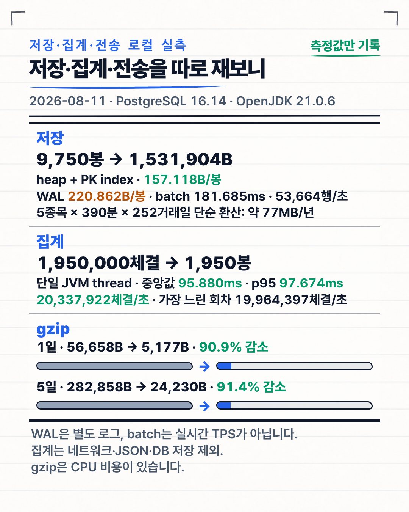

*그림 3. 같은 로컬 장비에서 저장·집계·전송을 나누어 측정했습니다. 각 숫자가 포함하지 않는 범위도 이미지 하단에 함께 표시했습니다.*

---

## 실행 3. 로컬 Flutter 화면과 연결하기

Flutter 클라이언트에는 서버 응답과 같은 `MinuteCandle` 모델을 추가했습니다. `MarketRepository`가 JWT와 조회 범위를 담아 REST API를 호출하고, Riverpod provider를 거쳐 `CandleChart`가 서버 OHLCV를 그대로 그립니다.

아래는 실제 연결 경로에서 핵심 호출만 모은 코드입니다.

```dart
// market_repository.dart
final res = await _dio.get(
  '/api/market/$ticker/candles',
  queryParameters: {
    'from': from.toUtc().toIso8601String(),
    'to': to.toUtc().toIso8601String(),
  },
);
return MinuteCandleSeries.fromJson(res.data as Map<String, dynamic>);

// stock_detail_screen.dart
final candlesAsync =
    ref.watch(minuteCandleSeriesProvider(widget.detail.ticker));
CandleChart(candles: visible)
```

클라이언트는 기본적으로 서울 시각의 가장 최근 거래일 시작부터 현재까지를 조회합니다. 주말이나 월요일 장 시작 전에는 직전 금요일로 시작 시각을 옮깁니다. 응답은 시간순으로 정렬한 뒤 최신 48개만 화면에 그립니다. 네트워크에서 받은 390개를 모두 같은 폭에 넣기보다 캔들 몸통과 시간 간격을 읽을 수 있는 밀도를 유지하기 위한 선택입니다.

화면 캡처는 2026년 8월 3일부터 7일까지 만든 결정적 역사 시드를 사용했습니다. 캡처 시점인 8월 11일의 기본 범위에는 이 데이터가 들어오지 않기 때문에 캡처 빌드에만 `MARKET_CANDLE_LOOKBACK_DAYS=7`을 주었습니다. 일반 빌드의 기본값은 자동 거래일 계산이며, 화면에는 조회된 값 중 최신 48개만 그렸습니다.

API는 삼성전자 `005930`의 5거래일 분봉 1,950개를 HTTP 200으로 반환했습니다. 마지막 분봉은 `2026-08-07 15:29 KST`이며 값은 다음과 같습니다.

- 시가 76,200원, 고가 76,700원, 저가 75,900원, 종가 76,300원
- 거래량 6,945주, 체결 수 39건
- `final=true`, `revision=1`

증거 검사는 예상한 5종목과 종목별 1,950개, 각 종목의 첫·마지막 시각을 먼저 확인했습니다. 삼성전자는 API와 DB의 1,950개 분봉을 첫 번째부터 마지막까지 순서대로 비교했습니다. 시간, OHLCV, 체결 수, 확정 여부와 revision이 모두 일치해야만 통과합니다.

검사가 실제 오류도 잡는지 확인하려고 한 종목 전체, 첫 봉, 마지막 봉, 중간 봉을 각각 삭제하고 고가를 1 올리는 다섯 가지 잘못된 상태를 만들었습니다. 모든 경우에 검사가 실패했고, 시드를 다시 넣은 뒤 원래 9,750개 행으로 복구되는 것까지 확인했습니다. 정상 데이터에서는 각 종목의 장중 연결과 1분 간격이 1,945/1,945쌍, 잘못된 OHLCV와 동적 가격 단위 위반은 0건, 한 분의 최대 움직임은 2틱, 일별 움직임 합계는 0이었습니다.

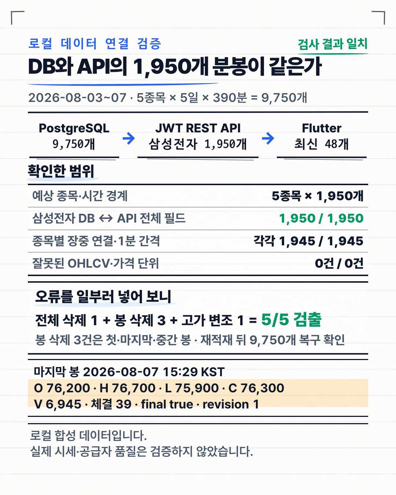

*그림 4. 예상한 5종목과 시각 경계, 삼성전자 DB·API 1,950개 전체 필드, 가격 단위와 오류 주입 실패를 확인했습니다. Authorization 값은 출력하지 않았습니다.*

그림 4가 직접 보여주는 것은 로컬 DB와 JWT REST API의 분봉이 같고 오류 주입 검사가 잘못된 상태를 잡았다는 사실입니다. 그림 1에서는 Flutter 분봉 카드의 마지막 값과 API 응답을 별도로 대조했습니다. 두 검사를 합쳐 저장·조회·표현 경로를 확인했지만, 데이터 출처는 `blog-local-seed`이므로 실제 증권사 시세의 정확성이나 실시간성을 증명하지는 않습니다.

---

## 결과 2. 빠르다고 말하기 전에 무엇을 측정했을까

이 절의 k6는 실제 증권사·거래소 endpoint가 아니라 `blog-local-seed`를 읽는 GrowAnt JWT REST backend만 가압했습니다. 분봉 수집 write도 껐으므로 아래 숫자는 공급자 속도나 read/write 동시 부하가 아닙니다.

화면이 보인다는 사실과 데이터 규칙이 맞다는 사실은 다릅니다. 8월 14일 현재 기준으로 다시 실행한 결과 서버 단위·웹 테스트 73개, PostgreSQL 통합·동시성 테스트 27개, Flutter 테스트 62개가 모두 성공했고 Flutter 정적 분석 문제도 0개였습니다.

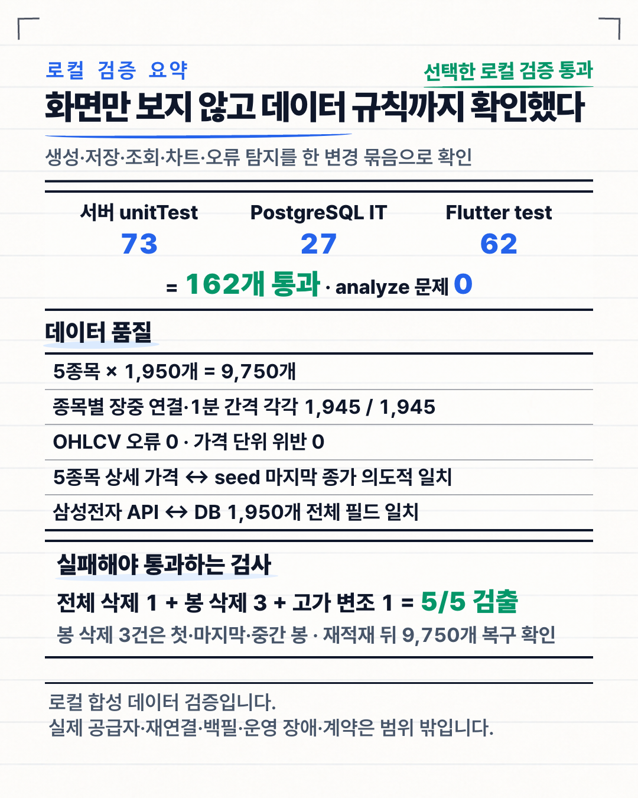

*그림 5. 서버 단위·웹 테스트 73개, PostgreSQL `*IT` 27개, Flutter 테스트 62개와 정적 분석을 함께 확인했습니다. 이 결과가 실제 공급자 장애나 운영 환경의 모든 문제를 보증하지는 않습니다.*

성능 숫자는 뜻을 모르면 판단하기 어렵습니다. VU는 쉬지 않고 요청을 반복하는 가상 사용자이고, p95는 요청 100개를 빠른 순서로 놓았을 때 95번째 요청의 응답 시간입니다. 처리량은 1초 동안 완료한 요청 수입니다.

이번 k6 합격선은 p95 200ms 미만, HTTP 오류율 1% 미만, 상태·`success`·최소 봉 수 검사 성공률 99% 초과로 잡았습니다. 이 검사는 매 요청의 OHLCV 전체 필드를 대조하는 검사가 아닙니다. 각 시나리오는 gzip을 사용해 20초 동안 실행했습니다.

8월 11일의 첫 B0 측정에서는 5일·100 VU를 세 번 실행했고 모두 임시 기준을 통과했습니다. 그러나 가장 느린 회차의 p95가 196.651ms로 기준에 3.349ms까지 다가갔고, p99는 337.026ms였습니다. 한 번 통과한 표를 결론으로 쓰기에는 흔들림이 컸습니다.

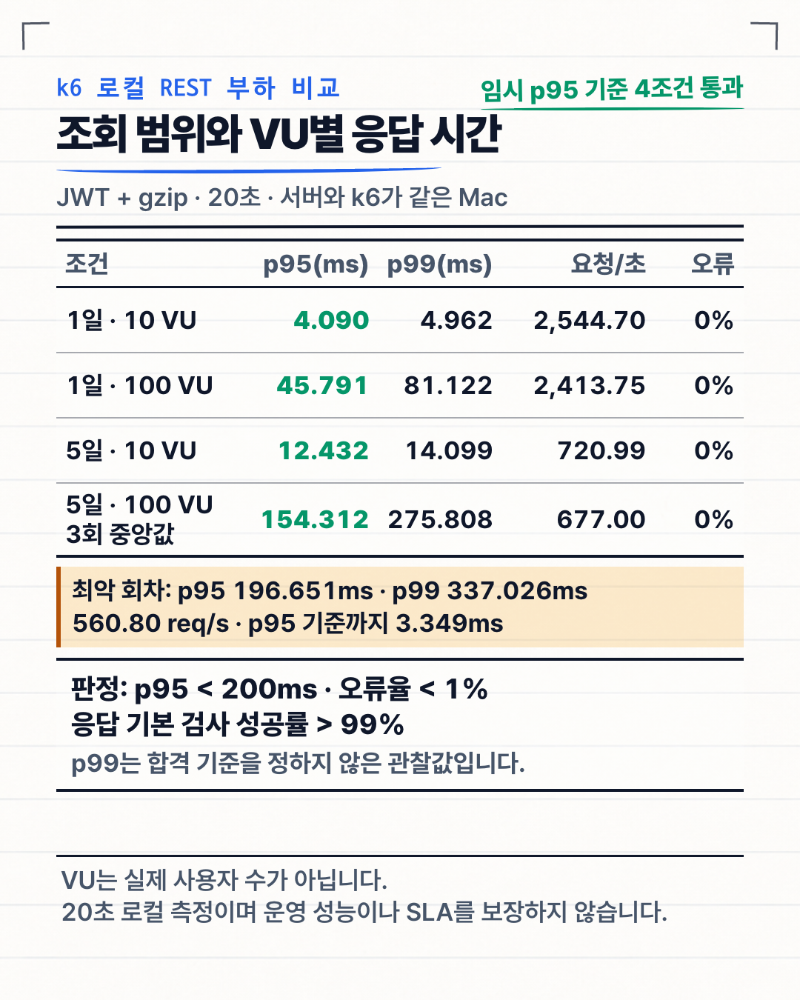

*그림 6. B0 첫 측정은 네 조건이 모두 통과했지만, 5일·100 VU의 최악 p95가 임시 기준에 매우 가까웠습니다. 이 이미지는 후속 재검증이 필요하다고 판단한 출발점입니다.*

그래서 8월 14일 B1에서는 네 조건을 모두 세 번씩, 총 12회 다시 실행했습니다. 단순한 실행 순서 영향을 줄이기 위해 두 번째 반복은 높은 부하부터 역순으로 진행했고, 격리한 PostgreSQL에 5종목 9,750개 시드를 넣었습니다. 부하는 삼성전자 `005930`의 같은 1일 또는 5일 구간을 반복하는 hot read이며, Nginx·TLS를 거치지 않은 backend 직접 요청입니다. 분봉 수집은 꺼서 실시간 write와 read의 동시 경합도 포함하지 않았습니다. 애플리케이션 코드와 k6 스크립트는 측정 commit 대비 바뀌지 않았습니다.

| 조회 범위·부하 | 요청/초 중앙값 | p95 중앙값 | p99 중앙값 | 오류율 | 결과 |
| --- | ---: | ---: | ---: | ---: | --- |
| 1일 · 10 VU | 1,701.93 | 6.739ms | 7.791ms | 0% | PASS 3/3 |
| 1일 · 100 VU | 1,661.27 | 66.079ms | 110.933ms | 0% | PASS 3/3 |
| 5일 · 10 VU | 525.71 | 18.983ms | 22.672ms | 0% | PASS 3/3 |
| 5일 · 100 VU | 517.81 | 203.918ms | 213.903ms | 0% | **FAIL 0/3** |

5일·100 VU의 p95는 `203.918ms`, `202.757ms`, `210.552ms`로 세 번 모두 임시 기준을 넘었습니다. 최대 응답 시간도 각각 `403.612ms`, `528.946ms`, `434.590ms`였습니다. 다만 12회 모두 HTTP 오류율은 0%, 상태·`success`·최소 봉 수 검사는 100%였습니다.

더 중요한 신호는 처리량입니다. 5일 조회를 10 VU에서 100 VU로 올렸는데도 중앙 처리량은 525.71에서 517.81요청/초로 늘지 않았고, p95만 18.983ms에서 203.918ms로 약 10.7배 증가했습니다. 현재 한 대의 Mac 안에서 백엔드·PostgreSQL·k6가 자원을 공유하므로 원인이 CPU, gzip, Hikari pool 5개, DB 또는 부하 발생기 중 무엇인지는 이 결과만으로 구분할 수 없습니다.

B1이 B0보다 느렸다고 해서 성능 회귀라고 단정하지도 않았습니다. B0의 원시 결과와 완전히 동일한 환경 manifest가 없기 때문입니다. 현재 결론은 더 좁습니다. **5거래일 전체 조회는 이 로컬 조건에서 이미 포화 신호가 보였고, 첫 화면 기본 요청으로 사용하면 안 됩니다.** 실행 환경·범위·원시 요약 hash는 [B1 부하 재검증 기록](B1-LOAD-TEST-EVIDENCE.md)에 남겼습니다.

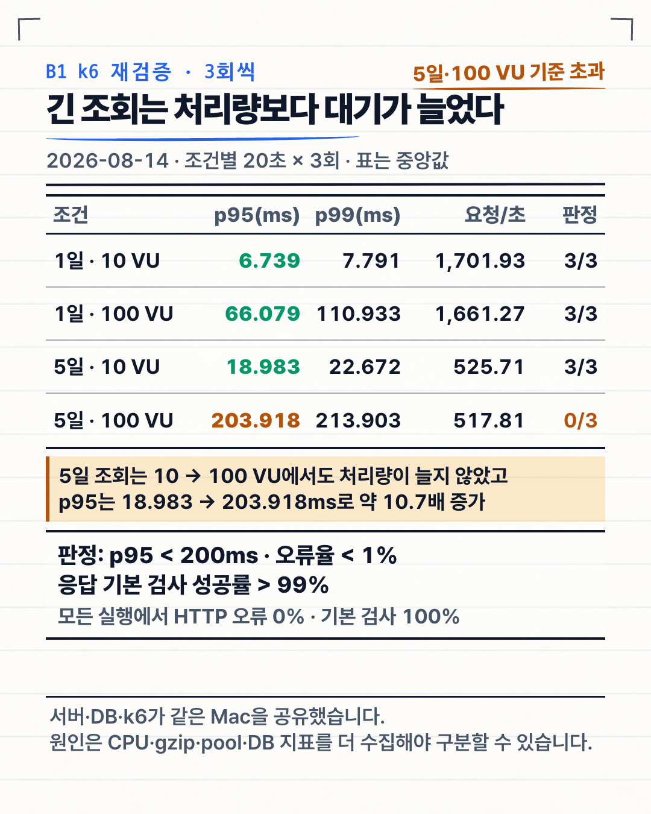

*그림 7. B1 재검증에서는 1일 조건과 5일·10 VU는 통과했지만, 5일·100 VU는 세 번 모두 p95 200ms 미만 기준을 넘었습니다. 오류는 없었지만 지연과 처리량 정체가 나타났습니다.*

클라이언트는 처음에 가장 최근 거래일만 요청하고, 그중 최신 48개를 그립니다. B1에서 5일·10 VU는 통과했지만 5일·100 VU는 세 번 모두 실패했고, 5일 응답은 1일보다 원본 크기도 약 다섯 배였습니다. 사용자가 과거로 이동할 때 이전 구간을 추가로 읽는 방식이 5일 전체를 첫 화면에 보내는 것보다 네트워크와 화면 밀도 모두에 맞았습니다.

VU 100을 실제 사용자 100명과 같다고 볼 수는 없습니다. 실제 사용자는 화면을 보고 쉬는 시간이 있지만, 이번 시험은 20초 동안 대기 없이 요청을 반복했고 서버와 k6도 같은 Mac에서 실행했습니다. 이 결과는 운영 보장이나 SLA가 아닙니다. 운영 판단에는 분리된 부하 발생기와 더 긴 단계 시험, 장시간 안정성 시험이 필요합니다.

---

## 확장. 사용자가 늘면 증권사 연결도 늘려야 할까

사용자마다 공급자 WebSocket을 열거나 REST 분봉을 polling하면 외부 API 한도와 사용자 수가 직접 연결됩니다. 공급자 수집은 종목 수에 맞춰 서버 한 곳에서 유지하고, 사용자에게 전달하는 API와 캐시 계층을 확장하는 편이 안전합니다.

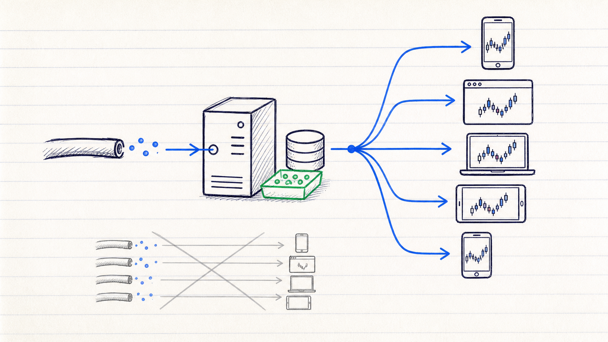

*설명용 삽화 — 목표 구조는 사용자마다 공급자 연결을 만드는 것이 아니라, 서버가 한 번 받은 시세를 여러 조회 요청에 나누어 전달하는 방식입니다. 현재 이 구조의 운영 배포나 실시간 fan-out이 끝났다는 의미는 아닙니다.*

현재 결과를 바탕으로 확장 순서를 다음처럼 잡았습니다.

1. 첫 화면은 가장 최근 거래일만 조회합니다.
2. 과거 구간은 사용자가 이동할 때 추가로 가져옵니다.
3. 끝난 거래일의 분봉은 종목과 날짜 단위로 캐시합니다.
4. WebSocket 구독과 REST polling 수집기는 전용 worker 하나로 분리하고, API 서버만 사용자 부하에 맞춰 늘립니다.
5. 진행 중인 마지막 분봉만 WebSocket 또는 SSE로 전달합니다.

다섯 종목 단계에서는 이 구조를 모두 미리 만들지 않습니다. DB 연결 대기, 응답 직렬화 CPU, 네트워크 전송량, 캐시 적중률을 관찰하고 실제 병목이 확인될 때 한 단계씩 적용합니다.

여기서 용량은 가입자 수만으로 계산할 수 없습니다. `동시에 차트를 연 세션 수 × 첫 조회 횟수 + 과거 페이지 요청 + 진행 봉 갱신 빈도`로 목표 RPS를 정해야 합니다. 현재 k6의 VU는 쉬지 않고 요청하므로 실제 사용자 수와 일대일로 대응하지 않습니다.

---

## 다음 행동. 공식 문서의 선택을 실제 데이터로 검증하기

실제 공급자 호출 전 Gate 0에서 시험 호출 자체가 허용되는지 먼저 서면으로 확인합니다. 이어 `storage`, `benchmark`(허용된 파생 포함), `replay`, `ci`, `internalDisplay`, `externalDistribution` 여섯 권리를 각각 확정합니다. 하나라도 `UNKNOWN`이면 실제 run을 시작하지 않고, 최소한 `storage`와 `benchmark`가 `ALLOWED`인 후보만 5종목 scored 시험에 올립니다. 사용하지 않는 purpose는 `DENIED`여도 됩니다.

공급자별 관측을 기존 `minute_candles`에 섞지 않기 위한 P1 기반은 [별도 PR #4](https://github.com/stdiodh/GrowAnt-SERVER/pull/4)에서 unit 126개·PostgreSQL 통합 57개, 패키징과 격리 컨테이너 smoke까지 검증했고 아직 병합 전입니다. 실제 NTP 표본·공급자별 timestamp/venue/session/정정·무체결 의미와 권리 증거는 채워지지 않았습니다. P1 병합과 Gate 0 서면 확인은 병행하고, 기다리는 동안 실제 시세를 쓰지 않는 합성 contract test까지 진행할 수 있습니다. 실제 adapter 연결과 5종목 관측만 권리 승인 뒤 실행합니다.

후보를 비교할 때는 빠른 공급자에만 더 자주 물어보지 않습니다. 공통 점수 run은 공급자마다 다섯 종목을 합쳐 총 1 TPS로 round-robin하고, 각 target candle을 분 종료 뒤 10분 동안 계속 관측합니다. 장 종료 30분 뒤와 다음 거래일 13:30에도 같은 봉을 다시 확인합니다. KIS의 T+5초·T+65초 조회나 토스의 더 촘촘한 polling은 원인을 분석하는 별도 diagnostic run으로만 남기고 공급자 점수에는 섞지 않습니다. 공통 스케줄러·시계·manifest가 깨진 날만 모든 후보에서 무효화합니다. 정상 요청의 timeout·오류·봉 부재는 해당 공급자의 실패 증거로 남기며 재실행으로 지우지 않습니다.

두 공급자 응답에는 확정 여부나 공급자 revision이 없습니다. 따라서 polling 사이에 OHLCV가 바뀐 순서를 로컬 observation sequence로 기록할 뿐, 공급자가 보장한 `isFinal`이나 revision처럼 표현하지 않습니다. 토스는 venue 선택·응답 필드가 없어 그 의미가 `UNKNOWN`인 동안 KIS의 KRX `J` 결과와 직접 OHLCV 점수를 비교하지 않습니다.

### KIS — 합성 contract는 먼저, 실제 수집은 권리 승인 뒤

1. **권리와 시장 의미를 고정합니다.** 내부 성능시험 저장 기간과 결과 공개 범위, 파생 OHLCV, KRX·NXT·통합 시세를 서면으로 확인합니다. 공개 사용자 차트는 KIS 제휴와 KRX·코스콤 계약을 별도 Gate로 둡니다.
2. **먼저 합성 contract test를 만듭니다.** 비밀이나 실제 시세 없이 `H0STCNT0`의 46필드 묶음, 등록 ACK, heartbeat, 잘못된 필드 수, REST 401·공급자 오류와 pagination을 재현합니다.
3. **승인 뒤 `KisMarketDataProvider`를 연결합니다.** KRX 정규장은 `H0STCNT0`과 시장 구분 `J`로 고정하고 하나의 WebSocket에서 5종목을 구독합니다. 통합 채널을 KRX 데이터로 간주하지 않습니다.
4. **체결 payload의 한계를 보존합니다.** 영업일·체결 시각은 초 단위이고 공급자 event ID나 밀리초 sequence가 없습니다. 연결 epoch와 wire-local 수신 순번을 별도 관측값으로 남기되 이를 공급자 식별자로 꾸미지 않고, 지연도 약 1초 양자화 구간으로 표현합니다.
5. **REST 복구 포트를 둡니다.** 당일 30봉 API와 실전 전용 일별 120봉 API를 구분합니다. 현재 첫 행은 다음 체결 전까지 바뀔 수 있으므로 원인 분석용 diagnostic에서 T+5초와 T+65초에 다시 관측하고, 시작·재연결 gap은 종료된 봉 기준으로 대조합니다. 이 두 시점의 결과는 공통 1 TPS 점수에 섞지 않습니다.
6. **현재 분의 gap을 남기지 않습니다.** REST 조회 중 WebSocket 체결을 버퍼링하고, 연결이 끊겼던 현재 bucket은 `dirty`로 표시합니다. 분이 끝난 뒤 해당 봉을 REST로 다시 대조하기 전에는 완전한 봉으로 취급하지 않습니다.
7. **한 연결·한 writer로 시작합니다.** 등록 ACK, heartbeat, approval·token 갱신, 제한된 지수 backoff와 jitter, `rt_cd`·`msg_cd`와 HTTP 상태, 종목별 마지막 체결·확정 봉·gap을 기록합니다. KIS의 공식 quota 신호는 `EGW00201`이며 HTTP 429나 `Retry-After`를 항상 준다고 가정하지 않습니다.
8. **같은 5거래일에서 검증합니다.** payload 변환, 중복, 역순, 부분 구독 실패와 재연결을 자동 테스트한 뒤 같은 다섯 종목을 동시에 관측합니다. 30초·2분·10분 통제 단절을 각각 최소 3회 수행하고 REST 복구, OHLCV 대조와 8시간 soak까지 통과해야 5종목 POC 공급자로 결정합니다.

### 토스 — 합성 contract만 가능하고 실제 사용은 권리 차단

1. **서면 예외 승인 전 실제 호출과 저장을 하지 않습니다.** 공식 안내의 본인 매매 목적 밖에 GrowAnt 내부 벤치마크가 포함되는지, 허용 저장 기간과 결과 공개 범위를 먼저 확인합니다.
2. 합성 응답으로 `symbol`, `interval=1m`, `count`, inclusive `before`, `nextBefore`, `adjusted` contract와 중복 경계를 테스트합니다. KIS 원시 체결 집계와 비교할 때는 `adjusted=false`를 사용합니다.
3. 승인되면 기존 체결 포트에 가짜 체결을 만들지 않고 `HistoricalMinuteCandleSource` 같은 공급자 집계 봉 전용 경계를 둡니다. OAuth secret은 secret manager에만 두고 고정 outbound IP를 허용 목록에 등록합니다.
4. 공통 점수 run에서는 중앙 수집기가 다섯 종목을 1초 간격으로 round-robin해 평균·순간 모두 총 1 TPS를 유지합니다. 별도 diagnostic에서 종목당 1 TPS를 쓰면 전체 5 TPS이므로 공통 점수와 다른 run ID로 격리합니다. 둘 다 문서상 차트 그룹 20 TPS보다 낮지만 실제 `X-RateLimit-*`와 429의 `Retry-After`를 기록합니다.
5. 진행 중 봉이 언제 처음 나타나고 언제 더 이상 바뀌지 않는지 측정합니다. 응답에 없는 `tradeCount`와 `isFinal`을 `0`·`true`로 꾸며 저장하지 않습니다.
6. 같은 종목·시각·`adjusted=false` 조건에서 승인된 독립 기준과 비교합니다. 본인 매매 목적 제한이 유지되는 동안은 기술 점수와 관계없이 GrowAnt 공급자에서 탈락시킵니다.

현재 기본키 `(ticker, bucket_start)`는 공급자·시장·세션·주기를 구분하지 못합니다. 따라서 KIS 장애 때 토스 값을 같은 테이블에 자동 fallback으로 섞지 않습니다. 다중 공급자 원본이 필요해지면 기존 V2 migration을 수정하지 않고 새 migration과 canonical 선택 계층을 별도로 설계해야 합니다.

공급자 endpoint를 k6로 직접 가압하지 않습니다. 실제 공급자는 허가된 정상 호출량으로 지연·누락·복구를 관측하고, k6는 같은 run에서 GrowAnt의 수집 write와 JWT read가 함께 걸릴 때 서버·DB가 버티는지만 측정합니다. 합격 조건은 실제 장의 미복구 gap 0건, 재연결·백필 완료 시간 측정, 10분 단계 부하와 8시간 안정성 시험이며 아래의 짧은 로컬 k6 기준선에는 포함되지 않습니다.

따라서 k6 숫자 하나로 증권사를 고르지는 않습니다. 공급자 점수는 권리·정확성·게시 지연·누락·복구로 내고, k6는 그 adapter를 붙인 GrowAnt가 같은 canonical fixture에서 목표 부하를 처리하는지 별도 gate로 판정합니다. 현재 계획의 25→50→100 RPS ramp는 탐색용이므로, 최종 판단 전에는 25·50·100 RPS마다 warm-up과 10분 고정 부하 plateau, cooldown을 분리해 최소 3회 반복하고 8시간 read/write soak를 수행합니다.

---

## 결론. 검증한 범위와 남은 한계

처음에는 빠른 증권사 API를 고르는 일이 가장 중요하다고 생각했습니다. 기초부터 다시 공부한 뒤에는 우선순위가 달라졌습니다.

분봉 한 개를 믿으려면 체결 시각, 중복, 늦은 데이터와 저장 실패를 함께 다뤄야 했습니다. 공개 서비스라면 그보다 먼저 시세를 표시하고 저장할 권리가 있는지 확인해야 합니다.

구현과 재실행으로 확인한 범위는 다음과 같습니다.

- `sim` 체결을 이벤트 시각 기준 1분 OHLCV로 집계합니다.
- 분이 끝난 뒤 최소 5초가 지난 시점부터 1초 스케줄러가 확정 봉을 PostgreSQL에 저장합니다. 따라서 일반적인 최초 확정 시점은 분 종료 후 약 5~6초입니다.
- 같은 분봉은 더 높은 revision만 반영합니다.
- JWT REST API가 최대 7일의 저장된 봉을 gzip JSON으로 반환합니다. 현재 collector와 seed가 저장한 행은 모두 확정 봉이지만 조회 SQL 자체에는 `is_final=true` 필터가 없습니다.
- 로컬 API의 OHLCV를 Flutter가 그대로 받아 최신 48개로 렌더링합니다.
- 로컬 시드의 종목별 장중 연결과 1분 간격 1,945/1,945쌍, 잘못된 OHLCV·가격 단위 위반 0건을 확인했습니다.
- 장중 인접 가격은 시간축에 맞춰 배치하고, 누락된 1분은 캔들 공백과 라인 선 끊김으로 구분합니다.
- 분봉 한 개의 관계 크기는 평균 157.118B였습니다.
- B1 3회 중앙값에서 1일·100 VU p95는 66.079ms로 통과했지만, 5일·100 VU p95는 203.918ms로 세 번 모두 임시 기준에 실패했습니다. 처리량도 5일·10 VU보다 늘지 않아 포화 신호로 기록했습니다.

검증하지 않은 범위도 분명합니다.

- KIS·키움·LS의 실제 체결 지연과 누락률
- 토스 1분봉의 실제 갱신 지연, 진행 중 봉의 변경 방식과 확정 시점
- WebSocket 재연결과 REST 백필
- B1에서 제외한 5종목·서로 다른 날짜 혼합 요청, cold cache, Nginx·TLS, 실시간 수집 write와 read의 동시 경합
- 서버 재시작 중인 분봉의 복구
- 다중 서버에서 수집기 하나만 실행하는 방법
- KRX 공휴일까지 반영하는 거래일 달력. 현재 클라이언트 계산은 토요일·일요일만 건너뜁니다.
- 장 운영 시간을 반영한 수집. 현재 `sim`은 로컬 검증용이라 24시간 체결을 만듭니다.
- KIS의 저장·벤치마크 서면 허가와 키움·LS의 시험 권리, 토스의 본인 매매 목적 밖 예외 승인
- Flutter 장시간 렌더링과 저사양 기기의 화면 성능

이번 POC의 가장 큰 결과는 특정 API가 가장 빠르다는 결론이 아닙니다. 분봉 화면을 만들 때 무엇을 먼저 배우고, 어떤 실패를 준비하며, 어떤 숫자를 측정해야 하는지 기준을 만들었다는 데 의미가 있습니다.

### 처음 세운 세 가지 목표에 대한 답

1. **어디서 실시간 데이터를 얻을 것인가:** 현재 구현은 `sim`뿐이고 운영 공급자 우승자는 없습니다. KIS는 저장·벤치마크 서면 허가 뒤 가장 먼저 검증할 WebSocket+REST 후보이며, 토스는 기능은 맞지만 현재 이용 범위상 차단했습니다. 공개 서비스는 정식 시세 계약 후보만 평가합니다.
2. **서버는 얼마나 저장할 수 있는가:** 현재 기본키와 revision upsert는 5종목 MVP의 중복 저장을 막습니다. 실측한 157.118B/봉을 단순 환산하면 5종목 1년은 약 77.21MB지만, 운영 용량에는 WAL 보관·백업·복제·vacuum 여유와 원시 체결 저장 여부를 추가해야 합니다.
3. **사용자가 늘면 어떻게 대응할 것인가:** 사용자마다 증권사 연결을 만들지 않고 중앙 수집기 하나가 받은 분봉을 DB·캐시·API가 나누어 제공합니다. 현재 첫 화면은 1일만 받고, 과거 페이지 추가 로딩은 다음 클라이언트 변경으로 구현합니다. B1에서 5일·100 VU가 실패했으므로 캐시와 수평 확장보다 먼저 긴 일괄 조회를 기본 경로에서 제거하고, 다음 시험에서 DB pool 대기·직렬화 CPU·gzip·query 지표를 분리해 측정합니다.

다음 순서는 `Gate 0 서면 확인 + P1 관측 기반 병합을 병행 → 대기 중 합성 KIS·토스 contract test → 역할별 scorecard와 checksum 동결 → 허가된 후보만 실제 adapter와 같은 5거래일 관측 → GrowAnt B2 read/write k6와 8시간 soak → 5종목 POC 역할 결정`입니다. 그 뒤 완전 합성 fixture로 50·200·1,000종목을 재생하고, KOSPI 전체 운영 공급자는 개인 API가 아니라 계약 universe·재배포 권리·SLA를 가진 정식 피드를 최소 20거래일 별도로 검증해 결정합니다.

### 다른 사람에게 1분 안에 설명한다면

1. 체결은 실제 거래 한 건이고, 1분봉은 그 체결들을 OHLCV로 요약한 값입니다.
2. 화면과 API 증거 데이터는 실제 증권사 시세가 아니라 결정적 로컬 시드입니다.
3. KIS는 권리 승인 뒤 검증할 WebSocket+REST 기술 후보이고, 토스는 REST 기능은 맞지만 현재 이용 범위상 GrowAnt 실험에서도 차단됐습니다.
4. 체결 발생 시각과 순번으로 역순·중복 데이터를 처리하고, 분 종료 후 최소 5초가 지나면 1초 스케줄러가 봉을 닫습니다.
5. 확정 봉은 PostgreSQL에 저장하며 높은 revision만 기존 값을 바꿉니다.
6. 분봉 한 개는 평균 157.118B였고, 5거래일 JSON은 gzip으로 282,858B에서 24,230B로 줄었습니다.
7. 사용자가 늘면 증권사 연결을 늘리기보다 조회 API와 캐시를 확장합니다.

---

## 더 깊게 보기: 본문에서 줄인 용어와 수치

<details>
<summary>처음 접하면 헷갈릴 수 있는 용어</summary>

- **백필(backfill):** 받지 못한 과거 구간을 조회 API로 다시 채우는 작업입니다.
- **워터마크(watermark):** 늦은 데이터를 언제까지 기다릴지 정한 마감 기준입니다.
- **멱등성(idempotency):** 같은 작업을 반복해도 최종 결과가 한 번 실행한 것과 같게 유지되는 성질입니다.
- **revision:** 같은 분봉 중 어떤 버전을 최신으로 볼지 나타내는 번호입니다.
- **WAL:** PostgreSQL이 장애 복구를 위해 기록하는 변경 로그입니다. 분봉 행 자체의 크기와는 구분합니다.
- **p99:** 요청을 빠른 순서로 놓았을 때 99번째 요청의 응답 시간입니다.
- **fan-out:** 한 번 받은 데이터를 여러 클라이언트 연결로 나누어 전달하는 구조입니다.

</details>

<details>
<summary>로컬 측정의 상세 조건</summary>

- PostgreSQL 16.14, 9,750개 분봉을 사용했습니다.
- 저장량은 테이블 1,171,456B와 기본키 인덱스 360,448B를 합산했습니다. WAL은 분봉당 220.862B였습니다.
- 집계 벤치마크는 OpenJDK 21.0.6에서 1,950,000개 체결을 단일 JVM thread로 재생해 1,950개 분봉을 만들었습니다.
- 집계 중앙값은 95.880ms, p95는 97.674ms, 중앙 처리량은 초당 20,337,922체결이었습니다.
- k6는 고정 VU로 20초 실행했고 서버와 같은 로컬 장비를 사용했습니다.
- 임시 합격선은 HTTP 오류율 1% 미만, p95 200ms 미만, 상태·`success`·최소 봉 수 검사 성공률 99% 초과였습니다.
- 이 수치는 공급자 성능이나 운영 SLA가 아닙니다.

</details>

<details>
<summary>재현 명령과 확인 항목</summary>

- `./gradlew unitTest`
- `./gradlew integrationTest`
- `./gradlew benchmarkMinuteCandles`
- `./gradlew benchmarkMinuteCandleStorage`
- `blog-market-candles-evidence.sh`의 장중 연속성·1분 간격·OHLCV 검사
- 1일·5거래일 gzip 응답 크기 측정
- 1일·5일, 10·100 VU 조합의 20초 k6 실행
- Flutter 분봉 모델·API 호출·실제 OHLC 렌더링 대조

</details>

## 참고 자료

1. 한국투자증권, [Open API 서비스 소개와 시세정보 이용 범위](https://apiportal.koreainvestment.com/about-open-api), [개인 Open API 이용약관](https://apiportal.koreainvestment.com/api/terms/public?termsType=MARKET), [제휴 안내](https://apiportal.koreainvestment.com/provider-info)
2. 한국투자증권 공식 GitHub, [국내주식 일별 분봉 조회 예제](https://github.com/koreainvestment/open-trading-api/blob/main/examples_llm/domestic_stock/inquire_time_dailychartprice/inquire_time_dailychartprice.py)
3. 한국투자증권 공식 GitHub, [국내주식 실시간 체결가 WebSocket 예제](https://github.com/koreainvestment/open-trading-api/blob/main/examples_llm/domestic_stock/ccnl_krx/ccnl_krx.py)
4. 한국투자증권, [REST·WebSocket 유량 공지](https://apiportal.koreainvestment.com/community/10000000-0000-0011-0000-000000000001/post/d0d1a83f-6f8d-4437-9700-6d26702fd989), [신규 신청 유량 공지](https://apiportal.koreainvestment.com/community/10000000-0000-0011-0000-000000000001/post/c1113824-17c7-47a7-b7b8-8880506a847c)
5. 키움증권, [REST API 소개와 유량](https://openapi.kiwoom.com/intro?dummyVal=0), [`ka10080` 주식분봉 가이드](https://openapi.kiwoom.com/guide/apiguide?apiId=ka10080&jobTp=FS_JOB_TP&jobTpCode=07), [Open API 서비스 이용약관](https://download.kiwoom.com/deploy/AG001/pdf/AG001_110_20260601.pdf)
6. 토스증권, [Open API 안내와 이용 범위](https://corp.tossinvest.com/ko/open-api), [현재 제공 기능·호출 한도](https://openapi.tossinvest.com/openapi-docs/overview.md), [canonical OpenAPI 명세](https://openapi.tossinvest.com/openapi-docs/latest/openapi.json)
7. LS증권, [OPEN API 사용 안내](https://openapi.ls-sec.co.kr/howto-use), [N분 차트 API](https://openapi.ls-sec.co.kr/apiservice?api_id=12320341-ad85-429a-90bd-5b3771c5e89f&group_id=73142d9f-1983-48d2-8543-89b75535d34c)
8. 금융위원회, [주식시세정보 Open API](https://www.data.go.kr/data/15094808/openapi.do)
9. 한국거래소, [무료 OPEN API 서비스 목록](https://openapi.krx.co.kr/contents/OPP/INFO/service/OPPINFO004.cmd), [OPEN API FAQ](https://openapi.krx.co.kr/contents/OPP/COMM/faq/OPPCOMM004.cmd)
10. 금융감독원, [OpenDART API 목록](https://opendart.fss.or.kr/intro/infoApiList.do), [요청 제한 오류 안내](https://opendart.fss.or.kr/guide/detail.do?apiGrpCd=DS001&apiId=2019001)
11. 한국거래소, [시장데이터 신청 절차](https://openapi.krx.co.kr/contents/OPP/DATA/OPPDATA003.jsp)
12. 한국거래소, [유가증권시장 정규시장 매매거래시간](https://regulation.krx.co.kr/contents/RGL/03/03020401/RGL03020401.jsp)
13. PostgreSQL, [INSERT와 ON CONFLICT](https://www.postgresql.org/docs/16/sql-insert.html)
14. Spring Boot, [서버 압축 설정 속성](https://docs.spring.io/spring-boot/appendix/application-properties/index.html)
15. Grafana k6, [Thresholds](https://grafana.com/docs/k6/latest/using-k6/thresholds/), [내장 지표](https://grafana.com/docs/k6/latest/using-k6/metrics/reference/)
