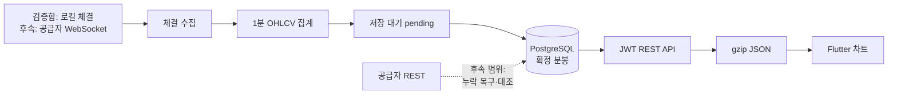
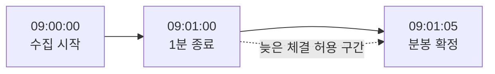
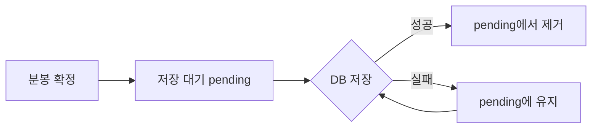

# 주식 1분봉은 어떻게 화면까지 올까: 기초 이론부터 로컬 API와 부하 테스트까지

> 측정 기준일은 2026년 8월 11일입니다. 화면과 API 검증에는 같은 값을 다시 만들 수 있는 `blog-local-seed`를 사용했습니다. 실제 증권사 시세가 아니며, 공급자 분석은 공식 문서, 성능 수치는 로컬 재실행 결과를 기준으로 합니다.
>
> 본문의 손그림은 어려운 개념을 설명하기 위한 삽화입니다. 실제 구현 여부와 성능 수치는 Flutter 화면과 로컬 측정 결과에서만 확인합니다.


*대표 이미지 — 체결 한 건이 1분봉으로 묶여 화면에 도착하기까지의 흐름을 단순화했습니다.*

처음에는 1분봉 차트를 만드는 일이 단순해 보였습니다. 증권사 API에서 가격을 받고, 데이터베이스에 저장한 다음, 차트에 그리면 끝이라고 생각했습니다.

그런데 막상 설계를 시작하니 가격보다 먼저 확인할 내용이 많았습니다. 같은 거래가 두 번 들어오거나 순서가 바뀌면 분봉은 달라질 수 있습니다. 개인용 API로 받은 시세를 여러 사용자에게 보여줄 수 있는지도 확인해야 합니다.

그래서 이번 작업에서는 코드보다 기초 이론을 먼저 공부했습니다. 체결과 분봉의 차이부터 시작해 REST와 WebSocket의 역할, 늦게 도착한 데이터, 중복 저장, HTTP 압축과 부하 지표를 차례로 정리했습니다.

이 글에서는 삼성전자, SK하이닉스, 카카오, NAVER, 현대차 다섯 종목을 대상으로 만든 1분봉 파이프라인을 살펴봅니다. 매수·매도는 다루지 않고, 체결 데이터가 서버를 거쳐 차트 화면에 도착하는 과정에만 집중합니다.


*실제 화면 — 고친 로컬 Flutter 화면은 서버가 반환한 OHLCV 중 최신 48개를 그립니다. `로컬 시험 데이터` 표시는 실제 시세와 혼동하지 않기 위한 경계입니다.*

화면에서 검증할 대상은 1분봉 카드입니다. 삼성전자 화면 상단의 현재가와 분봉 카드의 마지막 종가는 모두 76,300원입니다. 나머지 네 종목도 상세 현재가와 마지막 분봉 종가가 서로 일치하도록 같은 로컬 데이터를 사용했습니다.

---

## 1. 먼저 공부한 것: 차트의 막대 하나는 무엇일까

주식 화면에는 가격이 계속 바뀌어 보입니다. 이때 실제 거래가 끝난 한 건을 **체결**이라고 합니다. 누군가 사고 싶다고 제시한 가격인 호가와 달리, 체결은 가격과 수량이 실제로 확정된 기록입니다.

1분봉은 이 체결들을 1분 단위로 묶은 요약입니다. 예를 들어 09시 00분에 다음 세 건이 체결됐다고 가정해보겠습니다.

| 체결 시각 | 가격 | 수량 |
| --- | ---: | ---: |
| 09:00:05 | 70,000원 | 10주 |
| 09:00:20 | 70,500원 | 5주 |
| 09:00:50 | 69,800원 | 8주 |

이 세 건으로 만든 1분봉은 다음 값을 가집니다.

| 이름 | 의미 | 결과 |
| --- | --- | ---: |
| 시가(open) | 그 분에 가장 먼저 체결된 가격 | 70,000원 |
| 고가(high) | 그 분의 가장 높은 가격 | 70,500원 |
| 저가(low) | 그 분의 가장 낮은 가격 | 69,800원 |
| 종가(close) | 그 분에 가장 나중에 체결된 가격 | 69,800원 |
| 거래량(volume) | 체결 수량의 합 | 23주 |


*설명용 삽화 — 여러 체결을 한 분 동안 모아 캔들 한 개와 거래량으로 요약하는 개념을 단순화했습니다. 실제 계산은 바로 위 표처럼 첫·최고·최저·마지막 가격과 수량 합으로 구하며, 이 그림은 실제 시세나 측정 결과가 아닙니다.*

이 다섯 값을 영문 첫 글자로 묶어 `OHLCV`라고 부릅니다. 처음에는 약어보다 “여러 체결을 한 줄로 요약한다”는 뜻을 이해하는 편이 도움이 됐습니다.

### 캔들끼리 선을 그어야 이어져 보일까

캔들 차트는 봉과 봉 사이에 선을 억지로 그리지 않습니다. 각 봉의 몸통과 꼬리를 실제 가격 위치와 시간 위치에 놓습니다. 장중에는 다음 분의 첫 체결가가 이전 분의 마지막 체결가와 같거나 가까운 경우가 많아서 여러 봉이 자연스럽게 이어져 보입니다.

처음 만든 로컬 시드는 이 관계를 고려하지 않고 각 분의 시가를 따로 계산했습니다. 삼성전자 하루의 인접한 389쌍을 확인하니 다음 시가와 이전 종가가 같은 경우가 0쌍이었고, 차이의 평균은 187.61원, 최댓값은 740원이었습니다. 아래처럼 규칙적인 톱니 모양이 생긴 이유는 차트가 선을 빼먹어서가 아니라 시험 가격이 매분 불연속적으로 뛰었기 때문입니다.


*실제 화면 — 잘못된 기존 시드는 캔들마다 가격 위치가 크게 뛰었습니다. 이 화면은 수정 이유를 남기기 위한 before 자료입니다.*

새 교육용 시드는 장중에 `다음 시가 = 이전 종가`가 되도록 만들었습니다. 다섯 종목 모두 장중 연결과 1분 간격이 각각 1,945/1,945쌍이었고, 잘못된 OHLCV와 가격 단위 위반은 0건이었습니다. 한 분의 가격 변화는 최대 2틱이며 종목별 각 거래일의 상승·하락 합계는 0이 되도록 만들었습니다.

여기서 **틱**은 그 종목 가격이 한 번 움직이는 최소 단위입니다.

| 종목 | 로컬 시험 가격 단위 |
| --- | ---: |
| 삼성전자(005930) | 100원 |
| SK하이닉스(000660) | 100원 |
| 카카오(035720) | 50원 |
| NAVER(035420) | 100원 |
| 현대차(005380) | 500원 |

거래일이 바뀔 때만 -2틱에서 +2틱의 갭을 허용했습니다. 따라서 전체 종목에서 가능한 원화 범위는 -1,000원에서 +1,000원이지만, 같은 2틱도 카카오는 100원이고 현대차는 1,000원처럼 종목에 따라 금액이 다릅니다.

이 규칙을 실제 시장의 정답으로 오해하면 안 됩니다. 실제 시세에서는 시초가, 거래 중단, 체결이 없던 구간 등으로 다음 시가가 이전 종가와 달라질 수 있습니다. 서버는 실제 공급자 값을 보기 좋게 만들려고 임의로 고치지 않습니다. 라인 모드에서만 연속된 구간의 종가를 선으로 잇고, 중간 1분이 빠지면 캔들 모드는 빈 공간을, 라인 모드는 끊어진 선을 보여줍니다.

여기서 한 가지 선택이 생깁니다. 원래 체결을 모두 저장하면 나중에 분봉을 다시 계산할 수 있지만, 저장량과 쓰기 횟수가 커집니다. 이번 MVP는 원시 체결을 메모리에서 분봉으로 계산하고 확정된 분봉만 PostgreSQL에 저장했습니다.

KRX 정규장은 09시부터 15시 30분까지 390분입니다. 다섯 종목을 기준으로 하면 하루 최대 1,950개 구간이고, 5거래일이면 9,750개입니다. 이 정도 규모에서 저장소를 먼저 복잡하게 만들 필요가 있는지는 실제 크기를 측정한 뒤 판단하기로 했습니다.

---

## 2. 어디서 받을까: 속도보다 먼저 확인한 사용 권리

처음에는 가장 빠른 API를 찾으려고 했습니다. 그러나 기술적으로 시세를 받을 수 있다는 사실과 여러 사용자에게 그 시세를 보여줄 수 있다는 사실은 같지 않았습니다.

영화를 개인적으로 구매한 것과 여러 사람에게 상영할 권리를 얻은 것이 다른 것과 비슷합니다. 시세를 자체 분봉으로 가공하더라도 표시·재배포 권리가 자동으로 생긴다고 볼 수는 없습니다.


*설명용 삽화 — API 속도를 재기 전에 받은 시세를 저장하고 여러 사용자에게 보여줄 수 있는지부터 확인했습니다. 빈 확인란은 조사할 항목을 뜻하며, 실제 사용 허가나 계약 승인을 받았다는 의미가 아닙니다. 공급자의 실제 성능을 측정한 결과도 아닙니다.*

이번에는 KIS, 키움, LS, KRX 무료 API와 정식 시장 데이터 경로를 다음 기준으로 비교했습니다.

| 후보 | 실시간·과거 데이터 | 공개 문서에서 확인한 한도 | 공개 화면 사용 | 현재 판단 |
| --- | --- | --- | --- | --- |
| 한국투자 KIS | 체결 WebSocket, 당일·과거 분봉 REST | 실전 REST 18회/초, WebSocket 전체 상품 합산 41개 등록, 과거 분봉 최대 120개/호출 | 개인 시세의 제3자 제공은 금지되며 별도 계약 필요 | 내부 POC 1순위 |
| 키움 REST API | 체결 WebSocket, `ka10080` 분봉 REST | 국내 조회 5회/초, 한 세션에서 실시간 200종목 | 공개 문서에서 재표시 허용 근거를 찾지 못해 서면 확인 필요 | 비교 후보 |
| LS OPEN API | 체결 WebSocket, `t8412` N분 차트 REST | 개인 `t8412` 1회/초, 공식 예제 조회량 500개 | 공개 문서에서 재표시 허용 근거를 찾지 못해 서면 확인 필요 | 백필 비교 후보 |
| KRX 무료 OPEN API | 실시간 분봉이 아닌 일별 정보 | 키당 10,000회/일 | 비상업 목적과 제3자 제공 제한 | 마감 데이터 대조 보조 |
| KRX·코스콤 정식 피드 | 계약 범위의 실시간 시장 데이터 | 계약 상품에 따라 달라 공개 숫자로 비교하지 않음 | 계약과 KRX 승인 필요 | 공개 운영의 정식 경로 |

이 표의 `18회/초` 같은 값은 응답이 1초 안에 온다는 뜻이 아닙니다. 서버가 허용하는 요청 횟수의 상한입니다. 실제 속도는 공급자 시각부터 우리 서버 수신까지 걸린 시간, 끊김, 누락, 재연결과 백필 완료 시간을 따로 측정해야 합니다.

내부 POC의 첫 후보는 KIS로 정했습니다. 실제 속도가 가장 빠르다고 확인했기 때문은 아닙니다. 실시간 체결과 과거 분봉을 함께 시험할 공식 예제가 비교적 분명해, 첫 번째 검증 대상으로 삼기 좋다고 판단했습니다.

현재 서버에는 실제 KIS 어댑터가 없습니다. 로컬 `sim`이 만든 체결로 집계·저장 흐름만 검증한 상태입니다. 실제 공급자는 사용 권리와 계정을 확보한 뒤 같은 다섯 종목, 같은 거래 시간, 같은 장비에서 지연과 누락을 비교해야 합니다.

### REST와 WebSocket은 경쟁 관계가 아니었습니다

REST는 필요한 시점에 요청하고 한 번 응답받는 방식입니다. WebSocket은 연결을 유지한 채 새 체결을 계속 받는 방식입니다.

진행 중인 봉을 빠르게 바꾸려면 WebSocket이 어울립니다. 하지만 연결이 끊긴 동안의 체결은 알 수 없으므로, 과거 분봉 REST로 빈 구간을 다시 채워야 합니다. 이 작업을 **백필(backfill)**이라고 합니다.

이번에 세운 목표는 다음과 같습니다.

> WebSocket으로 현재 체결을 받고, REST로 과거와 누락 구간을 복구합니다.

현재 구현 범위는 로컬 체결 집계와 확정 분봉 REST 조회까지입니다. 실제 공급자 WebSocket 연결과 REST 백필은 후속 검증 범위입니다.

---

## 3. 체결은 어떤 길을 거쳐 화면으로 갈까

수집, 계산, 저장, 조회를 하나의 기능으로 묶으면 장애 원인을 찾기 어렵습니다. 그래서 각 단계의 책임을 나눴습니다.



공급자 연결은 사용자마다 만들지 않습니다. 서버가 종목별 체결을 한 번 받고, 여러 사용자는 우리 서버의 조회 API를 사용합니다. 사용자 수가 늘어도 증권사 연결 수가 함께 늘지 않게 하기 위한 구조입니다.

### 서버에 도착한 순서로 계산하면 안 되는 이유

체결이 실제로 발생한 순서와 서버에 도착한 순서는 다를 수 있습니다. 09:00:05 체결이 네트워크 지연으로 09:00:20 체결보다 늦게 도착할 수도 있습니다.

이때 도착 순서로 시가와 종가를 정하면 같은 체결을 받아도 결과가 달라집니다. 그래서 집계기는 체결 발생 시각 `occurredAt`과 같은 시각 안의 순번 `sequence`를 함께 비교합니다.

```kotlin
fun add(tick: TradeTick): Boolean {
    if (!identities.add(tick.identity())) return false

    val order = TickOrder(tick.occurredAt, tick.sequence)
    if (order < firstOrder) {
        firstOrder = order
        open = tick.price
    }
    if (order > lastOrder) {
        lastOrder = order
        close = tick.price
    }
    high = maxOf(high, tick.price)
    low = minOf(low, tick.price)
    volume += tick.quantity
    tradeCount++
    return true
}
```

첫 줄은 같은 체결이 다시 들어오면 거래량에 더하지 않습니다. 더 이른 체결은 시가를, 더 늦은 체결은 종가를 바꿉니다. 고가·저가·거래량은 모든 체결을 보며 갱신합니다.

실제 공급자를 연결할 때는 `sequence`가 재연결 전후에도 체결을 안정적으로 구분하는지 확인해야 합니다. 현재 `sim`의 순번만으로 실제 공급자의 중복 처리까지 검증했다고 말할 수는 없습니다.

### 1분이 끝나도 5초를 더 기다렸습니다

09시 01분이 되는 순간 09시 00분 봉을 닫으면 조금 늦게 도착한 체결을 놓칠 수 있습니다. 현재 서버는 분 종료 뒤 5초를 기다린 후 봉을 확정합니다.



이 마감 기준을 워터마크라고 부릅니다. 5초는 정답이 아니라 POC의 초기값입니다. 실제 공급자의 지연 분포를 측정한 뒤 정확성과 화면 갱신 속도 사이에서 다시 조정해야 합니다.

---

## 4. 계산한 분봉을 잃지 않고 저장하려면

분봉 계산이 끝났더라도 DB 저장은 실패할 수 있습니다. 계산 직후 메모리에서 지우면 DB가 잠시 느려진 순간의 분봉을 잃습니다.

현재 서버는 확정된 분봉을 `pending`, 즉 저장 대기 목록으로 옮깁니다. DB 저장이 성공한 뒤에만 목록에서 제거하고, 실패하면 다음 주기에 다시 시도합니다.



다만 `pending`은 메모리에 있습니다. DB가 잠시 실패하는 상황에는 다시 시도할 수 있지만, 서버 프로세스가 종료되면 저장 대기 데이터와 진행 중인 봉을 잃습니다. 운영 전에는 재시작한 구간을 REST로 다시 받거나, 내구성 있는 저장 경로를 추가해야 합니다.

### 같은 분봉이 여러 번 오면 최신 보정만 반영합니다

분봉은 `종목 코드 + 분 시작 시각`으로 식별합니다. 같은 분봉을 다시 저장할 때는 `revision`이라는 개정 번호를 비교합니다.

```sql
ON CONFLICT (ticker, bucket_start) DO UPDATE SET
    open = EXCLUDED.open,
    high = EXCLUDED.high,
    low = EXCLUDED.low,
    close = EXCLUDED.close,
    volume = EXCLUDED.volume,
    trade_count = EXCLUDED.trade_count,
    revision = EXCLUDED.revision
WHERE minute_candles.revision < EXCLUDED.revision;
```

처음 만든 스트림 분봉은 revision 0입니다. 같은 revision이 다시 오면 기존 행을 바꾸지 않고, 더 높은 revision만 반영합니다. 이렇게 하면 늦게 도착한 오래된 결과가 이미 보정한 값을 덮어쓰는 일을 막을 수 있습니다.

이 방식을 **멱등 저장**이라고 설명할 수 있습니다. 같은 작업을 여러 번 시도해도 최종 결과가 한 번 처리한 것과 같게 유지되는 성질입니다.

더 높은 revision을 자동으로 만드는 REST 대조 작업은 구현 범위에 포함되지 않았습니다. 이번 단계에서는 보정 데이터를 안전하게 받을 스키마와 저장 조건까지 검증했습니다.

---

## 5. 분봉 하나는 얼마나 크고, 어디를 압축해야 할까

컬럼 타입의 바이트만 더하면 실제 DB 크기를 알기 어렵습니다. PostgreSQL에는 행 정보와 페이지 여유 공간, 기본키 인덱스도 함께 저장되기 때문입니다.

2026년 8월 11일, PostgreSQL 16.14에 5종목 × 390분 × 5거래일인 9,750행을 다시 넣어 측정했습니다.

| 항목 | 로컬 실측값 |
| --- | ---: |
| 테이블 heap | 1,171,456B |
| 기본키 인덱스 | 360,448B |
| 전체 관계 크기 | 1,531,904B |
| 분봉 한 개당 관계 크기 | 157.118B |
| 삽입 WAL | 2,153,408B |
| 분봉 한 개당 WAL | 220.862B |
| 9,750행 batch 시간 | 181.685ms |
| batch 처리량 | 53,664행/초 |

한 행당 157.118B는 테이블과 기본키 인덱스를 합친 평균입니다. WAL은 장애 복구를 위한 변경 기록이므로 행 옆에 영구적으로 붙는 크기는 아닙니다. batch 처리량도 9,750행을 한 번에 넣은 결과라서 실제 수집 TPS로 바꾸어 읽으면 안 됩니다.

연 252거래일 동안 매분 체결이 있다고 가정하면 5종목 1년의 관계 크기는 약 77MB입니다. 이 규모에서는 데이터베이스 교체보다 누락 복구와 서버 재시작 대응이 먼저라고 판단했습니다.

### 집계 계산 자체도 분리해서 측정했습니다

단일 JVM thread에서 1,950,000개 체결을 재생해 1,950개 분봉을 만들었습니다. 중앙 처리 시간은 95.880ms, p95는 97.674ms였고 중앙 처리량은 초당 20,337,922체결이었습니다. 가장 느린 회차도 초당 19,964,397체결을 처리했습니다.

이 숫자는 네트워크 수신, JSON 해석, DB 저장을 뺀 메모리 집계 결과입니다. 전체 서버가 초당 약 2,034만 체결을 처리한다는 뜻이 아니라, 다섯 종목의 OHLCV 계산이 현재 우선 병목은 아니라는 근거로만 사용했습니다.

### 체결을 분봉으로 만드는 것과 gzip은 다른 작업입니다

체결을 분봉으로 바꾸면 개별 거래 순서와 가격을 원래대로 되돌릴 수 없습니다. 차트에 필요한 정보만 남기는 손실 요약입니다.

gzip은 완성된 JSON의 내용을 잃지 않고 전송 크기만 줄입니다. 압축을 풀면 원래 JSON을 다시 얻을 수 있습니다.

서버에는 다음 설정을 적용했습니다.

```yaml
server:
  compression:
    enabled: true
    mime-types: application/json
    min-response-size: 1KB
```

| 조회 범위 | 원본 JSON | gzip | 감소율 |
| --- | ---: | ---: | ---: |
| 1거래일, 390개 | 56,658B | 5,177B | 90.9% |
| 5거래일, 1,950개 | 282,858B | 24,230B | 91.4% |

압축이 항상 공짜인 것은 아닙니다. 데이터를 압축하고 푸는 데 CPU를 사용하므로 응답 크기와 처리 속도를 함께 측정해야 합니다.


*측정 결과 요약 — 같은 로컬 장비에서 저장·집계·전송을 나누어 측정했습니다. 각 숫자가 포함하지 않는 범위도 이미지 하단에 함께 표시했습니다.*

---

## 6. 로컬 Flutter 화면과 연결하기

Flutter 클라이언트에는 서버 응답과 같은 `MinuteCandle` 모델을 추가했습니다. `MarketRepository`가 JWT와 조회 범위를 담아 REST API를 호출하고, Riverpod provider를 거쳐 `CandleChart`가 서버 OHLCV를 그대로 그립니다.

아래는 실제 연결 경로에서 핵심 호출만 모은 코드입니다.

```dart
// market_repository.dart
final res = await _dio.get(
  '/api/market/$ticker/candles',
  queryParameters: {
    'from': from.toUtc().toIso8601String(),
    'to': to.toUtc().toIso8601String(),
  },
);
return MinuteCandleSeries.fromJson(res.data as Map<String, dynamic>);

// stock_detail_screen.dart
final candlesAsync =
    ref.watch(minuteCandleSeriesProvider(widget.detail.ticker));
CandleChart(candles: visible)
```

클라이언트는 기본적으로 서울 시각의 가장 최근 거래일 시작부터 현재까지를 조회합니다. 주말이나 월요일 장 시작 전에는 직전 금요일로 시작 시각을 옮깁니다. 응답은 시간순으로 정렬한 뒤 최신 48개만 화면에 그립니다. 네트워크에서 받은 390개를 모두 같은 폭에 넣기보다 캔들 몸통과 시간 간격을 읽을 수 있는 밀도를 유지하기 위한 선택입니다.

화면 캡처는 2026년 8월 3일부터 7일까지 만든 결정적 역사 시드를 사용했습니다. 캡처 시점인 8월 11일의 기본 범위에는 이 데이터가 들어오지 않기 때문에 캡처 빌드에만 `MARKET_CANDLE_LOOKBACK_DAYS=7`을 주었습니다. 일반 빌드의 기본값은 자동 거래일 계산이며, 화면에는 조회된 값 중 최신 48개만 그렸습니다.

API는 삼성전자 `005930`의 5거래일 분봉 1,950개를 HTTP 200으로 반환했습니다. 마지막 분봉은 `2026-08-07 15:29 KST`이며 값은 다음과 같습니다.

- 시가 76,200원, 고가 76,700원, 저가 75,900원, 종가 76,300원
- 거래량 6,945주, 체결 수 39건
- `final=true`, `revision=1`

증거 검사는 예상한 5종목과 종목별 1,950개, 각 종목의 첫·마지막 시각을 먼저 확인했습니다. 삼성전자는 API와 DB의 1,950개 분봉을 첫 번째부터 마지막까지 순서대로 비교했습니다. 시간, OHLCV, 체결 수, 확정 여부와 revision이 모두 일치해야만 통과합니다.

검사가 실제 오류도 잡는지 확인하려고 한 종목 전체, 첫 봉, 마지막 봉, 중간 봉을 각각 삭제하고 고가를 1 올리는 다섯 가지 잘못된 상태를 만들었습니다. 모든 경우에 검사가 실패했고, 시드를 다시 넣은 뒤 원래 9,750개 행으로 복구되는 것까지 확인했습니다. 정상 데이터에서는 각 종목의 장중 연결과 1분 간격이 1,945/1,945쌍, 잘못된 OHLCV와 동적 가격 단위 위반은 0건, 한 분의 최대 움직임은 2틱, 일별 움직임 합계는 0이었습니다.


*측정 결과 요약 — 예상한 5종목과 시각 경계, 삼성전자 DB·API 1,950개 전체 필드, 가격 단위와 오류 주입 실패를 확인했습니다. Authorization 값은 출력하지 않았습니다.*

이 캡처가 보여주는 것은 로컬 DB, JWT REST API, Flutter 분봉 카드가 같은 OHLCV를 사용한다는 사실입니다. 데이터 출처는 `blog-local-seed`이므로 실제 증권사 시세의 정확성이나 실시간성을 증명하지는 않습니다.

---

## 7. 빠르다고 말하기 전에 무엇을 측정했을까

화면이 보인다는 사실과 데이터 규칙이 맞다는 사실은 다릅니다. 다시 실행한 결과 서버 `*Test` 55개, PostgreSQL 통합 테스트 24개, Flutter 테스트 62개가 모두 성공했고 Flutter 정적 분석 문제도 0개였습니다.


*검증 결과 요약 — 서버 `*Test` 55개, `*IT` 24개, Flutter 테스트 62개와 정적 분석을 함께 확인했습니다. 이 결과가 실제 공급자 장애나 운영 환경의 모든 문제를 보증하지는 않습니다.*

성능 숫자는 뜻을 모르면 판단하기 어렵습니다. VU는 쉬지 않고 요청을 반복하는 가상 사용자이고, p95는 요청 100개를 빠른 순서로 놓았을 때 95번째 요청의 응답 시간입니다. 처리량은 1초 동안 완료한 요청 수입니다.

이번 k6 합격선은 p95 200ms 미만, HTTP 오류율 1% 미만, 응답 검사 성공률 99% 초과로 잡았습니다. 각 시나리오는 gzip을 사용해 20초 동안 실행했습니다.

| 조회 범위·부하 | p95 | p99 | 요청/초 | 오류율 | 결과 |
| --- | ---: | ---: | ---: | ---: | --- |
| 1일 · 10 VU | 4.090ms | 4.962ms | 2,544.70 | 0% | PASS |
| 1일 · 100 VU | 45.791ms | 81.122ms | 2,413.75 | 0% | PASS |
| 5일 · 10 VU | 12.432ms | 14.099ms | 720.99 | 0% | PASS |
| 5일 · 100 VU, 3회 중앙값 | 154.312ms | 275.808ms | 677.00 | 0% | PASS |

5일·100 VU는 세 번 독립 실행했습니다. 각 실행의 요청/초·p95·p99는 `677.00·154.312ms·275.808ms`, `703.37·150.722ms·249.157ms`, `560.80·196.651ms·337.026ms`였습니다. 세 번 모두 HTTP 오류율 0%, 응답 검사 100%였고 p95 200ms 기준을 통과했습니다.

하지만 중앙값만 보면 중요한 변동을 놓칠 수 있습니다. 가장 느린 실행은 처리량이 초당 560.80요청으로 줄었고 p95가 기준보다 불과 3.349ms 낮은 196.651ms, p99는 337.026ms였습니다. 짧은 로컬 시험의 통과를 운영 성능 보장으로 바꾸어 말하지 않고, 장시간 단계 부하에서 이 흔들림을 다시 확인해야 합니다.


*측정 결과 요약 — 네 조건 모두 p95 기준은 통과했습니다. 5일·100 VU는 세 번 실행했고 최악 p95 196.651ms와 p99 337.026ms도 함께 기록했습니다.*

클라이언트는 처음에 가장 최근 거래일만 요청하고, 그중 최신 48개를 그립니다. 5일 조건도 임시 p95 기준은 통과했지만 응답 크기가 약 다섯 배이고 p99가 늘었습니다. 사용자가 과거로 이동할 때 이전 구간을 추가로 읽는 방식이 5일 전체를 첫 화면에 보내는 것보다 네트워크와 화면 밀도 모두에 맞았습니다.

VU 100을 실제 사용자 100명과 같다고 볼 수는 없습니다. 실제 사용자는 화면을 보고 쉬는 시간이 있지만, 이번 시험은 20초 동안 대기 없이 요청을 반복했고 서버와 k6도 같은 Mac에서 실행했습니다. 이 결과는 운영 보장이나 SLA가 아닙니다. 운영 판단에는 분리된 부하 발생기와 더 긴 단계 시험, 장시간 안정성 시험이 필요합니다.

---

## 8. 사용자가 늘면 증권사 연결도 늘려야 할까

사용자마다 공급자 WebSocket을 열면 외부 API 한도와 사용자 수가 직접 연결됩니다. 공급자 연결은 종목 수에 맞춰 유지하고, 사용자에게 전달하는 API와 캐시 계층을 확장하는 편이 안전합니다.


*설명용 삽화 — 목표 구조는 사용자마다 공급자 연결을 만드는 것이 아니라, 서버가 한 번 받은 시세를 여러 조회 요청에 나누어 전달하는 방식입니다. 현재 운영 배포가 끝났다는 의미는 아닙니다.*

현재 결과를 바탕으로 확장 순서를 다음처럼 잡았습니다.

1. 첫 화면은 가장 최근 거래일만 조회합니다.
2. 과거 구간은 사용자가 이동할 때 추가로 가져옵니다.
3. 끝난 거래일의 분봉은 종목과 날짜 단위로 캐시합니다.
4. 수집기는 전용 worker 하나로 분리하고, API 서버만 사용자 부하에 맞춰 늘립니다.
5. 진행 중인 마지막 분봉만 WebSocket 또는 SSE로 전달합니다.

다섯 종목 단계에서는 이 구조를 모두 미리 만들지 않습니다. DB 연결 대기, 응답 직렬화 CPU, 네트워크 전송량, 캐시 적중률을 관찰하고 실제 병목이 확인될 때 한 단계씩 적용합니다.

---

## 9. 검증한 범위와 남은 한계

처음에는 빠른 증권사 API를 고르는 일이 가장 중요하다고 생각했습니다. 기초부터 다시 공부한 뒤에는 우선순위가 달라졌습니다.

분봉 한 개를 믿으려면 체결 시각, 중복, 늦은 데이터와 저장 실패를 함께 다뤄야 했습니다. 공개 서비스라면 그보다 먼저 시세를 표시하고 저장할 권리가 있는지 확인해야 합니다.

구현과 재실행으로 확인한 범위는 다음과 같습니다.

- `sim` 체결을 이벤트 시각 기준 1분 OHLCV로 집계합니다.
- 종료 뒤 5초를 기다리고 확정 봉을 PostgreSQL에 저장합니다.
- 같은 분봉은 더 높은 revision만 반영합니다.
- JWT REST API가 최대 7일의 확정 봉을 gzip JSON으로 반환합니다.
- 로컬 API의 OHLCV를 Flutter가 그대로 받아 최신 48개로 렌더링합니다.
- 로컬 시드의 종목별 장중 연결과 1분 간격 1,945/1,945쌍, 잘못된 OHLCV·가격 단위 위반 0건을 확인했습니다.
- 장중 인접 가격은 시간축에 맞춰 배치하고, 누락된 1분은 캔들 공백과 라인 선 끊김으로 구분합니다.
- 분봉 한 개의 관계 크기는 평균 157.118B였습니다.
- 1일·100 VU는 p95 45.791ms였고, 5일·100 VU도 세 번 모두 p95 기준을 통과했습니다. 다만 가장 느린 5일·100 VU 실행은 p95 196.651ms, p99 337.026ms였습니다.

검증하지 않은 범위도 분명합니다.

- KIS·키움·LS의 실제 체결 지연과 누락률
- WebSocket 재연결과 REST 백필
- 서버 재시작 중인 분봉의 복구
- 다중 서버에서 수집기 하나만 실행하는 방법
- KRX 공휴일까지 반영하는 거래일 달력. 현재 클라이언트 계산은 토요일·일요일만 건너뜁니다.
- 장 운영 시간을 반영한 수집. 현재 `sim`은 로컬 검증용이라 24시간 체결을 만듭니다.
- 실제 시세의 저장·화면 표시·재배포 권리
- Flutter 장시간 렌더링과 저사양 기기의 화면 성능

이번 POC의 가장 큰 결과는 특정 API가 가장 빠르다는 결론이 아닙니다. 분봉 화면을 만들 때 무엇을 먼저 배우고, 어떤 실패를 준비하며, 어떤 숫자를 측정해야 하는지 기준을 만들었다는 데 의미가 있습니다.

최종 공급자는 실제 권리와 같은 조건의 성능 시험을 마친 뒤 정해야 합니다. 지금의 선택은 `KIS 우선 검증`, `WebSocket 수집 + REST 복구`, `PostgreSQL 확정 봉 저장`이라는 다음 실험 방향입니다.

### 다른 사람에게 1분 안에 설명한다면

1. 체결은 실제 거래 한 건이고, 1분봉은 그 체결들을 OHLCV로 요약한 값입니다.
2. 화면과 API 증거 데이터는 실제 증권사 시세가 아니라 결정적 로컬 시드입니다.
3. 실시간 체결은 WebSocket으로 받고, 놓친 구간은 REST로 복구하는 구조를 목표로 합니다.
4. 체결 발생 시각과 순번으로 역순·중복 데이터를 처리하고, 분 종료 뒤 5초에 봉을 닫습니다.
5. 확정 봉은 PostgreSQL에 저장하며 높은 revision만 기존 값을 바꿉니다.
6. 분봉 한 개는 평균 157.118B였고, 5거래일 JSON은 gzip으로 282,858B에서 24,230B로 줄었습니다.
7. 사용자가 늘면 증권사 연결을 늘리기보다 조회 API와 캐시를 확장합니다.

---

## 더 깊게 보기: 본문에서 줄인 용어와 수치

<details>
<summary>처음 접하면 헷갈릴 수 있는 용어</summary>

- **백필(backfill):** 받지 못한 과거 구간을 조회 API로 다시 채우는 작업입니다.
- **워터마크(watermark):** 늦은 데이터를 언제까지 기다릴지 정한 마감 기준입니다.
- **멱등성(idempotency):** 같은 작업을 반복해도 최종 결과가 한 번 실행한 것과 같게 유지되는 성질입니다.
- **revision:** 같은 분봉 중 어떤 버전을 최신으로 볼지 나타내는 번호입니다.
- **WAL:** PostgreSQL이 장애 복구를 위해 기록하는 변경 로그입니다. 분봉 행 자체의 크기와는 구분합니다.
- **p99:** 요청을 빠른 순서로 놓았을 때 99번째 요청의 응답 시간입니다.
- **fan-out:** 한 번 받은 데이터를 여러 클라이언트 연결로 나누어 전달하는 구조입니다.

</details>

<details>
<summary>로컬 측정의 상세 조건</summary>

- PostgreSQL 16.14, 9,750개 분봉을 사용했습니다.
- 저장량은 테이블 1,171,456B와 기본키 인덱스 360,448B를 합산했습니다. WAL은 분봉당 220.862B였습니다.
- 집계 벤치마크는 OpenJDK 21.0.6에서 1,950,000개 체결을 단일 JVM thread로 재생해 1,950개 분봉을 만들었습니다.
- 집계 중앙값은 95.880ms, p95는 97.674ms, 중앙 처리량은 초당 20,337,922체결이었습니다.
- k6는 고정 VU로 20초 실행했고 서버와 같은 로컬 장비를 사용했습니다.
- 임시 합격선은 HTTP 오류율 1% 미만, p95 200ms 미만, 응답 검사 성공률 99% 초과였습니다.
- 이 수치는 공급자 성능이나 운영 SLA가 아닙니다.

</details>

<details>
<summary>재현 명령과 확인 항목</summary>

- `./gradlew test --tests '*Test'`
- `./gradlew test --tests '*IT'`
- `./gradlew benchmarkMinuteCandles`
- `MinuteCandleStorageMetricsIT`의 크기 측정
- `blog-market-candles-evidence.sh`의 장중 연속성·1분 간격·OHLCV 검사
- 1일·5거래일 gzip 응답 크기 측정
- 1일·5일, 10·100 VU 조합의 20초 k6 실행
- Flutter 분봉 모델·API 호출·실제 OHLC 렌더링 대조

</details>

## 참고 자료

1. 한국투자증권, [Open API 서비스 소개와 시세정보 이용 범위](https://apiportal.koreainvestment.com/about-open-api)
2. 한국투자증권 공식 GitHub, [국내주식 일별 분봉 조회 예제](https://github.com/koreainvestment/open-trading-api/blob/main/examples_llm/domestic_stock/inquire_time_dailychartprice/inquire_time_dailychartprice.py)
3. 한국투자증권 공식 GitHub, [국내주식 실시간 체결가 WebSocket 예제](https://github.com/koreainvestment/open-trading-api/blob/main/examples_llm/domestic_stock/ccnl_krx/ccnl_krx.py)
4. 한국투자증권, [REST·WebSocket 유량 공지](https://apiportal.koreainvestment.com/community/10000000-0000-0011-0000-000000000001/post/d0d1a83f-6f8d-4437-9700-6d26702fd989)
5. 키움증권, [REST API 소개와 유량](https://openapi.kiwoom.com/intro?dummyVal=0), [API 가이드](https://openapi.kiwoom.com/m/guide/apiguide)
6. LS증권, [OPEN API 사용 안내](https://openapi.ls-sec.co.kr/howto-use)
7. 한국거래소, [무료 OPEN API 서비스 목록](https://openapi.krx.co.kr/contents/OPP/INFO/service/OPPINFO004.cmd)
8. 한국거래소, [시장데이터 신청 절차](https://openapi.krx.co.kr/contents/OPP/DATA/OPPDATA003.jsp)
9. 한국거래소, [유가증권시장 정규시장 매매거래시간](https://regulation.krx.co.kr/contents/RGL/03/03020401/RGL03020401.jsp)
10. PostgreSQL, [INSERT와 ON CONFLICT](https://www.postgresql.org/docs/16/sql-insert.html)
11. Spring Boot, [서버 압축 설정 속성](https://docs.spring.io/spring-boot/appendix/application-properties/index.html)
12. Grafana k6, [Thresholds](https://grafana.com/docs/k6/latest/using-k6/thresholds/), [내장 지표](https://grafana.com/docs/k6/latest/using-k6/metrics/reference/)
