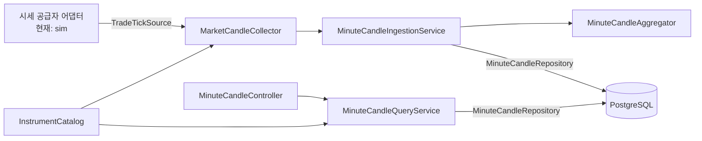

# 1분봉 개발 가이드

작성일: 2026-08-12

이 문서는 GrowAnt 서버에서 1분봉 기능을 수정하거나 새 시세 공급자를 연결할 때 필요한 구조, 설정, 검증 방법을 설명한다. 현재 구현은 **로컬 `sim`과 결정적 시드로 검증한 단일 인스턴스 POC**다. 실제 시세를 공개 서비스에 연결하기 전에 해결해야 할 항목은 [실시세 전환 차단 조건](#9-실시세-전환-차단-조건)에 따로 정리했다.

브랜치, 커밋, PR, CI 규칙은 항상 루트 [README](../README.md)를 먼저 따른다.

## 1. 가장 빠른 로컬 확인

필요한 도구는 Java 21, Docker Compose, `curl`, `jq`다. 저장 성능 검증에는 Docker가, REST 부하 시험에는 `k6`가 추가로 필요하다.

### 터미널 A: PostgreSQL과 서버 실행

```bash
docker compose up -d postgres
./gradlew bootRun --args='--spring.profiles.active=local'
```

서버가 시작되면서 Flyway가 [V2 분봉 테이블](../src/main/resources/db/migration/V2__minute_candles.sql)을 적용한다. `local` 프로파일은 로컬 PostgreSQL의 기본 계정 `growant/growant`를 사용하고, 현재 분봉 수집은 기본값으로 꺼져 있다.

### 터미널 B: 결정적 데이터 적재와 API 대조

```bash
./scripts/blog-market-candles-seed.sh catalog-week

BLOG_API_FROM='2026-08-03T09:00:00+09:00' \
BLOG_API_TO='2026-08-08T09:00:00+09:00' \
./scripts/blog-market-candles-evidence.sh
```

성공하면 다음을 확인한 것이다.

- 5종목 × 5거래일 = 9,750개 분봉이 들어 있다.
- 종목별 1,950개 분봉의 첫 시각과 마지막 시각이 예상 범위와 같다.
- 삼성전자 API와 DB의 모든 분봉에서 시간, OHLCV, `tradeCount`, `final`, `revision`이 순서대로 같다.
- 장중 1분 간격, 가격 연속성, OHLCV 관계와 종목별 가격 단위 검사가 통과한다.

보고서는 `build/reports/market-data/blog-local-evidence.md`에 생성된다. 시드와 증거 스크립트에 관한 자세한 주의점은 [8장](#8-로컬-시드와-증거-수집)에 있다.

## 2. 현재 구조와 데이터 흐름

현재 프로젝트는 하나의 Gradle 모듈이다. 분봉 기능 전체를 여러 모듈로 나누지 않고, 교체 가능성이 실제로 있는 공급자·종목 카탈로그·저장소만 좁은 포트로 분리했다.



실행 순서는 다음과 같다.

1. `MARKET_CANDLE_COLLECTION_ENABLED=true`이면 수집기 bean이 생성되고, 애플리케이션 준비 이벤트 후 구독을 시작한다.
2. 수집기는 설정된 종목이 카탈로그에 모두 있는지 확인하고 종목별로 한 번씩 구독한다.
3. 공급자 `Tick`을 도메인 `TradeTick`으로 바꿔 집계 서비스에 전달한다.
4. 집계기는 체결 발생 시각과 sequence로 1분 OHLCV를 만든다.
5. 스케줄러가 `현재 시각 - 확정 지연` 이전의 봉을 확정한다.
6. 확정 봉은 메모리 `pending`에 둔 뒤 PostgreSQL 저장에 성공한 경우에만 제거한다.
7. 조회 API는 카탈로그·수집 대상·기간을 검증하고 저장된 봉을 시간 오름차순으로 반환한다.

### 주요 파일과 책임

| 영역 | 파일 | 책임 |
| --- | --- | --- |
| 공급자 포트 | [MarketDataProvider.kt](../src/main/kotlin/com/growant/market/port/MarketDataProvider.kt) | 현재가 조회와 체결 구독의 경계, 구독 해제 핸들 정의 |
| 종목 포트 | [InstrumentCatalog.kt](../src/main/kotlin/com/growant/market/port/InstrumentCatalog.kt) | 종목 코드가 시장 카탈로그에 존재하는지 확인 |
| 로컬 공급자 | [SimulatedMarketDataProvider.kt](../src/main/kotlin/com/growant/market/sim/SimulatedMarketDataProvider.kt) | 로컬 random walk 체결 생성 |
| 수집 생명주기 | [MarketCandleCollector.kt](../src/main/kotlin/com/growant/market/candle/MarketCandleCollector.kt) | 종목별 구독, tick 변환, 초기 동기 구독 실패 rollback, 종료 시 구독 해제 |
| 집계 도메인 | [MinuteCandleAggregator.kt](../src/main/kotlin/com/growant/market/candle/MinuteCandleAggregator.kt) | 중복·역순·지연 체결 처리와 OHLCV 계산 |
| 수집 서비스 | [MinuteCandleIngestionService.kt](../src/main/kotlin/com/growant/market/candle/MinuteCandleIngestionService.kt) | 집계, 확정, 메모리 pending, 저장 재시도, 보정 조율 |
| 저장 포트 | [MinuteCandleRepository.kt](../src/main/kotlin/com/growant/market/candle/port/MinuteCandleRepository.kt) | 저장 결과와 기간 조회 계약 |
| JDBC 어댑터 | [MinuteCandleStore.kt](../src/main/kotlin/com/growant/market/candle/persistence/MinuteCandleStore.kt) | PostgreSQL 저장 결과 분류와 `[from, to)` 조회 |
| 조회 서비스 | [MinuteCandleQueryService.kt](../src/main/kotlin/com/growant/market/candle/MinuteCandleQueryService.kt) | 종목·수집 대상·기간 검증 |
| HTTP 어댑터 | [MinuteCandleController.kt](../src/main/kotlin/com/growant/market/candle/MinuteCandleController.kt) | ISO-8601 경계 parsing과 공통 응답 DTO 변환 |
| 정책 설정 | [CandleProperties.kt](../src/main/kotlin/com/growant/market/candle/CandleProperties.kt) | 추적 종목, 확정 지연, 주기, 범위, 시간대의 타입·기본값·검증 |

### 포트별 사용 원칙

- `TradeTickSource`는 체결 스트림만 필요한 코드가 의존한다. `subscribe`는 반드시 해제 가능한 `Subscription`을 반환한다.
- `QuoteReader`는 현재가 한 건을 읽는 경계다. 한 공급자가 두 기능을 모두 제공하면 두 포트를 합친 `MarketDataProvider`를 구현할 수 있다.
- `InstrumentCatalog`는 DTO 목록을 순회하지 않고 종목 존재 여부만 제공한다. 현재 구현은 `MarketService`다.
- `MinuteCandleRepository`는 도메인 서비스가 JDBC를 직접 알지 않게 한다. 저장소 교체가 필요할 때 집계기와 Controller를 수정하지 않는다.

공통 `BaseRepository`, 범용 이벤트 버스, Kafka, Redis, TimescaleDB는 현재 5종목 측정값만으로 먼저 추가하지 않는다. 실제 병목이나 전달 보장이 확인된 뒤 한 문제씩 도입한다.

## 3. 집계와 저장 규칙

### 체결 식별과 1분 경계

`TradeTick`의 주요 값은 다음과 같다.

- `occurredAt`: 공급자에서 체결이 발생한 시각이다. 서버 수신 시각으로 대신하지 않는다.
- `sequence`: 같은 시각의 체결 순서를 정하고 중복을 식별할 수 있어야 한다.
- `price`: 원화 정수이며 0보다 커야 한다.
- `quantity`: 체결 수량이며 0보다 커야 한다.

집계기는 `occurredAt`을 UTC의 분 시작으로 내림한다. 서버에 늦게 도착해도 더 이른 이벤트는 시가를, 더 늦은 이벤트는 종가를 바꾼다. 같은 `(occurredAt, sequence)`는 중복으로 처리해 거래량에 다시 더하지 않는다.

수락 결과는 다음처럼 구분된다.

| 결과 | 의미 |
| --- | --- |
| `ACCEPTED` | 새 체결을 봉에 반영함 |
| `DUPLICATE` | 이미 처리한 체결이라 무시함 |
| `TOO_LATE` | 봉 확정 경계가 지나 거절함 |

현재 도메인에는 정규장 밖 체결, 미래 시각, 공급자별 event ID를 구분하는 결과가 없다. 실시세 연결 전에 보완해야 한다.

### 확정과 실패 재시도

기본 확정 지연은 5초, 스케줄 실행 간격은 1초다. DB 저장 중에는 집계기 잠금을 잡지 않지만, 확정 작업끼리는 직렬화한다. 확정 봉은 `pending`에 남겨 저장 실패 시 다음 실행에서 다시 시도한다.

이 재시도는 **프로세스가 살아 있는 동안의 일시적 DB 장애**만 견딘다. 진행 중인 봉과 `pending`은 메모리 상태라 프로세스 재시작 시 복원되지 않는다.

### revision 저장 결과

기본키는 `(ticker, bucket_start)`다. 먼저 조건부 upsert를 실행하고, 반영되지 않은 경우에는 같은 `READ COMMITTED` 트랜잭션의 다음 조회에서 현재 행을 읽어 결과를 분류한다. 별도 조회는 동시 최초 저장을 기다린 뒤 커밋된 행을 정확히 `UNCHANGED`, `STALE_REVISION`, `REVISION_CONFLICT`로 구분하기 위해 필요하다.

| 결과 | 조건 | 호출자의 처리 |
| --- | --- | --- |
| `INSERTED_OR_UPDATED` | 새 봉이거나 더 높은 revision | 성공 처리 |
| `UNCHANGED` | 모든 분봉 도메인 값과 revision이 동일 | 멱등 성공으로 처리 |
| `STALE_REVISION` | 저장된 revision이 더 높음 | 오래된 보정이므로 무시 |
| `REVISION_CONFLICT` | revision은 같은데 내용이 다름 | 조용히 덮지 않고 예외로 중단 |

실시간 집계 봉은 기본 revision 0이다. 공급자 REST 대조로 보정할 때는 기존보다 큰 revision과 `isFinal=true`를 사용해야 한다.

## 4. 새 시세 공급자 추가 방법

현재 `kis`라는 설정값은 교체 지점을 보여주기 위한 이름일 뿐 실제 KIS 어댑터는 없다. 실제 어댑터를 추가할 때는 다음 순서를 따른다.

### 4.1 계약과 입력 의미부터 확정

코드를 작성하기 전에 공급자 문서와 서면 계약에서 다음을 확인한다.

- 화면 표시와 제3자 재배포가 가능한 데이터인지
- KRX, NXT, 통합 시세 중 어떤 시장인지
- 정규장·시간외 구분값과 거래일 달력
- 체결 발생 시각의 시간대와 정밀도
- 재연결 전후에도 중복을 구분할 수 있는 체결 번호가 있는지
- WebSocket 등록 한도, REST 호출 한도와 429 재시도 규칙
- 과거 분봉 또는 체결 백필 범위와 저장 가능 기간

이 값이 불명확하면 `Tick`의 시각과 sequence를 임의로 만들지 않는다.

### 4.2 어댑터 구현

예상 위치는 `com.growant.market.kis`처럼 공급자별 패키지다. 체결만 제공한다면 `TradeTickSource`, 현재가까지 제공한다면 `MarketDataProvider`를 구현한다.

Spring bean은 기존 `sim`과 동시에 선택되지 않게 조건을 둔다.

```kotlin
@Component
@ConditionalOnProperty(name = ["market.provider"], havingValue = "kis")
class KisMarketDataProvider : TradeTickSource {
    override fun subscribe(ticker: String, onTick: (Tick) -> Unit): Subscription {
        // Authenticate, subscribe once, and translate provider events.
        return Subscription {
            // Close this exact subscription. Repeated close should be safe.
        }
    }
}
```

어댑터가 지켜야 할 계약은 다음과 같다.

- callback의 `Tick.ticker`는 구독한 ticker와 같아야 한다. 다르면 수집기가 거절하고 경고한다.
- `epochMillis`는 서버 수신 시각이 아니라 공급자 체결 시각이어야 한다.
- `sequence`는 중복 체결을 안정적으로 구분해야 한다.
- `price`는 소수 없는 양의 원화 값이어야 한다. 수집기에서 `intValueExact()`로 변환하므로 소수나 `Int` 범위 밖 값은 실패한다.
- `quantity`는 양수여야 한다.
- 구독 핸들은 자신이 만든 연결만 닫고, `close()`를 여러 번 호출해도 안전해야 한다.
- 여러 종목의 초기 `subscribe()` 중 동기 실패가 발생하면 수집기가 앞서 만든 구독을 역순으로 닫는다. 등록 ACK 이후 비동기 연결 실패·재연결·자원 해제는 어댑터가 별도로 처리하고 상태를 노출해야 한다.
- 인증 토큰, 앱 키, 원본 응답의 개인정보를 로그나 Git에 남기지 않는다.

현재 수집기는 공급자 재연결과 REST 백필을 제공하지 않는다. 어댑터 내부에서 무한 재시도만 추가해 누락을 숨기지 말고, heartbeat·재연결 상태·누락 범위·백필 완료를 관측할 수 있는 별도 설계를 먼저 추가한다.

### 4.3 설정과 테스트

자격 증명은 `.env` 또는 배포 secret으로 주입한다. 저장소에는 이름만 예시로 남기고 실제 값은 커밋하지 않는다.

```bash
MARKET_PROVIDER=kis
MARKET_CANDLE_SOURCE=kis
MARKET_CANDLE_COLLECTION_ENABLED=true
```

`MARKET_CANDLE_SOURCE`를 생략하면 `MARKET_PROVIDER` 환경 변수 값이 저장 봉의 `source`에도 사용된다. `.env`에 `MARKET_CANDLE_SOURCE`가 이미 있으면 공급자를 바꿀 때 두 값을 함께 확인한다. V2 컬럼 길이는 40자이므로 둘 다 `kis`처럼 짧고 안정적인 식별자를 사용한다.

최소 테스트 범위:

- 공급자 payload가 ticker, 체결 시각, 가격, 수량, sequence로 정확히 변환되는지
- 중복, 역순, 잘못된 ticker가 기대한 결과로 처리되는지
- 두 번 `close()`해도 안전한지
- 일부 종목의 초기 동기 구독 실패 시 이미 만든 구독이 모두 닫히고 다시 시작할 수 있는지
- 연결 종료와 재연결 후 누락 구간이 검출되는지
- REST 백필과 실시간 버퍼를 합쳤을 때 중복과 누락이 없는지
- 429, 인증 만료, heartbeat timeout을 공급자 규칙에 맞게 처리하는지

실제 공급자를 켤 때는 **수집기 인스턴스를 한 대만** 실행한다.

## 5. 설정과 종목 추가

설정은 [application.yml](../src/main/resources/application.yml)과 타입이 있는 `CandleProperties`로 관리한다.

| 환경 변수 | 기본값 | 역할 |
| --- | --- | --- |
| `MARKET_PROVIDER` | `sim` | 공급자 bean 선택 |
| `MARKET_CANDLE_SOURCE` | `MARKET_PROVIDER` 환경 변수 값 | 저장 봉의 출처 식별자 |
| `MARKET_CANDLE_COLLECTION_ENABLED` | `false` | 체결 구독과 주기 확정 활성화 |
| `MARKET_CANDLE_TRACKED_TICKERS` | `005930,000660,035720,035420,005380` | 구독·조회 허용 종목 |
| `MARKET_CANDLE_FINALIZATION_DELAY` | `5s` | 분 종료 후 늦은 체결 대기 시간 |
| `MARKET_CANDLE_SCHEDULER_INTERVAL` | `1s` | 확정 작업 실행 간격 |
| `MARKET_CANDLE_MAX_QUERY_RANGE` | `7d` | API 한 번의 최대 조회 기간 |
| `MARKET_CANDLE_ZONE_ID` | `Asia/Seoul` | 응답 시간대와 정책 시간대 |

기간은 Spring `Duration` 형식인 `500ms`, `5s`, `1m`, `7d`처럼 적는다. 설정 시작 시 다음 값은 거절된다.

- 비어 있는 종목 목록
- 6자리 숫자가 아니거나 중복된 종목
- 음수인 확정 지연
- 0 이하인 스케줄 간격이나 최대 조회 기간

### 종목을 추가하는 경우

예를 들어 기아 `000270`도 분봉을 수집하려면 두 곳의 의미를 구분해야 한다.

1. [MarketService.kt](../src/main/kotlin/com/growant/market/MarketService.kt)의 시장 카탈로그에 종목이 있는지 확인한다.
2. 배포 환경의 `MARKET_CANDLE_TRACKED_TICKERS`에 종목을 추가한다. 프로젝트 기본 종목 자체를 바꾸는 경우에는 `CandleProperties.DEFAULT_TRACKED_TICKERS`와 `application.yml`의 환경 변수 기본값도 함께 맞춘다.
3. 공급자 계약과 구독 상한이 여섯 번째 종목을 허용하는지 확인한다.
4. 카탈로그 검증, 수집 구독, 조회 API 테스트를 추가한다.
5. 종목 수가 늘어난 조건으로 저장량과 조회 부하를 다시 측정한다.

카탈로그에만 있고 추적 목록에 없으면 일반 시장 API에는 나타나지만 분봉 조회는 `CANDLE_TICKER_NOT_TRACKED`로 실패한다. 추적 목록에는 있는데 카탈로그에 없으면 수집을 켠 서버가 시작 구독 단계에서 실패한다. 이 실패를 없애기 위해 검증을 건너뛰지 말고 두 설정의 의도를 맞춘다.

종목 추가만으로 DB migration은 필요 없다. 시장, 세션, 봉 간격을 키에 추가하는 변경은 별도 migration이 필요하다.

## 6. API, JWT와 호환성

### 조회 계약

```http
GET /api/market/{ticker}/candles?from={ISO-8601}&to={ISO-8601}
Authorization: Bearer {JWT}
Accept: application/json
Accept-Encoding: gzip
```

- `from`은 포함하고 `to`는 포함하지 않는 `[from, to)` 범위다.
- 두 값은 offset을 포함한 ISO-8601이어야 한다. 현재는 둘 중 하나 또는 모두 생략해도 최신 거래일을 자동 계산하지 않으며 `INVALID_CANDLE_RANGE`가 된다.
- 기본 최대 범위는 7일이다.
- ticker가 카탈로그에 없으면 `INVALID_TICKER`, 카탈로그에는 있지만 분봉 대상이 아니면 `CANDLE_TICKER_NOT_TRACKED`다.
- DB 시간은 UTC `TIMESTAMPTZ`로 보관하고 응답은 기본 `Asia/Seoul` offset으로 변환한다.
- 응답 봉은 `bucket_start` 오름차순이다.
- 1KB 이상 JSON은 서버 gzip 설정의 대상이다.

성공 응답의 공통 envelope와 분봉 필드는 유지한다.

```json
{
  "success": true,
  "data": {
    "ticker": "005930",
    "interval": "1m",
    "timezone": "Asia/Seoul",
    "candles": [
      {
        "time": "2026-08-03T09:00:00+09:00",
        "open": 76300,
        "high": 76400,
        "low": 76200,
        "close": 76300,
        "volume": 1000,
        "tradeCount": 20,
        "final": true,
        "revision": 1
      }
    ]
  },
  "error": null
}
```

### JWT 확인

로그인만 공개되어 있고 분봉을 포함한 나머지 API는 모두 JWT가 필요하다. 시장 데이터가 사용자별 소유 데이터가 아니더라도 이 보호를 임의로 해제하지 않는다.

```bash
curl \
  --header 'Content-Type: application/json' \
  --data '{"provider":"kakao","nickname":"minute-candle-dev"}' \
  http://127.0.0.1:8080/api/auth/login
```

응답의 `data.token`을 `Authorization: Bearer <JWT>`로 보낸다. 토큰이 없거나 올바르지 않으면 HTTP 401과 기존 `ApiResponse` 오류 envelope를 유지해야 한다. 토큰과 Authorization 헤더는 보고서, 캡처, 로그에 남기지 않는다.

### V2 DB 호환성

[V2__minute_candles.sql](../src/main/resources/db/migration/V2__minute_candles.sql)은 이미 적용된 migration이므로 수정하지 않는다. 변경이 필요하면 `V3__...sql`처럼 새 migration을 추가한다.

현재 V2의 중요한 계약은 다음과 같다.

- 기본키: `(ticker, bucket_start)`
- 가격: 양의 `INTEGER`
- 거래량·체결 수: 0 이상의 `BIGINT`
- revision: 0 이상의 `INTEGER`
- source: 최대 40자
- high/low와 OHLC 관계를 DB check 제약으로 검증

현재 키에는 시장, 거래 세션, 봉 간격이 없다. KRX와 NXT 또는 정규장과 시간외 데이터를 같은 ticker·분에 함께 넣으면 구분할 수 없다. 이 의미를 확정하지 않은 채 source 문자열만 바꿔 실시세를 저장하면 안 된다.

API를 리팩터링할 때도 다음 기존 계약을 보존한다.

- `ApiResponse`의 `success`, `data`, `error`
- 분봉 endpoint, 필드 이름과 숫자 타입
- JWT 보호와 기존 오류 코드
- 시장 목록·상세 API와 기존 `StockDetailDto.candles`

계약 변경이 꼭 필요하면 버전 또는 명시적인 클라이언트 전환 계획을 먼저 만든다.

## 7. 테스트와 성능 측정

### 기능 테스트

```bash
./gradlew unitTest
./gradlew integrationTest
./gradlew clean bootJar
```

- `unitTest`: 이름이 `*Test`인 단위·웹 계층 테스트
- `integrationTest`: 이름이 `*IT`인 PostgreSQL Testcontainers 통합·동시성 테스트
- `test`: 두 종류의 일반 회귀 테스트를 실행하되 이름에 `Benchmark`가 있는 성능 측정은 제외

README에서 사용하던 기존 이름 필터 명령도 계속 사용할 수 있다.

```bash
./gradlew test --tests '*Test'
./gradlew test --tests '*IT'
```

주요 안전망은 집계 경계·역순·중복, DB 실패 pending, API JSON 계약, revision 충돌, 동시 저장을 포함한다. 포트 구현은 Spring이나 DB 없이 fake로 단위 테스트하고, 실제 SQL 의미는 `*IT`에서 확인한다.

### 집계와 저장 벤치마크

성능 결과를 덮어쓰지 않으려면 영문자, 숫자, `.`, `_`, `-`만 포함한 `RUN_ID`를 지정한다.

```bash
RUN_ID=2026-08-12-before \
./gradlew benchmarkMinuteCandles \
  -PmarketBenchmarkTicksPerMinute=1000 \
  -PmarketBenchmarkWarmupRounds=3 \
  -PmarketBenchmarkMeasurementRounds=7 \
  --rerun-tasks \
  --no-build-cache

RUN_ID=2026-08-12-before \
./gradlew benchmarkMinuteCandleStorage \
  --rerun-tasks \
  --no-build-cache
```

결과:

```text
build/reports/market-data/2026-08-12-before/
├── minute-candle-aggregation-benchmark.md
└── minute-candle-storage-benchmark.md
```

`RUN_ID`를 생략하면 기존 호환 경로인 `build/reports/market-data/` 바로 아래에 저장되어 다음 실행이 같은 파일을 덮어쓸 수 있다. 같은 `RUN_ID`를 다시 사용해도 기존 파일을 덮으므로, 날짜·commit·시나리오가 드러나는 새 ID를 매번 사용한다. `build`는 `clean` 때 삭제되므로 채택 근거는 민감정보를 제거한 뒤 별도 장기 보관한다.

저장 벤치마크는 Testcontainers PostgreSQL에 9,750행을 넣어 relation 크기, WAL, batch 시간을 관측한다. 환경 편차가 큰 성능값을 일반 테스트의 pass/fail 조건으로 사용하지 않는다. 변경 전후를 같은 장비·JDK·데이터셋에서 번갈아 여러 번 실행하고, 결과 정확성과 분포를 함께 비교한다.

### REST k6 부하 시험

먼저 조회 범위에 데이터를 적재하고 서버를 실행한다.

```bash
RUN_ID=2026-08-12-rest-100vu \
BASE_URL=http://127.0.0.1:8080 \
TOKEN='<JWT>' \
TICKER=005930 \
FROM='2026-08-03T09:00:00+09:00' \
TO='2026-08-08T09:00:00+09:00' \
MIN_CANDLES=1950 \
VUS=100 \
DURATION=20s \
./scripts/market-candles-load.sh
```

요약 JSON은 `build/reports/market-data/<RUN_ID>/rest-candles-k6-summary.json`에 저장된다. k6 스크립트는 HTTP 200, `success=true`, 최소 봉 개수와 지연·오류율을 검사하는 부하 도구다. 모든 응답 필드와 DB 일치는 증거 스크립트와 계약 테스트가 담당한다.

VU를 실제 가입자 수로 해석하거나 로컬 20초 결과를 운영 SLA로 사용하지 않는다. 운영 판단에는 별도 부하 발생기, 단계 부하, 장시간 soak와 서버·DB 지표가 필요하다.

## 8. 로컬 시드와 증거 수집

### 시드 범위

[blog-market-candles-seed.sh](../scripts/blog-market-candles-seed.sh)는 두 범위를 제공한다.

| 인자 | 데이터 | 용도 |
| --- | --- | --- |
| `samsung-day` | 삼성전자 390개 | 빠른 단일 화면 확인 |
| `catalog-week` | 5종목 9,750개 | API·DB 증거 검사와 부하 시험 |

기본 시작일은 `2026-08-03`이며 5거래일이 같은 API 범위에 있도록 월요일만 허용한다. 다른 월요일을 사용하려면 다음처럼 지정한다.

```bash
BLOG_SEED_START_DATE=2026-08-10 \
./scripts/blog-market-candles-seed.sh catalog-week
```

이 시드는 실제 거래소 휴장일을 조회하지 않고 월요일부터 금요일까지를 결정적으로 생성하는 교육용 데이터다. 실제 거래일 달력 검증에 사용하지 않는다.

시드는 `source=blog-local-seed`인 행만 멱등 갱신한다. 같은 키에 다른 source 데이터가 있으면 덮어쓰지 않고 transaction 전체를 실패시킨다.

`BLOG_DB_HOST`, `BLOG_DB_PORT`, `BLOG_DB_NAME`, `BLOG_DB_USER`, `BLOG_DB_PASSWORD`로 접속 대상을 바꿀 수 있으므로 **폐기 가능한 로컬 DB에서만 실행한다**. 이 스크립트는 읽기 전용이 아니며 원격·공용 DB를 대상으로 실행하면 안 된다.

### 증거 검사

[blog-market-candles-evidence.sh](../scripts/blog-market-candles-evidence.sh)는 `curl`, `jq`와 `psql` 또는 실행 중인 Compose PostgreSQL이 필요하다. `BLOG_API_TOKEN`이 없으면 로컬 데모 로그인을 호출해 토큰을 만들며, 보고서에는 토큰을 기록하지 않는다.

주요 선택 환경 변수:

| 환경 변수 | 기본값 | 역할 |
| --- | --- | --- |
| `BLOG_API_BASE_URL` | `http://127.0.0.1:8080` | 서버 주소 |
| `BLOG_SEED_START_DATE` | `2026-08-03` | 시드 시작일 |
| `BLOG_API_FROM` | 시작일 09:00 KST | 조회 시작 포함 |
| `BLOG_API_TO` | 시작일 + 5일 09:00 KST | 조회 종료 제외 |
| `BLOG_API_TOKEN` | 자동 로그인 | 기존 로컬 JWT 사용 |

증거 보고서는 고정 파일명이라 다시 실행하면 이전 파일을 덮어쓴다. 채택 판단에 사용할 결과는 실행 직후 별도 실행 폴더에 복사한다.

```bash
RUN_ID=2026-08-12-local-evidence
mkdir -p "build/reports/market-data/${RUN_ID}"
cp \
  build/reports/market-data/blog-local-evidence.md \
  "build/reports/market-data/${RUN_ID}/blog-local-evidence.md"
```

`build`는 임시 산출물 디렉터리다. 장기 보존할 결과는 secret과 로컬 사용자 경로를 제거한 뒤 별도 증거 파일로 선별한다. 성능 숫자만 복사하지 말고 commit SHA, JDK·PostgreSQL 버전, 데이터 범위, 명령, 성공·실패 조건을 함께 남긴다.

### 현재 시각의 sim 수집 확인

역사 시드가 아니라 실제 수집 생명주기를 확인할 때만 한 서버에서 다음 설정을 켠다.

```bash
MARKET_PROVIDER=sim \
MARKET_CANDLE_COLLECTION_ENABLED=true \
./gradlew bootRun --args='--spring.profiles.active=local'
```

`sim`은 종목별로 1초마다 체결을 만들고 기본 5초 지연 뒤 봉을 확정한다. API 조회에는 현재 시각을 포함하는 offset 범위와 JWT가 필요하다. 이 random walk 결과를 실제 시장 데이터나 공급자 성능으로 해석하지 않는다.

## 9. 실시세 전환 차단 조건

다음 항목을 해결하기 전에는 `MARKET_PROVIDER`를 실제 공급자로 바꿔 공개 서비스에 배포하지 않는다.

### Gate 0: 표시·저장·재배포 권리

- 개인용 API로 받은 시세를 여러 사용자에게 표시할 수 있다는 서면 근거
- 원천 체결과 자체 집계 분봉의 저장 기간, 재생, 다운로드 허용 범위
- KRX, NXT, 통합 시세 각각의 계약 범위
- 출처 표시, 사용자 수 보고, 과금과 2차 공급자 사용 조건

자체 OHLCV로 가공했다는 이유만으로 원천 시세의 권리 제한이 사라지지 않는다.

### Gate 1: 시장·세션·간격의 데이터 모델

현재 `Tick`, `MinuteCandle`, V2 기본키에는 venue, 정규장·시간외 session, interval이 없다. 또한 서버가 09:00~15:30이나 휴장일을 직접 필터링하지 않는다.

- MVP가 KRX 정규장만 받도록 어댑터와 도메인에서 명시적으로 검증한다.
- NXT·시간외·다른 간격을 지원한다면 의미를 먼저 정의하고 새 V3 migration으로 키와 조회 계약을 확장한다.
- 거래소 휴장일, 조기 종료, 거래 정지와 체결 공백을 테스트한다.

### Gate 2: 재시작과 누락 복구

현재 집계 상태와 pending은 메모리에만 있다. 프로세스가 분 중간에 종료되면 이전 체결을 복원할 수 없다.

- 마지막 저장 지점과 공급자 watermark를 확인한다.
- 실시간 체결을 임시 버퍼링한 뒤 REST로 누락 구간을 백필한다.
- 백필과 버퍼를 순서대로 합치고 중복을 제거한다.
- 공급자 분봉과 자체 집계 봉을 대조하고 높은 revision으로 보정한다.
- 원시 체결을 저장하지 않는다면 공급자 백필의 보관 한계와 장애 허용 시간을 문서화한다.

### Gate 3: 단일 수집기 소유권

여러 API replica에서 수집을 켜면 같은 종목을 중복 구독하고 revision 0 봉을 경쟁 저장한다. 같은 revision의 내용이 다르면 현재 저장소는 conflict로 중단하지만, 이것이 정상적인 운영 방식은 아니다.

- 초기 운영은 수집 전용 worker 한 대만 사용한다.
- 수평 확장 시 leader election 또는 명확한 partition 소유권을 둔다.
- API 읽기 replica 수와 공급자 구독 수가 연결되지 않게 한다.

### Gate 4: 공급자 연결 안정성

- heartbeat timeout과 연결 상태
- 지수 backoff와 jitter를 적용한 재연결
- 인증 토큰 갱신
- 종목별 구독 복구와 부분 실패 rollback
- REST 429·5xx 제한 준수
- 공급자 시각과 서버 시각 차이, 미래·지연 tick 검증
- 재연결 전후 sequence 또는 공급자 event ID의 중복 의미

연결이 다시 열렸다는 사실만으로 누락이 복구됐다고 판단하지 않는다.

### Gate 5: 관측과 용량 검증

최소한 다음 항목을 지표와 경보로 확인한다.

- 공급자 시각부터 수신까지 p50·p95·p99 지연
- accepted, duplicate, too-late, misrouted, invalid tick 수
- 종목별 마지막 tick·마지막 확정 봉 시각과 gap
- pending 개수와 가장 오래된 pending 시간
- 저장 conflict·재시도·실패율
- heap, GC, CPU, DB pool 대기, query p95·p99
- gzip 전후 응답 크기, cache hit ratio와 네트워크 egress

같은 5종목으로 한 거래일 공급자 시험, 재연결·백필 오류 주입, 10분 이상 단계 부하, 8시간 soak를 완료한다. 실제 장비와 네트워크에서 확인하기 전 로컬 숫자를 운영 수용 인원으로 환산하지 않는다.

## 10. 변경 완료 체크리스트

분봉 변경 PR 전 다음을 확인한다.

- [ ] 루트 README의 브랜치·커밋·PR 규칙을 따랐다.
- [ ] 공급자, 종목 카탈로그, 저장소 포트 중 필요한 경계만 수정했다.
- [ ] 기존 endpoint, `ApiResponse`, JWT와 오류 코드를 유지했다.
- [ ] V2 migration을 수정하지 않았고 schema 변경은 새 migration에 추가했다.
- [ ] `unitTest`, `integrationTest`, `clean bootJar`, 전용 Compose `container-smoke`가 통과했다.
- [ ] 집계 또는 저장 변경이면 같은 `RUN_ID` 규칙으로 변경 전후를 측정했다.
- [ ] API 변경이면 결정적 시드의 DB·API 전체 필드 대조가 통과했다.
- [ ] 실제 공급자 변경이면 권리, 세션, 재연결, 백필, 단일 수집기 조건을 확인했다.
- [ ] JWT, 앱 키, 계정 정보, 로컬 사용자 경로를 로그·보고서·캡처에서 제거했다.

관련 연구 결과와 측정 근거는 [1분봉 수집·저장·조회 MVP 및 성능 검증](market-minute-candles.md)과 [누적 연구 일지](market-minute-candles-research-log.md)를 함께 참고한다.
