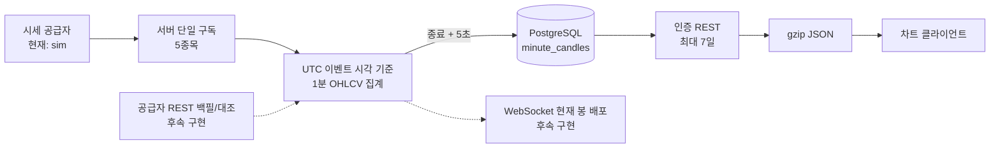

# 1분봉 수집·저장·조회 MVP 및 성능 검증

작성일: 2026-08-10

대상 범위: 국내 주식 5종목, KRX 정규장 1분봉, 차트 조회 전용

## 1. 결론

- 5종목의 1분봉 집계와 PostgreSQL 저장 자체는 현재 MVP 규모에서 병목이 아니다.
- 실제 병목 후보는 긴 조회 구간의 JSON 직렬화와 네트워크 전송이다. JSON 압축으로 5거래일 응답을 282,858B에서 33,306B로 88.2% 줄였다.
- 로컬 단일 서버에서 100 VU로 조회했을 때 1일 p95는 52.524ms로 통과했지만, 5거래일 p95는 세 번 모두 200ms를 넘었다. 따라서 클라이언트는 기본적으로 가장 최근 거래일만 조회하도록 정했다.
- 공개 서비스 전에 가장 먼저 해결할 항목은 기술이 아니라 시세 표시·재배포 권리다. 증권사 개인 API로 받은 시세를 여러 사용자에게 표시할 수 있다고 가정하면 안 된다.
- 이번 변경은 로컬 `sim` 공급자로 수집 파이프라인을 검증한다. KIS·키움·LS 실데이터 속도 비교는 계정, API 키, 서면 사용 허가를 확보한 뒤 같은 측정 규격으로 실행해야 한다.

## 2. 이번 MVP에서 구현한 범위

추적 종목은 기존 시장 카탈로그 순서의 삼성전자(005930), SK하이닉스(000660), 카카오(035720), NAVER(035420), 현대차(005380) 5개다.



구현 내용은 다음과 같다.

- 체결 시각과 sequence를 이용한 UTC 1분 경계 집계
- 역순 체결에서도 open/close를 이벤트 순서대로 결정하고 high/low/volume/tradeCount 집계
- 동일 `(occurredAt, sequence)` 체결 중복 제거. 실제 공급자 adapter는 이벤트마다 고유한 sequence를 제공해야 함
- 마지막 체결 유무와 무관한 1초 주기 확정, 종료 후 5초 지연 허용
- 확정 경계보다 늦은 체결 거절 및 DB 실패 시 메모리 봉 보존
- `(ticker, bucket_start)` 복합 기본키와 revision 기반 멱등 upsert
- 인증된 1분봉 기간 조회 API와 7일 상한
- 분봉 대상으로 명시한 5종목만 조회 허용. 나머지 기존 카탈로그 종목은 `CANDLE_TICKER_NOT_TRACKED`로 구분
- JSON gzip 압축
- 집계 리플레이, PostgreSQL 실제 크기, REST 부하를 다시 실행할 수 있는 측정 도구

기본 설정의 `market.candles.collection-enabled`는 `false`다. 라이선스가 확인된 공급자 또는 로컬 검증 환경에서만 `MARKET_CANDLE_COLLECTION_ENABLED=true`로 켠다.

## 3. 데이터 공급자 후보와 판단 기준

### 3.1 권리 확인이 Gate 0인 이유

한국투자증권은 개인 시세를 본인 투자 목적에 한정하고 제3자 제공을 금지하며, 앱·웹 표시에는 제휴 및 거래소 시세 계약이 필요하다고 안내한다. KRX도 재배포·프로그램 개발·수익사업에 별도 계약과 승인을 요구한다.

- [한국투자증권 Open API 이용 대상과 시세 제한](https://apiportal.koreainvestment.com/about-open-api)
- [한국투자증권 제휴 안내](https://apiportal.koreainvestment.com/provider-info)
- [KRX 정보 이용 계약 절차](https://openapi.krx.co.kr/contents/OPP/DATA/OPPDATA003.jsp)
- [KRX 데이터 라이선스 안내](https://openapi.krx.co.kr/contents/OPP/DATA/OPPDATA004.jsp)

자체 집계한 1분봉도 원천 시세의 가공 데이터이므로 자동으로 재배포 가능 데이터가 된다고 보지 않는다. 공개 전 아래 항목을 공급자와 코스콤에 서면으로 확인한다.

- 로그인·무료·유료 사용자의 화면 표시 허용 범위
- KRX, NXT, 통합 시세 각각의 권리
- 원천 체결과 자체 집계 OHLCV의 저장 기간, 재생, 다운로드 허용 범위
- 사용자 수 보고 및 과금 기준
- 장애 복구용 2차 공급자 사용 허용 여부
- 출처·로고 표시 조건

### 3.2 기술 후보

| 후보 | 실시간·백필 방식 | 공개 문서상 주요 제한 | 이번 판단 |
| --- | --- | --- | --- |
| 한국투자 KIS | 체결 WebSocket + 당일/과거 분봉 REST | 실전 REST 초당 제한과 WebSocket 등록 제한이 공개되어 비교적 투명함 | 내부 POC 1순위, 공개 사용은 계약 후 |
| 키움 REST API | 체결 WebSocket + `ka10080` 분봉 REST | 계좌·토큰 단위 호출 제한, 실시간 종목 상한 | 내부 비교군, 서면 허가 필요 |
| LS OPEN API | 체결 WebSocket + `t8412` N분 차트 REST | `t8412` 개인 초당 제한, 예제 조회량이 큼 | 백필 비교군, 서면 허가 필요 |
| KRX 무료 OPEN API | 일별 REST | 실시간·1분봉이 아니며 비상업·제3자 제공 제한 | 정합성 보조만 가능 |
| KRX/코스콤 정식 피드 | 계약된 실시간 시장 데이터 | 계약, KRX 승인, 비용·리드타임 필요 | 공개 운영의 명확한 경로 |
| 해외 범용 API | 상품별 REST/스트림 | 한국 시장은 EOD 또는 지연인 경우가 많음 | 한국 실시간 MVP 기본축에서 제외 |

공식 자료:

- [KIS API 서비스 목록](https://apiportal.koreainvestment.com/apiservice-apiservice)
- [KIS 과거 분봉 공식 예제](https://github.com/koreainvestment/open-trading-api/blob/main/examples_llm/domestic_stock/inquire_time_dailychartprice/inquire_time_dailychartprice.py)
- [키움 API 가이드](https://openapi.kiwoom.com/m/guide/apiguide)
- [LS N분 차트 API](https://openapi.ls-sec.co.kr/apiservice?api_id=12320341-ad85-429a-90bd-5b3771c5e89f&group_id=73142d9f-1983-48d2-8543-89b75535d34c)
- [KRX 정식 데이터 상품](https://openapi.krx.co.kr/contents/OPP/DATA/OPPDATA002.jsp)

이번 로컬 측정값을 KIS·키움·LS의 실제 속도로 해석하면 안 된다. 세 공급자는 자격 증명과 재표시 허가가 없어 아직 실측하지 않았다.

## 4. 공급자 속도·안정성 시험 계획

세 공급자를 같은 5종목, 같은 KRX 정규장 조건으로 최소 한 거래일씩 독립 실행한다. 사용자마다 공급자 연결을 만들지 않고 서버가 공급자별 한 연결을 유지한다.

수집할 지표:

| 영역 | 지표 | 임시 합격선 |
| --- | --- | ---: |
| 실시간 지연 | 공급자 시각 → 서버 수신 p50/p95/p99 | p95 < 1초, p99 < 2초 |
| 품질 | 중복, 역순, 미복구 누락, 비정상 가격·수량 | 확정 봉 미복구 누락 0 |
| 연결 | 끊김 횟수, 재연결 시간, 구독 복구 시간 | 재연결 10초 이내 |
| 복구 | 마지막 저장 시점부터 REST gap 백필 완료 시간 | 60초 이내 |
| REST | 2xx/429/5xx, 응답 p95/p99, 9,750봉 백필 시간 | 429 정책 준수, 주간 대조 완료 |
| 정합성 | 서버 집계 봉과 공급자 분봉의 OHLCV 차이 | 주간 확정 봉 100% 대조 |
| 운영 | 8시간 soak 중 수동 개입과 메모리 증가 | 수동 개입 0, 지속 증가 없음 |

비교를 흐리지 않도록 첫 시험은 KRX 정규장 390분으로 고정한다. NXT 또는 통합 시세는 거래 시간과 OHLCV 의미가 달라 별도 실험으로 분리한다.

## 5. 저장 구조와 실제 데이터 크기

핵심 키는 `(ticker, bucket_start)`다. 시간은 UTC `TIMESTAMPTZ`로 저장하고 응답에서 `Asia/Seoul`로 변환한다. 가격은 원화 정수, 거래량과 체결 수는 `BIGINT`다. `revision`이 기존 값보다 큰 경우에만 보정하므로 동일 이벤트 재처리와 오래된 보정이 최신 봉을 덮는 일을 막는다.

주요 제약:

- open/high/low/close > 0
- high는 모든 가격 이상, low는 모든 가격 이하
- volume, tradeCount, revision >= 0
- 확정 스트림 봉은 revision 0, 공급자 REST 대조 보정은 더 큰 revision 사용

### 5.1 PostgreSQL 16.14 실측

Testcontainers의 빈 PostgreSQL에 5종목 × 390분 × 5일 = 9,750행을 한 JDBC batch로 저장했다.

| 항목 | 결과 |
| --- | ---: |
| 테이블 heap | 1,171,456B |
| 기본키 인덱스 | 360,448B |
| 관계 전체 | 1,531,904B |
| 분봉 1개당 관계 크기 | 157.118B |
| 삽입 WAL | 2,153,408B |
| 분봉 1개당 WAL | 220.862B |
| 9,750행 batch 시간 | 192.849ms |
| batch 처리량 | 50,558행/초 |

`157.118B/봉`은 단순 컬럼 합계가 아니라 PostgreSQL page·tuple·인덱스 오버헤드를 포함한 실제 관계 크기다. 복제본, 백업, 테이블 팽창은 포함하지 않는다. WAL은 checkpoint와 full-page write 설정에 따라 달라진다.

### 5.2 5종목 보관량 추정

KRX 정규장 390분과 연 252거래일을 가정했다.

| 기간 | 행 수 | 관계 크기 추정 | WAL 추정 |
| --- | ---: | ---: | ---: |
| 1거래일 | 1,950 | 0.31MB | 0.43MB |
| 5거래일 | 9,750 | 1.53MB 실측 | 2.15MB 실측 |
| 21거래일 | 40,950 | 6.43MB | 9.04MB |
| 252거래일 | 491,400 | 77.21MB | 108.53MB |

행 수와 관계 크기는 종목 수에 거의 선형으로 증가한다. 같은 스키마라면 100종목은 연 약 1.54GB, 1,000종목은 연 약 15.44GB의 주 테이블·인덱스가 예상된다. 운영 용량은 관계 크기에 replica, PITR/WAL 보관, 백업, vacuum 여유를 더해 산정한다. NXT·시간외 거래를 포함하면 `390분` 가정부터 다시 계산해야 한다.

## 6. 집계 속도

단일 JVM thread에서 5종목 × 390분 × 분당 종목별 1,000체결, 총 1,950,000체결을 메모리 재생했다. 매 회 1,950개 봉 생성과 전체 거래량·checksum을 검증했다.

환경: OpenJDK 21.0.6, JVM에서 확인한 processor 15개, warm-up 3회, 측정 7회.

| 항목 | 결과 |
| --- | ---: |
| 중앙 처리 시간 | 98.088ms |
| p95 처리 시간 | 109.593ms |
| 중앙 처리량 | 19,880,150체결/초 |
| 최저 처리량 | 17,793,168체결/초 |

이는 네트워크, 공급자 parsing, DB 저장을 제외한 집계기 자체의 마이크로 벤치마크다. 절대적인 운영 TPS가 아니라 “5종목 집계 CPU는 현재 우선 병목이 아니다”라는 판단에 사용한다. 정식 JMH가 아니므로 서버 기종 비교에는 같은 명령을 여러 번 실행해 분산을 함께 본다.

## 7. 조회 응답과 사용자 부하

실제 애플리케이션, PostgreSQL 16.14, JWT 인증, 로컬 loopback 조건에서 측정했다. 서버와 k6가 같은 장비를 공유했으므로 이 수치를 운영 용량으로 그대로 보장하지 않는다.

API:

```http
GET /api/market/{ticker}/candles?from={ISO-8601}&to={ISO-8601}
Authorization: Bearer {JWT}
Accept-Encoding: gzip
```

응답은 `interval=1m`, `timezone=Asia/Seoul`, 시간 오름차순 OHLCV, `tradeCount`, `final`, `revision`을 포함한다. 기간은 시작 포함·종료 제외이며 최대 7일이다.

### 7.1 응답 크기

| 조회 구간 | 봉 수 | 원본 JSON | gzip | 감소율 |
| --- | ---: | ---: | ---: | ---: |
| 1일 | 390 | 56,658B | 7,058B | 87.5% |
| 5거래일 | 1,950 | 282,858B | 33,306B | 88.2% |

### 7.2 k6 결과

각 시나리오는 고정 VU로 20초 실행했다. 합격선은 p95 < 200ms, HTTP 오류율 < 1%, 응답 검증 성공률 > 99%다.

| 구간 | 압축 | VU | 요청/초 | p95 | p99 | 오류율 | 판정 |
| --- | --- | ---: | ---: | ---: | ---: | ---: | --- |
| 1일 | gzip | 10 | 2,061.08 | 4.959ms | 5.674ms | 0% | 통과 |
| 1일 | gzip | 100 | 2,002.90 | 52.524ms | 59.581ms | 0% | 통과 |
| 5거래일 | gzip | 10 | 460.41 | 20.016ms | 20.960ms | 0% | 통과 |
| 5거래일 | gzip | 100 | 467.73 | 218.975ms | 223.820ms | 0% | 실패 |

5거래일·100 VU는 우연한 한 번의 흔들림인지 확인하기 위해 세 번 실행했다. p95는 각각 226.610ms, 214.152ms, 218.975ms로 세 번 모두 임시 합격선인 200ms를 넘었다. 세 실행 모두 HTTP 오류율은 0%, 응답 내용 검증은 100%였으므로 기능 오류가 아니라 긴 응답을 동시에 직렬화·전송하는 비용이 먼저 드러난 결과다.

VU는 실제 가입자 수가 아니라 쉬지 않고 같은 요청을 반복하는 가상 사용자 수다. 로컬 한 장비의 결과를 운영 수용 인원으로 환산하지 않는다. 다만 이번 결과만으로도 기본 7일 일괄 조회보다 1일 초기 조회, 과거 구간 추가 로딩, 확정 봉 캐시를 먼저 적용할 근거는 충분하다.

## 8. 사용자 증가 대응 순서

1. 차트 진입 시 가장 최근 거래일만 REST로 받고 사용자가 과거로 이동할 때 추가 구간을 요청한다. 주말과 월요일 장 시작 전에는 직전 금요일을 기준으로 잡는다.
2. 모든 JSON 응답에 gzip을 유지한다.
3. 동일 종목·동일 구간 확정 봉은 사용자별 계산을 하지 않고 애플리케이션 캐시 또는 Redis에 저장한다.
4. 공급자 WebSocket은 서버에서 종목당 한 번만 구독하고, 클라이언트 연결에는 내부 fan-out을 사용한다.
5. 현재 진행 중인 한 개 봉만 WebSocket으로 갱신하고 확정 이력은 REST·캐시로 제공한다.
6. 단일 인스턴스 한계를 넘기 전에 읽기 인스턴스를 수평 확장하고, WebSocket 구독 상태는 Redis pub/sub 또는 전용 스트림 계층으로 분리한다.
7. 캐시 hit ratio, 직렬화 CPU, DB pool 대기, 네트워크 egress, WebSocket 연결 수를 함께 관측한다.

현재 Hikari pool은 5다. 이번 로컬 조회에는 충분했지만 운영에서는 인스턴스 수 × pool 크기가 PostgreSQL 최대 연결을 넘지 않도록 제한하고, 예상 사용자 수별 10분 이상 단계 부하와 soak로 다시 결정한다.

## 9. 재현 방법

결정적 로컬 시험 데이터 적재와 API·DB 대조:

```bash
./scripts/blog-market-candles-seed.sh catalog-week

BLOG_API_FROM='2026-08-03T09:00:00+09:00' \
BLOG_API_TO='2026-08-08T09:00:00+09:00' \
./scripts/blog-market-candles-evidence.sh
```

시드 스크립트는 5종목 × 5일의 9,750개 봉을 `blog-local-seed` 출처로만 멱등 저장한다. 같은 키에 다른 출처의 데이터가 있으면 덮어쓰지 않고 전체 작업을 실패시킨다. 날짜·DB 주소는 스크립트 도움말의 `BLOG_*` 환경 변수로 바꿀 수 있다.

집계 리플레이:

```bash
./gradlew benchmarkMinuteCandles
```

PostgreSQL 저장 크기와 batch 처리량:

```bash
./gradlew test --tests 'com.growant.market.candle.persistence.MinuteCandleStorageMetricsIT'
```

REST 부하:

```bash
BASE_URL=http://localhost:8080 \
TOKEN='<JWT>' \
TICKER=005930 \
FROM=2026-08-03T00:00:00Z \
TO=2026-08-10T00:00:00Z \
MIN_CANDLES=1950 \
VUS=100 \
DURATION=20s \
./scripts/market-candles-load.sh
```

실행별 원본 결과는 `build/reports/market-data/`에 생성된다. 성능 수치는 pass/fail assertion으로 고정하지 않고 같은 환경의 회귀 비교 자료로 사용한다.
REST 시험 전에 해당 ticker와 기간의 봉을 수집하거나 별도 시험 데이터로 적재해야 한다. `MIN_CANDLES`는 빈 응답을 빠른 성공으로 잘못 측정하지 않기 위한 최소 개수 검증값이다.

## 10. 완료 기준과 남은 범위

이번 단계에서 확인한 것:

- 1분 경계, 역순 체결, 동일 시각 sequence, 종목 격리
- DB 제약, 멱등 저장, 높은 revision 보정, 기간 정렬 조회
- DB 저장 실패 시 미확정 상태 보존과 늦은 체결 경계
- JWT 보호 API, 7일 범위 검증, gzip
- 9,750봉 실제 저장 크기와 batch 성능
- 10·100 VU 실제 REST 부하

다음 단계에서 반드시 확인할 것:

- KIS·키움·LS 계정과 서면 표시 권리를 확보한 실시간 한 거래일 비교
- 공급자 WebSocket 재연결, heartbeat, rate limit, gap REST 백필 구현
- 공급자 분봉과 자체 집계 분봉의 일 단위 OHLCV 대조 및 revision 자동 증가
- 클라이언트 WebSocket fan-out과 실제 차트 라이브러리 렌더링 성능
- 운영과 같은 별도 부하 발생기·네트워크·서버 사양에서 10분 단계 부하와 8시간 soak
- CPU, heap, GC, DB pool wait, query plan, cache hit ratio, egress의 통합 관측

현재 수집기는 로컬·단일 인스턴스 POC 경계다.

- 분 중간에 프로세스가 재시작되면 그 분의 재시작 이전 체결은 메모리에서 복원되지 않는다. 실제 공급자 연결 전에는 시작 시 현재 분 REST 백필을 먼저 수행하거나 해당 분을 저장 대상에서 제외해야 한다.
- 여러 API replica에서 수집을 동시에 활성화하면 각 replica가 같은 종목을 구독하고 revision 0 봉을 경쟁 저장한다. 운영에서는 수집 전용 단일 worker를 두거나 leader election을 구현해야 한다.
- 따라서 `MARKET_CANDLE_COLLECTION_ENABLED=true`는 현재 한 collector 인스턴스에서만 사용한다.

실시세 공급자와 클라이언트 fan-out은 의도적으로 아직 구현하지 않았다. 자격 증명 없이 가짜 공급자 성능 수치를 만들거나, 재배포 권리 확인 전에 실제 시세를 공개 경로로 노출하지 않기 위한 경계다.
