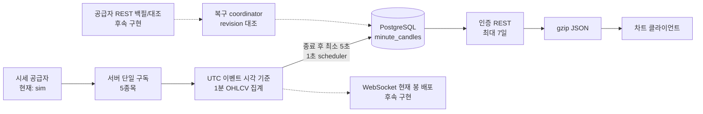
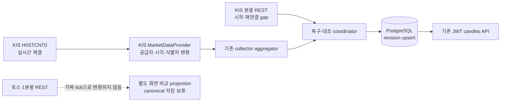

# 1분봉 수집·저장·조회 MVP 및 성능 검증

작성일: 2026-08-11, B1 부하 재검증 반영: 2026-08-14

시세 공급자 비교일: 2026-08-14, KIS·토스 공식 문서 추가 재확인일: 2026-08-15

대상 범위: 국내 주식 5종목, KRX 정규장 1분봉, 차트 조회 전용

## 1. 결론

- 5종목의 1분봉 집계와 PostgreSQL 저장 자체는 현재 MVP 규모에서 병목이 아니다.
- 긴 조회 구간에서 포화 신호가 보였다. JSON 압축으로 5거래일 응답을 282,858B에서 24,230B로 91.4% 줄였지만, B1은 CPU·gzip·Hikari·DB·부하 발생기 중 원인을 구분할 지표를 수집하지 않았다.
- B0에서 임계선에 가까웠던 5거래일·100 VU를 다시 확인하기 위해 B1에서 네 조건을 각 3회 실행했다. B1 중앙값은 1일·100 VU p95 66.079ms로 통과했지만, 5거래일·100 VU p95 203.918ms로 세 번 모두 실패했다. 5거래일은 10→100 VU에서 처리량이 525.71→517.81요청/초로 늘지 않고 p95만 약 10.7배 증가했다. 따라서 첫 화면은 최근 거래일만 조회하고 과거 추가 로딩은 다음 클라이언트 변경으로 구현한다.
- 처음 만든 로컬 시드는 각 분의 시가를 따로 계산해 삼성전자 하루 기준 다음 시가와 이전 종가의 평균 차이가 187.61원, 최대 차이가 740원이었다. 새 교육용 시드는 장중 9,725쌍 모두 다음 시가를 이전 종가와 같게 만들고 거래일 경계에서만 -2틱에서 +2틱의 갭을 허용한다. 종목별 가격 단위가 달라 원화 범위는 전체 -1,000원에서 +1,000원이다.
- 공개 서비스 전에 가장 먼저 해결할 항목은 기술이 아니라 시세 표시·재배포 권리다. 증권사 개인 API로 받은 시세를 여러 사용자에게 표시할 수 있다고 가정하면 안 된다.
- 현재 검증은 `sim → 수집·집계 → PostgreSQL` 계층과 `결정적 seed → PostgreSQL → REST → Flutter` 경로로 나뉜다. 같은 실제 공급자 데이터가 전체를 관통한 E2E는 아니다. KIS WebSocket + REST는 서면 저장·벤치마크 허가 뒤 가장 먼저 검증할 조건부 기술 후보이고, 토스 REST 1분봉은 현재 공개 이용 범위상 `RIGHTS_BLOCKED`다. KIS·키움·토스·LS 실데이터 비교는 계정, API 키, 서면 사용 허가를 확보한 뒤 같은 측정 규격으로 실행해야 한다.

## 2. 이번 MVP에서 구현한 범위

추적 종목은 기존 시장 카탈로그 순서의 삼성전자(005930), SK하이닉스(000660), 카카오(035720), NAVER(035420), 현대차(005380) 5개다.



구현 내용은 다음과 같다.

- 체결 시각과 sequence를 이용한 UTC 1분 경계 집계
- 역순 체결에서도 open/close를 이벤트 순서대로 결정하고 high/low/volume/tradeCount 집계
- 동일 `(occurredAt, sequence)` 체결 중복 제거. 실제 공급자 adapter는 이벤트마다 고유한 sequence를 제공해야 함
- 마지막 체결 유무와 무관하게 `now - 5초` watermark를 1초마다 검사한다. 일반적인 최초 확정 시점은 분 종료 후 약 5~6초다.
- 확정 경계보다 늦은 체결 거절 및 DB 실패 시 메모리 봉 보존
- `(ticker, bucket_start)` 복합 기본키와 revision 기반 멱등 upsert
- 인증된 1분봉 기간 조회 API와 7일 상한
- 분봉 대상으로 명시한 5종목만 조회 허용. 나머지 기존 카탈로그 종목은 `CANDLE_TICKER_NOT_TRACKED`로 구분
- 종목별 가격 단위 준수, 분당 최대 2틱 이동과 일별 이동 합계 0인 결정적 로컬 시드
- JSON gzip 압축
- 집계 리플레이, PostgreSQL 실제 크기, REST 부하를 다시 실행할 수 있는 측정 도구

기본 설정의 `market.candles.collection-enabled`는 `false`다. 라이선스가 확인된 공급자 또는 로컬 검증 환경에서만 `MARKET_CANDLE_COLLECTION_ENABLED=true`로 켠다.

## 3. 데이터 공급자 후보와 판단 기준

### 3.1 권리 확인이 Gate 0인 이유

한국투자증권과 키움증권은 개인 시세를 개인 업무에 한정하고 제3자 제공을 금지한다. 토스증권의 공개 이용 안내도 본인 매매 목적만 허용하며 외부 배포·상업적 이용을 금지한다. KRX는 재배포·프로그램 개발·수익사업에 별도 계약과 승인을 요구한다.

- [한국투자증권 Open API 이용 대상과 시세 제한](https://apiportal.koreainvestment.com/about-open-api)
- [한국투자증권 제휴 안내](https://apiportal.koreainvestment.com/provider-info)
- [키움 Open API 서비스 이용약관](https://download.kiwoom.com/deploy/AG001/pdf/AG001_110_20260601.pdf)
- [토스증권 Open API 이용 안내](https://corp.tossinvest.com/ko/open-api)
- [KRX 정보 이용 계약 절차](https://openapi.krx.co.kr/contents/OPP/DATA/OPPDATA003.jsp)
- [KRX 데이터 라이선스 안내](https://openapi.krx.co.kr/contents/OPP/DATA/OPPDATA004.jsp)

자체 집계한 1분봉도 원천 시세의 가공 데이터이므로 자동으로 재배포 가능 데이터가 된다고 보지 않는다. 실제 공급자 호출 전 시험·저장·벤치마크·재생·CI·내부 표시·외부 제공과 파생 OHLCV 범위를 각각 공급자와 코스콤에 서면으로 확인한다. 해당 실험에 필요한 판단이 `UNKNOWN`이면 실행하지 않는다.

- 로그인·무료·유료 사용자의 화면 표시 허용 범위
- KRX, NXT, 통합 시세 각각의 권리
- 원천 체결과 자체 집계 OHLCV의 저장 기간, 재생, 다운로드 허용 범위
- 사용자 수 보고 및 과금 기준
- 장애 복구용 2차 공급자 사용 허용 여부
- 출처·로고 표시 조건

### 3.2 기술 후보

| 후보 | 1분봉 취득 방식 | 공개 문서상 주요 제한 | 이번 판단 |
| --- | --- | --- | --- |
| 한국투자 KIS | `H0STCNT0` KRX 체결 WebSocket 집계 + 당일·일별 분봉 REST | 신규 실전 첫 3일 3 TPS 후 18 TPS, 모의 1 TPS, WebSocket은 앱 키당 1세션·전 상품 합산 41개 등록. 일별 분봉은 실전 전용이며 최대 120봉/호출·보관된 범위에서 최대 1년 | **5종목 조건부 기술 1순위**. 저장·벤치마크·공개 사용은 각각 서면 확인 후 |
| 키움 REST API | `0B` 체결 WebSocket + `ka10080` 주식분봉 REST | 국내 조회 5 TPS, 토큰당 한 세션, 실시간 200종목. 보관기간·페이지 크기 수치는 공개 문서에 없음 | 종목 수 확장 비교군, 제3자 제공은 약관상 금지 |
| 토스증권 Open API | `/api/v1/candles?interval=1m&adjusted=false` REST | 최대 200봉/호출, 일반 시세 15 TPS, 차트 그룹 20 TPS. 현재 공식 운영 명세는 REST-only이며 보관기간·명시적 확정 상태·체결 수가 없음 | 기능은 적합하지만 본인 매매 목적 밖 사용은 `RIGHTS_BLOCKED` |
| LS OPEN API | 체결 WebSocket + `t8412`·`t8452` N분 차트 REST | 공개 상세에서 확인한 `t8412` 1 TPS | 저속 백필 비교군, 권리 확인 필요 |
| KRX/코스콤 정식 피드 | 계약된 실시간 시장 데이터 | 계약, KRX 승인, 비용·리드타임 필요 | 공개 운영의 명확한 경로 |

KIS와 LS의 해당 시세 API는 공식 상세에서 무과금으로 표시된다. 키움은 매매 시 HTS와 같은 수수료를 적용한다고 안내하고, 토스도 계좌 고객용 서비스로 기존 수수료를 안내한다. 이는 API 이용 비용에 대한 설명일 뿐 시세 표시·재배포 권리를 의미하지 않는다.

무료 공공 API는 별도로 분류한다. 호출 한도보다 먼저 데이터 시간 단위를 확인해야 한다.

| 후보 | 실제 데이터와 갱신 | 공개 호출 한도 | 1분봉 판단 |
| --- | --- | --- | --- |
| 금융위원회 주식시세정보 | 일별 OHLCV, 일 1회, 기준일 다음 영업일 13시 이후 | 개발계정 10,000회/일 | 1분봉·실시간 체결 없음 |
| KRX 무료 OPEN API | 주식 일별매매정보, 당일·장중·실시간 미제공 | 키당 10,000회/일 | 1분봉 없음. 일봉 참고만 가능 |
| OpenDART | 공시·기업 개황·재무정보, 가격·체결·OHLCV 미제공 | 일반적으로 20,000건 이상에서 제한 오류가 날 수 있으나 공개 가이드에 시간 단위 미기재 | 분봉 원천이 아니라 공시 이벤트 보강용 |

공공 API는 수 분 지연된 1분봉 대안이 아니다. 이번에 확인한 세 API는 1분봉 자체가 없으며, 일별 OHLCV로 장중 390개 봉을 복원할 수 없다.

이번 공식 문서 조사 범위는 증권사 4개와 공공 API 3개다. 계좌 없이 누구나 쓰는 무료 공개 API 중 국내주식 실시간 체결 또는 1분봉을 제공한 것은 0개였고, 계좌·앱 신청 후 기술적으로 1분봉을 만들거나 읽을 후보는 4개였다. 이는 전체 시장의 완전한 목록이나 공개 재배포 허가 수를 뜻하지 않는다.

공식 자료:

- [KIS API 서비스 목록](https://apiportal.koreainvestment.com/apiservice-apiservice)
- [KIS 과거 분봉 공식 예제](https://github.com/koreainvestment/open-trading-api/blob/main/examples_llm/domestic_stock/inquire_time_dailychartprice/inquire_time_dailychartprice.py)
- [KIS REST·WebSocket 유량 공지](https://apiportal.koreainvestment.com/community/10000000-0000-0011-0000-000000000001/post/d0d1a83f-6f8d-4437-9700-6d26702fd989)
- [KIS 신규 신청 유량 공지](https://apiportal.koreainvestment.com/community/10000000-0000-0011-0000-000000000001/post/c1113824-17c7-47a7-b7b8-8880506a847c)
- [키움 `ka10080` 주식분봉 가이드](https://openapi.kiwoom.com/guide/apiguide?apiId=ka10080&jobTp=FS_JOB_TP&jobTpCode=07)
- [키움 Open API 서비스 이용약관](https://download.kiwoom.com/deploy/AG001/pdf/AG001_110_20260601.pdf)
- [토스 Open API 현재 기능·호출 한도](https://openapi.tossinvest.com/openapi-docs/overview.md)
- [토스 캔들 API 명세](https://openapi.tossinvest.com/openapi-docs/latest/api-reference/Apis/MarketDataApi.md#getCandles)
- [토스 API 이용 범위](https://corp.tossinvest.com/ko/open-api)
- [LS N분 차트 API](https://openapi.ls-sec.co.kr/apiservice?api_id=12320341-ad85-429a-90bd-5b3771c5e89f&group_id=73142d9f-1983-48d2-8543-89b75535d34c)
- [금융위원회 주식시세정보](https://www.data.go.kr/data/15094808/openapi.do)
- [KRX 무료 OPEN API 서비스 목록](https://openapi.krx.co.kr/contents/OPP/INFO/service/OPPINFO004.cmd)
- [OpenDART API 목록](https://opendart.fss.or.kr/intro/infoApiList.do)
- [KRX 정식 데이터 상품](https://openapi.krx.co.kr/contents/OPP/DATA/OPPDATA002.jsp)

이번 로컬 측정값을 KIS·키움·토스·LS의 실제 속도로 해석하면 안 된다. 네 공급자는 자격 증명과 필요한 시험·저장 권리가 없어 아직 실측하지 않았다.

### 3.3 현재 채택 가능 여부와 조건부 기술 우선순위

선택은 목적별로 나눈다.

| 목적 | 선택 | 이유 |
| --- | --- | --- |
| 5종목 실제 수집 어댑터 | **아직 미채택. KIS 조건부 1순위** | 5종목 기술 적합성은 높지만 저장·파생·내부 벤치마크 서면 허가 전에는 실제 호출하지 않음 |
| 가장 단순한 1분봉 REST 경로 | **토스 기능 적합·권리 차단** | 최대 200봉을 읽을 수 있지만 본인 매매 목적 밖의 GrowAnt 시험·저장·표시는 승인 전 실행하지 않음 |
| 41종목을 넘는 내부 실시간 비교 | **키움 문서상 후보·권리 미확정** | 공개 문서상 한 세션에서 실시간 200종목을 지원하지만 시험·저장 권리와 실제 품질은 아직 확인하지 않음 |
| 공개 다중 사용자 운영 | **개인용 무료 API 중 채택 없음** | KRX·코스콤/NXT 또는 B2B 시세 계약이 Gate 0 |

토스 REST를 GrowAnt의 운영 원본으로 바로 채택하지 않는 첫 이유는 본인 매매 목적 밖 사용이 현재 공개 이용 범위에서 차단되기 때문이다. 권리 문제가 해결되더라도 토스 캔들은 OHLCV는 주지만 `tradeCount`와 명시적인 `isFinal`은 주지 않는다. 현재 `MinuteCandle`과 API는 두 값을 요구하므로 알 수 없는 값을 `0`·`true`로 만들지 않는다. 토스 경로를 영속화하려면 기존 migration을 수정하지 않고 nullable 값 또는 별도 품질 상태를 표현하는 새 forward-only migration과 호환 정책을 먼저 설계한다.

KIS REST로 복구한 봉에는 체결 수가 없을 수 있다. WebSocket 집계 봉의 체결 수를 유지할지, 미확인 상태를 별도로 표현할지 같은 정책을 실제 adapter 구현 전에 확정한다.

### 3.4 권리 승인 뒤 GrowAnt 적용 설계



구현 순서는 다음과 같다.

1. **권리·시장 의미 고정:** KRX 정규장, 1분, 현재 5종목만 허용하고 시험·저장·벤치마크·파생·재생·표시·재배포 권리를 서면 확인한다.
2. **합성 contract test 후 KIS adapter:** 실제 시세 없이 46필드 묶음, ACK, heartbeat와 오류를 먼저 검증한다. 허가 뒤 `com.growant.market.kis`에 `KisMarketDataProvider : MarketDataProvider`를 추가하고 `market.provider=kis`에서만 bean을 만든다. 하나의 물리 WebSocket에서 KRX `H0STCNT0` 5종목을 multiplex한다. 공급자 event ID가 없으므로 연결 epoch·wire-local 순번을 별도 관측하되 공급자 sequence로 꾸미지 않는다.
3. **공급자 중립 REST port:** 공급자가 집계한 분봉을 읽는 `HistoricalMinuteCandleSource`와 복구 상태를 관리하는 coordinator를 추가한다. KIS와 토스 REST client가 이 port를 구현하며, 토스 분봉을 가짜 `Tick`으로 분해하지 않는다.
4. **gap 복구:** 시작·재연결 시 DB의 마지막 확정 봉보다 1분 앞에서 가장 최근에 끝난 분까지 조회한다. 조회 중 WebSocket tick은 버퍼링한다. REST가 덮는 지난 bucket은 보정 후보로 먼저 reconcile하고, 그 경계 뒤의 tick만 event-time 순서로 집계기에 풀어준다. 연결이 끊겼던 현재 bucket은 `dirty`로 표시해 종료 뒤 REST로 다시 확인하기 전에는 완전한 봉으로 취급하지 않는다. 공급자 집계 봉과 원시 tick을 같은 목록으로 합치지 않으며, 경계가 겹치는 공급자 봉은 더 높은 revision으로 대조한다.
5. **단일 writer:** 초기 운영은 수집 전용 worker 한 대만 사용한다. API replica와 사용자 수가 WebSocket 연결이나 토스 polling 횟수를 늘리지 않게 한다.
6. **관측·실패 처리:** HTTP 상태와 공급자 `rt_cd`·`msg_cd`, 제한된 지수 backoff와 jitter, heartbeat timeout, 인증 갱신, 종목별 마지막 tick·확정 봉·gap, pending과 revision conflict를 지표로 남긴다. KIS quota는 `EGW00201`을 우선 신호로 사용하고 공식 문서가 보장하지 않은 HTTP 429·`Retry-After`를 전제로 하지 않는다. 일시적 DB 장애만 재시도하고, 같은 revision·다른 값은 quarantine한다. 현재 SQL의 `source_updated_at=now()`는 수집 시각이므로 새 forward-only migration에서 `ingested_at`으로 바로잡거나 공급자 원천 갱신 시각과 분리한다.
7. **검증:** payload mapping, 동일 시각 순서, 중복, 부분 구독 실패, idempotent close, 재연결, REST/WS 경계 중복, 401과 공급자 quota 오류를 자동 테스트한다. fake REST/WS와 PostgreSQL 통합 테스트에서 `WS → 강제 단절 → REST gap → 재접속 → DB 보정 → JWT API`를 관통한다. 이후 실제 5종목 5거래일과 8시간 soak를 별도 수행한다.

토스는 본인 매매 목적 밖의 GrowAnt 시험·저장에 대한 서면 예외 승인 전 실제 호출하지 않는다. 승인을 받으면 OAuth secret은 secret manager로 관리하고 고정 outbound IP를 허용한 뒤, 중앙 collector가 최신 2개 봉을 5초 주기로 조회한다. 5종목을 1초 간격 round-robin으로 분산하면 평균·순간 모두 1 TPS이고 한꺼번에 보내면 순간 5 TPS다. 둘 다 차트 그룹 20 TPS보다 낮지만 실제 `X-RateLimit-*`와 429의 `Retry-After`를 따른다. `before`의 포함 경계 중복을 제거하고 `adjusted=false`로 원시 가격 의미를 고정한다. canonical 저장은 `tradeCount`·확정 의미와 별도 호환 정책을 정한 뒤에만 허용한다.

현재 기본키 `(ticker, bucket_start)`는 provider·venue·session·interval을 구분하지 못한다. 따라서 KIS 장애 시 토스로 같은 거래일을 자동 전환해 같은 테이블에 섞어 쓰지 않는다. 자동 fallback이 필요하면 시험 관측 스키마와 별개로 공급자 원본 저장과 canonical 선택 계층을 새 forward-only migration에서 설계한다.

## 4. 공급자 속도·안정성 시험 계획

Gate 0을 통과한 KIS·키움·LS만 같은 5종목, 같은 KRX 정규장 5거래일에 독립 실행한다. 토스는 서면 예외 승인을 받은 경우에만 같은 조건에서 REST 분봉의 게시 지연과 후속 보정 여부를 측정한다. 사용자마다 공급자 연결이나 polling을 만들지 않고 서버가 공급자별 수집을 한 곳에서 유지한다.

수집할 지표:

| 영역 | 지표 | 임시 합격선 |
| --- | --- | ---: |
| 실시간 지연 | 공급자 시각 → 서버 수신 p50/p95/p99 | 시각 필드 정밀도와 서버 NTP 오차 확인 후 합격선 확정. 초 단위뿐이면 최대 1초 양자화 오차를 함께 표시 |
| REST-only 게시 지연 | 분 종료 → 토스 봉 최초 관측·최종 안정화 시간 | 실제 분포를 먼저 수집한 뒤 합격선 결정 |
| 품질 | 중복, 역순, 미복구 누락, 비정상 가격·수량 | 확정 봉 미복구 누락 0 |
| 연결 | 끊김 횟수, 재연결 시간, 구독 복구 시간 | 재연결 10초 이내 |
| 복구 | 마지막 저장 시점부터 REST gap 백필 완료 시간 | 60초 이내 |
| REST | 2xx/401/429/5xx와 공급자 body 오류, 응답 p95/p99, 9,750봉 백필 시간 | 공급자별 quota 정책 준수, 주간 대조 완료 |
| 정합성 | 서버 집계 봉과 공급자 분봉의 OHLCV 차이 | 주간 확정 봉 100% 대조 |
| 운영 | 8시간 soak 중 수동 개입과 메모리 증가 | 수동 개입 0, 지속 증가 없음 |

비교를 흐리지 않도록 첫 시험은 KRX 정규장 390분으로 고정한다. NXT 또는 통합 시세는 거래 시간과 OHLCV 의미가 달라 별도 실험으로 분리한다.

## 5. 저장 구조와 실제 데이터 크기

핵심 키는 `(ticker, bucket_start)`다. 시간은 UTC `TIMESTAMPTZ`로 저장하고 응답에서 `Asia/Seoul`로 변환한다. 가격은 원화 정수, 거래량과 체결 수는 `BIGINT`다. `revision`이 기존 값보다 큰 경우에만 보정하므로 동일 이벤트 재처리와 오래된 보정이 최신 봉을 덮는 일을 막는다.

주요 제약:

- open/high/low/close > 0
- high는 모든 가격 이상, low는 모든 가격 이하
- volume, tradeCount, revision >= 0
- 확정 스트림 봉은 revision 0, 공급자 REST 대조 보정은 더 큰 revision 사용

### 5.1 PostgreSQL 16.14 실측

Testcontainers의 빈 PostgreSQL에 5종목 × 390분 × 5일 = 9,750행을 한 JDBC batch로 저장했다.

| 항목 | 결과 |
| --- | ---: |
| 테이블 heap | 1,171,456B |
| 기본키 인덱스 | 360,448B |
| 관계 전체 | 1,531,904B |
| 분봉 1개당 관계 크기 | 157.118B |
| 삽입 WAL | 2,153,408B |
| 분봉 1개당 WAL | 220.862B |
| 9,750행 batch 시간 | 181.685ms |
| batch 처리량 | 53,664행/초 |

`157.118B/봉`은 단순 컬럼 합계가 아니라 PostgreSQL page·tuple·인덱스 오버헤드를 포함한 실제 관계 크기다. 복제본, 백업, 테이블 팽창은 포함하지 않는다. WAL은 checkpoint와 full-page write 설정에 따라 달라진다.

### 5.2 5종목 보관량 추정

KRX 정규장 390분과 연 252거래일을 가정했다.

| 기간 | 행 수 | 관계 크기 추정 | WAL 추정 |
| --- | ---: | ---: | ---: |
| 1거래일 | 1,950 | 0.31MB | 0.43MB |
| 5거래일 | 9,750 | 1.53MB 실측 | 2.15MB 실측 |
| 21거래일 | 40,950 | 6.43MB | 9.04MB |
| 252거래일 | 491,400 | 77.21MB | 108.53MB |

행 수와 관계 크기는 종목 수에 거의 선형으로 증가한다. 같은 스키마라면 100종목은 연 약 1.54GB, 1,000종목은 연 약 15.44GB의 주 테이블·인덱스가 예상된다. 운영 용량은 관계 크기에 replica, PITR/WAL 보관, 백업, vacuum 여유를 더해 산정한다. NXT·시간외 거래를 포함하면 `390분` 가정부터 다시 계산해야 한다.

## 6. 집계 속도

단일 JVM thread에서 5종목 × 390분 × 분당 종목별 1,000체결, 총 1,950,000체결을 메모리 재생했다. 매 회 1,950개 봉 생성과 전체 거래량·checksum을 검증했다.

환경: OpenJDK 21.0.6, JVM에서 확인한 processor 15개, warm-up 3회, 측정 7회.

| 항목 | 결과 |
| --- | ---: |
| 중앙 처리 시간 | 95.880ms |
| p95 처리 시간 | 97.674ms |
| 중앙 처리량 | 20,337,922체결/초 |
| 최저 처리량 | 19,964,397체결/초 |

이는 네트워크, 공급자 parsing, DB 저장을 제외한 집계기 자체의 마이크로 벤치마크다. 절대적인 운영 TPS가 아니라 “5종목 집계 CPU는 현재 우선 병목이 아니다”라는 판단에 사용한다. 정식 JMH가 아니므로 서버 기종 비교에는 같은 명령을 여러 번 실행해 분산을 함께 본다.

## 7. 조회 응답과 사용자 부하

실제 애플리케이션, PostgreSQL 16.14, JWT 인증, 로컬 loopback 조건에서 `blog-local-seed`를 읽어 측정했다. 5종목 9,750행을 적재했지만 k6는 삼성전자 `005930`의 같은 범위를 반복한 hot read이고, Nginx·TLS를 우회했으며 분봉 수집 write는 껐다. 서버와 k6가 같은 장비를 공유했으므로 이 수치를 공급자 성능이나 운영 용량으로 그대로 보장하지 않는다.

API:

```http
GET /api/market/{ticker}/candles?from={ISO-8601}&to={ISO-8601}
Authorization: Bearer {JWT}
Accept-Encoding: gzip
```

응답은 `interval=1m`, `timezone=Asia/Seoul`, 시간 오름차순 OHLCV, `tradeCount`, `final`, `revision`을 포함한다. 기간은 시작 포함·종료 제외이며 최대 7일이다.

### 7.1 응답 크기

| 조회 구간 | 봉 수 | 원본 JSON | gzip | 감소율 |
| --- | ---: | ---: | ---: | ---: |
| 1일 | 390 | 56,658B | 5,177B | 90.9% |
| 5거래일 | 1,950 | 282,858B | 24,230B | 91.4% |

### 7.2 k6 결과

각 시나리오는 고정 VU로 20초 실행했다. 합격선은 p95 < 200ms, HTTP 오류율 < 1%, HTTP 200·`success=true`·최소 봉 수 검사 성공률 > 99%다. 매 요청의 OHLCV 전체 필드를 대조하는 검사는 아니다.

8월 11일 B0에서는 5거래일·100 VU 세 회차가 모두 통과했지만 최악 p95가 196.651ms로 기준에 가까웠다. 이 결과를 다시 확인하기 위해 8월 14일 B1은 네 조건을 모두 세 번씩 실행하고 두 번째 반복의 실행 순서를 반대로 했다.

| 구간 | VU | 요청/초 중앙값·범위 | p95 중앙값·범위 | p99 중앙값·범위 | 오류율 | 판정 |
| --- | ---: | ---: | ---: | ---: | ---: | --- |
| 1일 | 10 | 1,701.93 · 1,681.94~1,794.23 | 6.739ms · 6.378~6.768 | 7.791ms · 7.411~7.807 | 0% | 통과 3/3 |
| 1일 | 100 | 1,661.27 · 1,653.61~1,702.57 | 66.079ms · 65.313~67.607 | 110.933ms · 110.170~112.458 | 0% | 통과 3/3 |
| 5거래일 | 10 | 525.71 · 492.62~530.95 | 18.983ms · 18.258~19.842 | 22.672ms · 19.832~23.312 | 0% | 통과 3/3 |
| 5거래일 | 100 | 517.81 · 514.79~525.26 | 203.918ms · 202.757~210.552 | 213.903ms · 211.406~234.654 | 0% | **실패 0/3** |

5거래일·100 VU의 회차별 p95는 `203.918ms`, `202.757ms`, `210.552ms`였고 최대 응답은 `403.612ms`, `528.946ms`, `434.590ms`였다. 모든 B1 실행의 HTTP 오류율은 0%, HTTP 200·`success`·최소 봉 수 검사는 100%였다.

5거래일 조회는 10→100 VU에서 처리량이 525.71→517.81요청/초로 늘지 않았지만 p95는 18.983→203.918ms로 약 10.7배 증가했다. 포화 신호는 확인했으나 backend·PostgreSQL·k6가 같은 Mac을 공유했고 CPU, heap, GC, Hikari wait, PostgreSQL 지표를 수집하지 않았으므로 병목 원인을 단정하지 않는다. B0와 B1의 환경 동일성도 입증할 수 없어 두 결과의 차이를 성능 회귀로 표현하지 않는다.

VU는 실제 가입자 수가 아니라 쉬지 않고 같은 요청을 반복하는 가상 사용자 수다. 로컬 한 장비에서 20초 동안 실행한 결과를 운영 수용 인원이나 SLA로 환산하지 않는다. 이번 결과는 기본 7일 일괄 조회보다 1일 초기 조회와 과거 구간 추가 로딩을 먼저 적용할 근거다. 실행 환경과 원시 summary hash는 [B1 부하 재검증 기록](blog/minute-candles/B1-LOAD-TEST-EVIDENCE.md)에 남겼다.

## 8. 사용자 증가 대응 순서

1. 차트 진입 시 가장 최근 거래일만 REST로 받고 사용자가 과거로 이동할 때 추가 구간을 요청한다. 주말과 월요일 장 시작 전에는 직전 금요일을 기준으로 잡는다.
2. 1KB 이상 분봉 JSON 응답에 gzip을 유지한다.
3. 동일 종목·동일 구간 확정 봉은 사용자별 계산을 하지 않고 애플리케이션 캐시 또는 Redis에 저장한다.
4. 공급자 WebSocket 구독과 REST polling은 서버 수집기 한 곳에서만 수행하고, 클라이언트 연결에는 내부 fan-out을 사용한다.
5. 현재 진행 중인 한 개 봉만 WebSocket으로 갱신하고 확정 이력은 REST·캐시로 제공한다.
6. 단일 인스턴스 한계를 넘기 전에 읽기 인스턴스를 수평 확장하고, WebSocket 구독 상태는 Redis pub/sub 또는 전용 스트림 계층으로 분리한다.
7. 캐시 hit ratio, 직렬화 CPU, DB pool 대기, 네트워크 egress, WebSocket 연결 수를 함께 관측한다.

현재 Hikari pool은 5다. B1에서 pool 대기 지표를 수집하지 않았으므로 이 값이 충분하거나 병목이라고 단정할 수 없다. 다음 시험에서 active·idle·pending을 함께 기록하고, 운영에서는 인스턴스 수 × pool 크기가 PostgreSQL 최대 연결을 넘지 않도록 제한한 뒤 예상 사용자 수별 10분 이상 단계 부하와 soak로 다시 결정한다.

## 9. 재현 방법

결정적 로컬 시험 데이터 적재와 API·DB 대조:

```bash
./scripts/blog-market-candles-seed.sh catalog-week

BLOG_API_FROM='2026-08-03T09:00:00+09:00' \
BLOG_API_TO='2026-08-08T09:00:00+09:00' \
./scripts/blog-market-candles-evidence.sh
```

시드 스크립트는 5종목 × 5일의 9,750개 봉을 `blog-local-seed` 출처로만 멱등 저장한다. 같은 키에 다른 출처의 데이터가 있으면 덮어쓰지 않고 전체 작업을 실패시킨다. 날짜·DB 주소는 스크립트 도움말의 `BLOG_*` 환경 변수로 바꿀 수 있다.

이 로컬 시드는 화면과 시간축을 공부하기 위해 장중에는 다음 분의 시가를 이전 분의 종가와 정확히 같게 만든다. 종목별 장중 연속성과 1분 간격은 각각 1,945/1,945쌍이고 잘못된 OHLCV와 동적으로 계산한 가격 단위 위반은 모두 0건이었다. 분당 움직임은 최대 2틱이며 종목별 각 거래일의 움직임 합은 0이다.

종목별 가격 단위는 삼성전자·SK하이닉스·NAVER 100원, 카카오 50원, 현대차 500원이다. 거래일 경계에서는 -2틱에서 +2틱의 갭을 허용하므로 전체 원화 범위는 -1,000원에서 +1,000원이지만 종목마다 실제 금액은 다르다. 이는 교육용 시험 데이터 규칙이며 실제 시장에서는 시초가, 거래 중단, 체결 공백 등으로 가격 갭이 생기는 것이 정상일 수 있다.

증거 검사는 예상한 5종목, 종목별 1,950개, 첫·마지막 시각 경계를 확인한다. 삼성전자 API와 DB의 1,950개 분봉은 시간, OHLCV, `tradeCount`, `final`, `revision`을 순서대로 전부 비교한다. 검사가 일부만 우연히 맞아도 통과하지 않는지 확인하기 위해 한 종목 전체와 첫·마지막·중간 봉을 각각 삭제하거나 `high`를 1 올리는 훼손을 만들었다. 각 경우에 검사가 실패했고 데이터를 다시 적재한 뒤 복구되는 것까지 확인했다.

집계 리플레이:

```bash
./gradlew benchmarkMinuteCandles
```

PostgreSQL 저장 크기와 batch 처리량:

```bash
./gradlew benchmarkMinuteCandleStorage
```

REST 부하:

```bash
BASE_URL=http://localhost:8080 \
TOKEN='<JWT>' \
RUN_ID='b1-example-5d-100vu-r1' \
TICKER=005930 \
FROM=2026-08-03T00:00:00Z \
TO=2026-08-08T00:00:00Z \
MIN_CANDLES=1950 \
VUS=100 \
DURATION=20s \
./scripts/market-candles-load.sh
```

실행별 원본 결과는 `build/reports/market-data/`에 생성된다. k6의 임시 threshold로 각 실행의 pass/fail은 판정하지만, 이를 CI 차단선·운영 SLA·영구 용량 기준으로 고정하지 않고 같은 환경의 회귀 비교 자료로 사용한다.
REST 시험 전에 해당 ticker와 기간의 봉을 수집하거나 별도 시험 데이터로 적재해야 한다. `MIN_CANDLES`는 빈 응답을 빠른 성공으로 잘못 측정하지 않기 위한 최소 개수 검증값이다.

## 10. 완료 기준과 남은 범위

이번 단계에서 확인한 것:

- 1분 경계, 역순 체결, 동일 시각 sequence, 종목 격리
- DB 제약, 멱등 저장, 높은 revision 보정, 기간 정렬 조회
- DB 저장 실패 시 확정 봉의 저장 대기 상태 보존과 늦은 체결 경계
- JWT 보호 API, 7일 범위 검증, gzip
- 9,750봉 실제 저장 크기와 batch 성능
- 1일·5거래일 × 10·100 VU를 각 3회 실행한 실제 REST 부하와 5거래일·100 VU p95 실패 기록
- 로컬 시드의 종목별 장중 가격 연속성과 1분 간격 1,945/1,945쌍, 잘못된 OHLCV·가격 단위 위반 0건
- 예상 5종목·종목별 1,950개·시각 경계와 삼성전자 API/DB 1,950개 전체 필드 순서 비교
- 한 ticker 전체·첫·마지막·중간 봉 삭제와 `high + 1` 훼손 실패 및 재적재 복구

다음 단계에서 반드시 확인할 것:

- KIS·키움·LS의 시험·저장·벤치마크 서면 권리와 계정을 확보한 실시간 5거래일 비교
- 토스의 본인 매매 목적 밖 시험·저장 서면 예외 승인을 확보한 경우에만 1분봉 게시 지연·보정 방식 비교
- 공급자 WebSocket 재연결, heartbeat, rate limit, gap REST 백필 구현
- 공급자 분봉과 자체 집계 분봉의 일 단위 OHLCV 대조 및 revision 자동 증가
- 클라이언트 WebSocket fan-out과 실제 차트 라이브러리 렌더링 성능
- 운영과 같은 별도 부하 발생기·네트워크·서버 사양에서 10분 단계 부하와 8시간 soak
- CPU, heap, GC, DB pool wait, query plan, cache hit ratio, egress의 통합 관측

현재 수집기는 로컬·단일 인스턴스 POC 경계다.

- 분 중간에 프로세스가 재시작되면 그 분의 재시작 이전 체결은 메모리에서 복원되지 않는다. 실제 공급자 연결 전에는 시작 시 현재 분 REST 백필을 먼저 수행하거나 해당 분을 저장 대상에서 제외해야 한다.
- 여러 API replica에서 수집을 동시에 활성화하면 각 replica가 같은 종목을 구독하고 revision 0 봉을 경쟁 저장한다. 운영에서는 수집 전용 단일 worker를 두거나 leader election을 구현해야 한다.
- 따라서 `MARKET_CANDLE_COLLECTION_ENABLED=true`는 현재 한 collector 인스턴스에서만 사용한다.

실시세 공급자와 클라이언트 fan-out은 의도적으로 아직 구현하지 않았다. 자격 증명 없이 가짜 공급자 성능 수치를 만들거나, 재배포 권리 확인 전에 실제 시세를 공개 경로로 노출하지 않기 위한 경계다.
